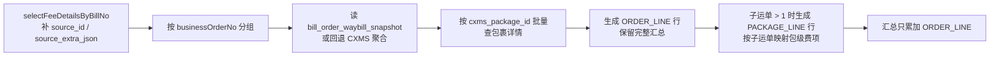

# 2026-08-11 BMS 对账报表导出增加尾程包裹数据行技术调整方案与计划（V2）

**版本：** V2（已对齐产品 2026-08-11 最新 PRD 调整）
**日期：** 2026-08-11
**需求依据：** `aidocs` 提交 `43aba95028864bc8a9458a6fd564233512764d81`（对账报表导出文件增加尾程包裹数据行）+ 产品 2026-08-11 最新 PRD 说明（截图：变更原因、变更范围、变更内容、保持不变的内容）
**前端范围：** `admin_front/src/views/billing`（本次以导出数据与 Excel 渲染为主，前端发起/管理面板预计无需改动，见 §5.4）
**涉及系统：** `bms`、`platform-admin`、`aidocs/technical-caliber/sql/ar_bill.sql`
**文档状态：** V2 已按最新 PRD 调整，待技术评审；实施前需先确认 §8 疑问点
**方案性质：** 只修改导出的 Excel，不修改系统页面；只调整对账报表导出的行粒度、数据组织和 Excel 表现，不改变账单生成、金额计算、汇率、审核、核销、返款、调账及当前有效账单结果口径。

---

## 1. PRD 变更整理

目标提交的核心变化是把面向客户和面向财务的对账报表明细从“一行一个业务订单”调整为“业务订单行 + 尾程包裹行”的两级结构。

### 1.0 最新 PRD 调整核对（V2）

| 产品最新表述 | 与 `43aba950` 的关系 | 本方案落地方式 |
| --- | --- | --- |
| 变更原因是“财务无法直接查看每个子运单号对应的包裹信息和费用”。 | 与原 PRD 目标一致。 | 按子运单生成包裹行并展示包裹自身字段与费项。 |
| 变更范围：客户报表（应收、返款）+ 财务报表（拆分式、合并式）。 | 与原 PRD 一致。 | 应收/返款客户 Sheet 2、内部拆分式/合并式全部改造。 |
| 只修改导出的 Excel，不修改系统页面。 | 原 PRD 未如此明确。 | 前端页面、账单明细、任务管理不展示包裹行；前端预计零改动，仅后端导出数据与 Excel 渲染调整。 |
| 订单行保留原有订单字段、全部子运单号、订单金额和订单合计。 | 与原 PRD 一致。 | `ORDER_LINE` 沿用现有 `buildArFinanceExportRow` 汇总结果。 |
| 包裹行只填写当前子运单对应的数据；缺值留空，不能从订单行复制，也不能分摊订单金额。 | 原 PRD 已表述，最新版更明确。 | 包裹行按 CXMS 包裹详情和包级费项映射生成，缺失字段置空；禁止复制订单行值。 |
| 同一订单的所有包裹行紧跟该订单行下方，中间不能插入其他订单或包裹数据。 | 与原 PRD 一致。 | `rows` 按“订单行 + 连续包裹行”顺序输出，Excel 行分组同段连续。 |
| 包裹行浅蓝色；业务订单号单元格显示`业务订单号>`。 | 与原 PRD 一致。 | Excel 层表现，不写入真实业务订单号字段。 |
| 客户报表和财务报表可以保留各自原有字段。 | 原 PRD 第 6 点已表述。 | 不强制客户/财务统一列集合；包裹行只填对应 Excel 已有字段。 |
| 展开或收起包裹行时，订单金额、账单总金额、核销金额不能变化。 | 原 PRD 未如此明确，与“不得合并求和”同义。 | 汇总只基于订单行；Sheet 1/账单汇总不因包裹行变化。 |

### 1.1 Sheet 2：业务订单行与尾程包裹行（19.6.1.4.1）

1. 每个业务订单固定输出一条业务订单行；订单行保留订单自身字段、订单级金额和按业务订单口径形成的汇总结果。
2. 业务订单行的`子运单号`保留逗号分隔的完整子运单号清单，不因展开包裹行而清空、拆散或被包裹行替代。
3. 每个业务订单至少包含一个子运单号且不重复。按英文逗号`,`拆分后：
   - 只有 1 个子运单号：只输出业务订单行，不生成尾程包裹行；
   - 多于 1 个子运单号：按每个子运单号输出一条尾程包裹行，连续排列在所属订单行下方。
4. 业务订单行与尾程包裹行使用 Excel 行分组形成父子层级；尾程包裹行统一浅蓝色底色，`业务订单号`单元格展示`业务订单号>`，`>`仅表示层级，不属于真实单号。
5. 尾程包裹行只展示该包裹自身专有值：当前子运单号、包裹标识、包裹履约时间、承运信息、重量、直接挂靠该包裹的费项金额；订单专有值和其它包裹的值不得复制、继承或分摊。
6. 订单行是汇总层，包裹行是下钻层。同一费用以订单汇总值和包裹明细值同时呈现时，两层表达同一账单事实，不得合并求和；账单汇总、核销和 Sheet 1 金额仍以当前有效账单结果为准。
7. 客户版和财务版可自行决定信息边界，但不得改变行粒度、父子关系和字段归属规则。

### 1.2 面向财务的导出（19.6.2）

1. 拆分式：每张账单一个独立 Sheet，Sheet 内同样使用业务订单行 + 尾程包裹行的两级结构。
2. 合并式：全部账单进入同一个`费项明细` Sheet，每张账单的业务订单行及其尾程包裹行连续成块，相邻账单数据区不得交叉。
3. 合并式`账单编号`作为第一列写入每条业务订单行和尾程包裹行。
4. 合并式视觉规则调整：
   - 删除“相邻账单交替浅蓝/浅绿底色”；
   - 业务订单行使用普通数据行底色；
   - 尾程包裹行统一浅蓝色底色，覆盖表头范围内全部列，空值单元格也保持底色。
5. 浅蓝色只表示尾程包裹子行，不表达账单归属、账单状态、异常程度或金额含义；账单归属以`账单编号`为准，订单归属以`业务订单号`及 Excel 行分组为准。
6. 合并式数据区仍不得插入重复表头、空白分隔行、合并单元格或额外的账单汇总行；业务订单父行和包裹子行不属于禁止的额外汇总行。
7. 拆分式/合并式共同遵守行粒度、父子分组、字段归属、动态费项展开、日期格式和金额精度规则。

### 1.3 CERD 变更

1. `业务主单快照`新增`子运单号列表`：至少一个子运单号，逗号分隔且不重复；列表中的每个子运单号对应一条尾程包裹快照。
2. `业务主单快照`与`尾程包裹快照`的关系由一对零或一改为一对多（`||--|{`）。
3. 新增概念实体`导出明细行快照`：
   - 导出任务账单 → 导出明细行快照，一对多；
   - 业务主单快照 → 导出明细行快照；
   - 尾程包裹快照 → 导出明细行快照（可零或一）；
   - 导出明细行快照自关联：父业务订单行。
4. `导出明细行快照`字段：行类型、业务主单快照、尾程包裹快照、父业务订单行、行顺序、行数据快照。
5. 新增枚举`行类型`：`业务订单行`、`尾程包裹行`；业务订单行不得引用尾程包裹，尾程包裹行必须同时引用所属业务主单、尾程包裹和父业务订单行；子运单号列表多于一项时才允许生成尾程包裹行。
6. 概念层明确：Excel 蓝色底色和`>`层级标志是导出表现，不进入实体字段。

### 1.4 本次不调整

1. 只修改导出的 Excel，不修改系统页面；应收/返款页面、账单详情、导出管理均不新增包裹行展示。
2. 账单生成、费项入池、结果版本、当前有效账单、汇总金额和核销口径。
3. 返款账单只提供客户导出，不新增内部导出。
4. 导出任务创建、异步执行、进度、失败重试、文件替换、失效和下载鉴权机制。
5. 历史导出任务及其已固化快照不追溯重建。
6. 客户报表和财务报表保留各自原有字段，不强制统一列集合；包裹行只填对应 Excel 已有字段，缺值留空。

---

## 2. 现有代码核查结论

### 2.1 导出链路

| 环节 | 现有实现 |
| --- | --- |
| 数据冻结 | `bms/biz/.../BillExportServiceImpl.create` 逐账单调 `ArBillServiceImpl.exportData` / `RefundBillServiceImpl.exportData`，结果 JSON 写入 `bill_export_task_item.data_snapshot_json`。 |
| 执行器 | `platform-admin/biz/.../BmsBillExportAsyncTask` 读取快照，调 `BmsFinanceExportExcelHelper.writeArExportFile` / `writeRefundExportFile` / `writeArSplitInternalExportFile` / `writeArMergedInternalExportFile`。 |
| 应收导出模型 | `ArBillFinanceExportRespDTO.bill/feeColumns/rows/summary/adjustments`；`ArBillFinanceExportRowDTO` 当前一行对应一个业务订单。 |
| 返款导出模型 | `RefundBillFinanceExportRespDTO` + `RefundBillFinanceExportRowDTO`，同样一行对应一个业务订单。 |
| Excel 明细 | `writeArDetailRows` 直接遍历 `rows` 逐行写入；内部拆分式、合并式复用同一行模型；合并式已实现“账单编号第一列 + 账单交替底色 + 批注”。 |
| 前端 | `admin_front/src/views/billing/receivableBill/index.vue` 已支持客户/内部用途和拆分/合并选择；`billExport/index.vue` 已支持内部格式筛选、列表和详情展示。 |

### 2.2 关键代码现状

1. `ArBillServiceImpl.exportData`（约 `ArBillServiceImpl.java:403`）：
   - 按 `businessOrderNo` 分组 `fee_detail`；
   - `loadArSourceOrderMap` 查询 OFP 订单字段，并调用 `CxmsShippingPackageQueryService.queryAggregates` 回填尾程子运单串；
   - 每个订单调用 `buildArFinanceExportRow` 生成一行 `ArBillFinanceExportRowDTO`；
   - `accumulateArSummary` 对每一行累加汇总。
2. `CxmsShippingPackageQueryService.queryAggregates`：
   - 按 `(warehouse_code, erp_order_no)` 查询有效包裹，返回 `CxmsShippingPackageAggregateDTO`；
   - 已含 `subWaybills`（`packageId` + `subWaybillNo`）和 `joinedSubWaybillNos`；
   - 当前只查询少量字段，未返回包裹级重量、履约时间、承运信息、包裹标识等。
3. `bill_order_waybill_snapshot`：
   - 2026-08-03 方案已落地，保存 `(bill_no, business_order_no, warehouse_code, sub_waybill_no, cxms_package_id)` 一行一个子运单；
   - 表结构、实体、Mapper 和 XML 已存在，但 Mapper 目前只有 `selectMainOrderId`、`deleteByBillOrder`、`deleteByBillNo`、`insertBatch`，没有“按账单读取全部关系”的查询。
4. `fee_detail` 的包级费项识别：
   - `attached_object` 支持 `LAST_PACKAGE`；
   - `source_id` 指向 `sale_order_additional_matter.id`；
   - `source_extra_json` 保存来源行 JSON，含 `a_sub_bill_waybill_no` / `a_bill_waybill_no`，可精确还原单包裹；
   - `ArBillMapper.selectFeeDetailsByBillNo` 当前没有把 `source_id`、`source_extra_json`、`source_row_hash` 等带回 `ArBillFeeDetailDTO`。
5. 返款：
   - `RefundBillServiceImpl.exportData` 同样按业务订单生成一行；
   - 返款明细的包级来源主要来自 `sale_order_package_fee`，`fee_detail.source_extra_json` 中保存来源快照；
   - `RefundBillFeeDetailDTO` 当前也没有携带 `source_id` / `source_extra_json`。

### 2.3 数据核验结论（只读抽样）

1. 样例账单 `ARB-OG0370-20260804-81FF` 的 `bill_order_waybill_snapshot` 中，同一业务订单存在多个子运单（例如 `VIP26080311` 3 个、`VIP26080313` 3 个），证明一对多关系已经具备。
2. 包级 `sale_order_additional_matter` 三行分别对应 `YUDAN26080313-1/-2/-3`，但 `fee_detail.last_mile_waybill_no` 可能保存完整逗号串，不能靠逗号串直接定位单包裹；精确映射必须使用 `source_id` + `source_extra_json` 中的 `a_sub_bill_waybill_no`（回退 `a_bill_waybill_no`）。
3. 存在“只有 `bill_waybill_no`、`sub_bill_waybill_no` 为空”的历史或部分来源行，属于无法精确映射的边界，需按 §8 疑问点确认处理策略。
4. 历史账单可能没有 `bill_order_waybill_snapshot` 回填；新方案需支持历史兼容或明确不做包裹行。

---

## 3. 差距清单

| 编号 | 当前实现 | PRD 要求 | 调整结论 |
| --- | --- | --- | --- |
| G-01 | `rows` 一行一个业务订单，无行类型。 | 业务订单行 + 尾程包裹行两级结构。 | 行 DTO 增加 `rowType` 与包裹行字段，`exportData` 生成子行。 |
| G-02 | CXMS 查询只返回少量聚合字段。 | 包裹行需要包裹标识、履约时间、承运信息、重量。 | 新增 CXMS 包裹详情查询/DTO。 |
| G-03 | `selectFeeDetailsByBillNo` 未带回 `source_id` / `source_extra_json`。 | 包级费项必须精确归属单包裹。 | 补 DTO/Mapper 字段或另做批量查询。 |
| G-04 | 没有包级费项映射逻辑。 | 包裹行只展示直接挂靠该包裹的费项金额。 | 按子运单号映射费项，无法映射时按确认口径处理。 |
| G-05 | 合并式用账单交替底色。 | 订单行普通底色 + 包裹行固定浅蓝。 | 重写合并式底色逻辑。 |
| G-06 | 汇总对全部 rows 累加。 | 同一费用订单层和包裹层不得合并求和。 | 汇总只基于订单行；包裹行仅明细展示。 |
| G-07 | 历史快照无 `bill_order_waybill_snapshot` 时无法生成包裹行。 | 历史任务兼容需明确。 | 新任务优先用快照，缺失时回退 CXMS 当前关系或仅订单行，待确认。 |
| G-08 | 返款导出未实现包裹行。 | 返款客户 Sheet 2 同样两级结构。 | 返款 `exportData` 与 Excel 同步改造。 |
| G-09 | Excel 无行分组、无`>`层级标志。 | 父子分组 + 浅蓝 + `>`。 | Excel 渲染增加分组和表现规则。 |
| G-10 | CERD 新增`导出明细行快照`。 | 概念实体及行类型。 | 推荐用 `rows` JSON 落地，不新建物理表；如产品要求再建表。 |

---

## 4. 目标技术方案

### 4.1 行数据模型

在 `ArBillFinanceExportRowDTO`、`RefundBillFinanceExportRowDTO` 中统一增加：

```text
rowType                 ORDER_LINE / PACKAGE_LINE，历史快照 null 按 ORDER_LINE 处理
parentBusinessOrderNo   尾程包裹行的父业务订单号，订单行为空
packageId               CXMS 包裹记录 ID（cxms_package_id）
packageNo               包裹标识/包裹号（源字段待确认，见 Q-02）
warehouseCode           包裹所属仓库编码
```

包裹行复用现有订单行中“字段语义可下沉”的字段，但值必须来自包裹自身：

| 现有字段 | 订单行语义 | 包裹行语义 |
| --- | --- | --- |
| `subWaybillNo` | 完整逗号子运单清单 | 当前包裹单个子运单号 |
| `checkWeight` / `billingWeight` | 订单级重量 | 包裹级核单/计费重量 |
| `measureTime` / `deliveryTime` / `signedTime` | 订单级履约时间 | 包裹级履约时间 |
| `logisticsName` | 订单承运商 | 包裹承运信息 |
| `lastTrajectoryStatus/Desc/Time` | 订单内最新轨迹 | 包裹自身末条轨迹（推荐） |

订单行的`子运单号`仍保存完整逗号清单；包裹行只保存当前包裹子运单号。`rows` 列表顺序即 `导出明细行快照.行顺序`。

### 4.2 包裹关系来源

推荐按以下优先级取包裹关系：

1. 优先读 `bill_order_waybill_snapshot`：按 `bill_type + bill_no` 批量查询，得到每个业务订单的 `(warehouse_code, sub_waybill_no, cxms_package_id)`，与账单生成时冻结的包裹关系一致。
2. 对没有关系快照的订单（历史账单）回退到现有 `loadArSourceOrderMap` / `queryAggregates`：`CxmsShippingPackageAggregateDTO.subWaybills` 已含 `packageId` 与 `subWaybillNo`，可作为临时包裹关系。
3. 只有 1 个子运单号的订单不生成包裹行；多于 1 个时按包裹 ID / 子运单号稳定排序生成包裹行。

新增 `BillOrderWaybillSnapshotMapper.selectByBillNo`，返回 `bill_no + business_order_no` 维度列表，供应收和返款共用。

### 4.3 CXMS 包裹详情查询

新增 `CxmsShippingPackageDetailDTO` 与 `CxmsShippingPackageQueryService.queryPackageDetailsByIds`：

- 入参：`cxms_package_id` 集合（批量，单批不超过 300）；
- 独立 CXMS 连接，`WHERE id IN (...)`，不跨库 JOIN；
- 返回 `id → 包裹详情` Map，强类型 DTO，禁止裸 Map 作为对外方法入参/返回值。

需要确认并纳入查询的字段（实施前以 CXMS DDL 为准）：

| 导出含义 | CXMS 候选字段 | 状态 |
| --- | --- | --- |
| 包裹标识 | `package_no` / `sub_waybill_no` / 包裹条码 | 待确认 |
| 子运单号 | `sub_waybill_no` | 已有 |
| 承运信息 | `logistics_name` / `carrier_product_name` / `tail_express_name` | 待确认 |
| 重量 | `gross_weight` / `settle_weight` / `pickup_weight` / `fee_weight` | 待确认 |
| 履约时间 | `measure_time` / `delivery_time` / `signed_time` 等 | 待确认 |

### 4.4 包级费项映射

应收包级费项映射规则（推荐默认口径，待确认）：

1. 只处理 `attached_object = LAST_PACKAGE`（含 `ADDITIONAL_FEE + last_mile_waybill_no` 派生）的费项。
2. 从 `source_extra_json` 读取 `a_sub_bill_waybill_no`；非空时按该子运单号匹配包裹行。
3. 回退读取 `a_bill_waybill_no`：仅当该值能唯一匹配一个包裹时归属到该包裹；不能唯一匹配时不归属任何包裹行。
4. 无法精确映射的包级费项默认保留在业务订单行汇总中，不复制到包裹行；是否按异常处理见 Q-04。
5. 包裹行金额使用与订单行相同的 `mergeFinanceFeeCell` 逻辑，但只汇总映射到该包裹的费项；`feeCells`、`feeAmountMap`、`amount*Currency` 等字段只放包裹级结果。

返款包级费项（`sale_order_package_fee` 来源）同样优先使用 `bill_order_waybill_snapshot` + `source_extra_json` 映射；若真实数据中没有包级费项，则订单只有一个子运单时保持现状，不强制制造包裹行。

### 4.5 导出数据组装流程



`ArBillServiceImpl.exportData` 改造点：

1. 保留现有订单行构建逻辑，作为 `ORDER_LINE`。
2. 构建包裹关系后，按订单生成 `PACKAGE_LINE`。
3. `accumulateArSummary` 只对 `ORDER_LINE` 累加；`feeColumns` 仍按全部费项去重，不受包裹行影响。
4. 历史快照无 `rowType` 时渲染端按 `ORDER_LINE` 兼容。

`RefundBillServiceImpl.exportData` 采用相同结构，仅字段集合不同。

### 4.6 Excel 渲染调整

#### 4.6.1 公共行写入

`writeArDetailRows` / `writeRefundDetailRows` 改为按行类型遍历：

- `ORDER_LINE`：普通数据行样式，`业务订单号`输出真实订单号；
- `PACKAGE_LINE`：浅蓝底样式，`业务订单号`输出`父业务订单号 + >`，其余列只输出包裹行自身值；
- 同订单 `PACKAGE_LINE` 连续排在 `ORDER_LINE` 下方；
- 使用 POI `sheet.groupRow(orderRowIndex, lastPackageRowIndex)` 建立 Excel 行分组；
- 包裹行背景色复用现有浅蓝 `#EAF3F8`（或产品确认的新色值）。

#### 4.6.2 客户导出

- 应收客户 Sheet 2（`费项明细`）使用两级结构；Sheet 1 汇总和 Sheet 3 冲正不改变。
- 返款客户 Sheet 2（`返款明细`）使用两级结构。
- 客户版包裹行是否同样浅蓝底建议“是”，与财务版保持一致，待 Q-06 确认。

#### 4.6.3 内部拆分式

- 每个 Sheet 使用两级结构；
- 表头首个单元格批注不变；
- 包裹行浅蓝，订单行普通底。

#### 4.6.4 内部合并式

- 保留单 Sheet、`账单编号`第一列、并集费项列、批注、筛选冻结；
- 删除账单交替底色；
- 业务订单行普通数据行底，尾程包裹行固定浅蓝；
- `账单编号`写入每条订单行和包裹行；
- 行分组在统一 Sheet 内按订单建立，跨账单连续。

### 4.7 防重复汇总与历史兼容

1. `summary` 只由订单行累加；渲染层不重新按 rows 全量求和。
2. 客户 Sheet 1 仍使用 `summary`，包裹行不参与。
3. 新导出任务快照含 `rowType`；历史任务快照无 `rowType`，渲染端按订单行处理，不生成包裹行。
4. 历史账单没有 `bill_order_waybill_snapshot` 时，推荐回退 CXMS 当前关系生成包裹行；若产品要求“历史账单不做包裹行”，则只输出订单行，见 Q-07。

### 4.8 存储方案：暂不新建物理表

推荐继续沿用 `bill_export_task_item.data_snapshot_json`，将 `rows[]` 作为 `导出明细行快照` 的 JSON 落地，不新建 `bill_export_task_item_line` 表：

1. 现有异步导出、重试、文件替换链路都只消费 `data_snapshot_json`，不建表改动最小；
2. 每行数据已含行类型、父订单、包裹引用和行数据，可完整还原；
3. 包裹行不会增加新金额事实，不需要独立物理表做统计或对账。

若产品/CERD 要求“逐行明细由独立实体保存”或需要按行检索，再增加：

```text
bill_export_task_item_line
  id / task_id / task_item_id / bill_no / line_type
  / parent_line_id / business_order_no / package_id / package_no
  / line_seq / line_snapshot_json / sc_id / shop_id / user_id ...
```

新增物理表时必须同步 `aidocs/technical-caliber/sql/ar_bill.sql` 完整 `CREATE TABLE`，并按 BMS 规范包含数据隔离三字段。

---

## 5. 后端/前端调整清单

### 5.1 `bms/model`

1. `ArBillFinanceExportRowDTO`、`RefundBillFinanceExportRowDTO`：增加 `rowType`、`parentBusinessOrderNo`、`packageId`、`packageNo`、`warehouseCode`。
2. 新增行类型常量/枚举（建议 `BillExportRowTypeEnum`：`ORDER_LINE` / `PACKAGE_LINE`）。
3. `ArBillFeeDetailDTO`：增加 `sourceId`、`sourceRowHash`、`sourceExtraJson`（`sourceTable` 已有）。
4. `RefundBillFeeDetailDTO`：同样增加 `sourceId`、`sourceRowHash`、`sourceExtraJson`。
5. 新增 `CxmsShippingPackageDetailDTO`。

### 5.2 `bms/dao`

1. `ArBillMapper.selectFeeDetailsByBillNo` 与 `ArBill-mapper.xml`：补 `source_id AS sourceId`、`source_row_hash AS sourceRowHash`、`source_extra_json AS sourceExtraJson`。
2. `RefundBill-mapper.xml` 的 `RefundFeeUnion`：补 `source_id`、`source_extra_json` 等来源字段。
3. `BillOrderWaybillSnapshotMapper` + XML：新增 `selectByBillNo`。

### 5.3 `bms/biz`

1. `CxmsShippingPackageQueryService`：新增包裹详情批量查询。
2. `ArBillServiceImpl`：
   - 扩展订单快照结构，保存包裹关系（`ArSourceOrderSnapshot` 增加包裹列表）；
   - `exportData` 生成订单行 + 包裹行；
   - 新增包级费项映射方法；
   - 汇总只累加订单行。
3. `RefundBillServiceImpl`：同步改造。

### 5.4 `platform-admin`

1. `BmsFinanceExportExcelHelper`：
   - 公共明细行写入支持 `rowType`；
   - 包裹行浅蓝样式；
   - Excel 行分组；
   - 合并式删除账单交替底色；
   - 返款客户 Sheet 2 支持包裹行。
2. `BmsBillExportAsyncTask` 无需改任务状态机；仅依赖新快照渲染。

### 5.5 `admin_front/src/views/billing`

产品最新 PRD 明确“只修改导出的 Excel，不修改系统页面”，因此前端预期无需改动：

- `receivableBill/index.vue` 的导出用途/格式选择已满足 PRD；
- `billExport/index.vue` 已支持内部格式展示与详情。

如需增加“本次导出含包裹行数”或任务详情行数展示，再做前端小改；建议放到产品确认后单独评审。

### 5.6 文档与 SQL 归档

1. 若最终不新增物理表，`ar_bill.sql` 无需变更。
2. 若新增 `bill_export_task_item_line`，必须同步完整 `CREATE TABLE`。
3. 实施落地后，同步更新 `aidocs/bms/design/` 下应收/返款导出设计文档及关联 UML（如适用）。

---

## 6. 实施计划

### 阶段 0：需求确认（先于开发）

1. 与产品确认 §8 全部疑问点。
2. 与数据/CXMS 负责人确认 `ob_shipping_package_header` 包裹字段映射。
3. 输出最终字段映射表和包级费项无法映射的处理规则。
4. 确认“只修改导出的 Excel，不修改系统页面”的边界，前端不在本次范围。

### 阶段 1：数据模型与查询

1. 完成 DTO/枚举/Mapper 改造。
2. 完成 `bill_order_waybill_snapshot.selectByBillNo`。
3. 完成 CXMS 包裹详情查询与测试数据核对。

### 阶段 2：应收导出

1. 改造 `ArBillServiceImpl.exportData`。
2. 用样例账单验证：
   - 单子运单不生成包裹行；
   - 多子运单生成父行 + N 个子行；
   - 包级费项金额精确归属。
3. 校验客户导出 Sheet 1 汇总不重复。
4. 校验订单金额、账单总金额、核销金额与不生成包裹行时一致。

### 阶段 3：返款导出

1. 改造 `RefundBillServiceImpl.exportData`。
2. 用返款样例账单验证包级/订单级费项归属。

### 阶段 4：Excel 渲染

1. 改造客户应收/返款 Sheet 2。
2. 改造内部拆分式/合并式。
3. 验证浅蓝底、行分组、`>`标志、合并式去掉账单交替底色。
4. 验证展开/收起包裹行不会改变任何金额展示。

### 阶段 5：回归与验收

1. 新旧快照兼容回归（历史任务仍可渲染）。
2. 导出任务创建、重试、部分成功、文件替换回归。
3. 大数据量账单导出性能抽查。
4. 同步文档与 SQL 归档。

---

## 7. 验收清单

1. 应收客户导出：
   - 子运单 = 1：只输出订单行；
   - 子运单 > 1：订单行后连续输出包裹行；
   - 订单行`子运单号`为完整逗号清单；
   - 包裹行`子运单号`为单值，订单号单元格为`父订单号>`；
   - 包裹行浅蓝底，只显示自身字段与费项；
   - Sheet 1 汇总金额与当前有效账单一致，不因包裹行翻倍。
2. 返款客户导出：两级结构、字段归属、汇总一致。
3. 内部拆分式：每账单 Sheet 内两级结构，批注正常。
4. 内部合并式：
   - 单 Sheet、账单编号在每条订单行和包裹行；
   - 订单行普通底、包裹行浅蓝底；
   - 无账单交替底色；
   - 数据区无额外汇总行，筛选/透视可用。
5. Excel 行分组存在且父子层级正确。
6. 展开/收起包裹行后，订单金额、账单总金额、核销金额不变。
7. 系统页面无新增包裹行展示，只改导出 Excel。
8. 历史任务旧快照可正常下载，不抛错。
9. 新任务重试失败项后，重新生成文件且内容一致。
10. 相关代码通过 `mvn -f bms/pom.xml -pl web -am test-compile` 编译校验（本项目无现成 lint/单测入口，按 BMS 规范做编译与手工回归）。

---

## 8. 疑问点

### Q-01 包裹字段精确来源

“包裹标识、包裹履约时间、承运信息、重量”分别映射 CXMS `ob_shipping_package_header` 的哪些字段？推荐候选：

- 包裹标识：`package_no` / 包裹条码；
- 重量：`gross_weight` / `settle_weight` / `pickup_weight`；
- 时间：`measure_time` / `delivery_time` / `signed_time`；
- 承运：`logistics_name` / `carrier_product_name` / `tail_express_name`。

### Q-02 是否新增“包裹标识”列

PRD 统一明细字段表没有新增“包裹标识”固定列，最新版又明确“客户报表和财务报表可以保留各自原有字段”。方案默认不新增列，复用现有`子运单号`列展示当前包裹；是否仍需要独立“包裹标识”列，请产品确认。

### Q-03 订单行金额口径

订单行金额是否继续包含包级费项的“订单汇总值”？方案默认“是”（订单行 = 订单级 + 全部包级费项汇总），包裹行只展示该包裹自身金额，两层不求和。请确认。

### Q-04 包级费项无法精确映射

当包级费项只有 `bill_waybill_no`、没有 `sub_bill_waybill_no`，且无法唯一匹配包裹时，处理策略是：

- 默认：留在订单行汇总，不生成对应包裹行金额；
- 备选：该账单导出失败并提示；
- 备选：输出为包裹行的空金额或单独提示行。

### Q-05 `>` 格式与默认折叠

`业务订单号>` 是否固定无空格格式？Excel 行分组默认展开还是折叠？方案默认展开 + `>`标记；无论展开或折叠，金额展示不变。

### Q-06 客户版包裹行底色

客户版 Sheet 2 的包裹行是否也使用浅蓝底？方案默认与财务版一致（是）。

### Q-07 历史账单兼容

历史账单没有 `bill_order_waybill_snapshot` 时：

- 默认：新导出任务回退 CXMS 当前关系生成包裹行；
- 备选：只输出订单行，不生成包裹行。

是否接受回退造成的“账单生成时关系与导出时关系可能不一致”风险？

### Q-08 是否新建导出明细行物理表

CERD 新增`导出明细行快照`实体。方案默认继续使用 `bill_export_task_item.data_snapshot_json` 的 `rows[]` 落地，不建表。是否接受该映射，或产品要求独立物理表？

### Q-09 返款是否全量展开

返款账单是否按真实包级费项全量展开包裹行？若返款明细当前只有订单级数据，是否允许“只有 1 个子运单不生成包裹行，或所有返款都不生成包裹行”？

### Q-10 包裹行末条轨迹

当前 LFC 轨迹查询结果按订单聚合为“订单内最新一条”。包裹行是否输出自身末条轨迹？方案推荐按包裹子运单号分别查询并输出，避免复制订单级轨迹。
