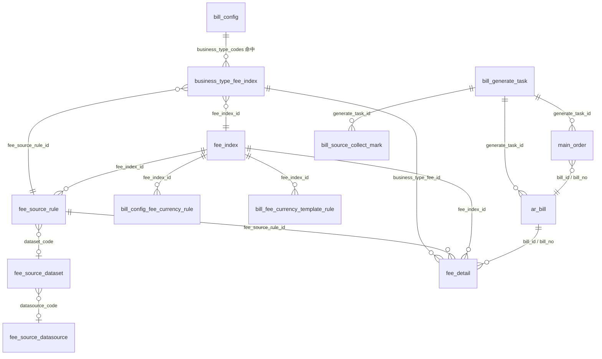

# 2026-08-12 BMS 应收账单生成费项索引关联关系技术说明

**日期：** 2026-08-12
**适用范围：** `bms` 应收账单（`MEMBER_AR`）生成链路
**代码依据：** `BillGenerateServiceImpl` / `BillGenerateMapper`
**数据依据：** `aidocs/technical-caliber/sql/ar_bill.sql`、`tmall_bms` 实际库

---

## 1. 文档目的

本文说明应收账单生成时，客户侧费项索引及其关联表之间的真实关系，包括：

1. `fee_index`、`business_type_fee_index`、`fee_source_rule`、`fee_source_dataset`、`fee_source_datasource` 各自承担什么职责。
2. 生成时实际执行的关联 SQL 是什么。
3. 费项规则如何拆成 `fee_detail`，最终如何汇总进 `ar_bill`。
4. 币种规则、来源打标、订单快照等周边关系。
5. 数据库现状：哪些是外键约束，哪些只是逻辑关联。

本文只覆盖客户应收账单，不展开返款账单、成本账单和成本费项索引 `cost_fee_index`。

---

## 2. 总体结论

应收账单生成时，费项索引不是单表直连，而是走下面这条规则链：

```text
bill_config.business_type_codes
  -> business_type_fee_index（业务类型 + 费项 + 取数规则绑定）
  -> fee_index（费项主数据）
  -> fee_source_rule（取数规则）
  -> fee_source_dataset（来源数据集）
  -> fee_source_datasource（JDBC 数据源连接）
  -> OFP/CXMS 来源表取数
  -> fee_detail（费用快照）
  -> ar_bill（应收账单）
```

关键结论：

1. `fee_index` 只定义“费项是什么”，不直接定义来源表。
2. `business_type_fee_index` 是“业务类型、费项、取数规则”三者的绑定表，是生成入口。
3. `fee_source_rule` 定义“从哪里取、取哪个字段、按什么过滤”。
4. `fee_source_dataset` 定义公共来源数据集、履约时间字段和分页窗口。
5. `fee_source_datasource` 定义运行时 JDBC 连接。
6. 最终 `fee_detail` 同时保存 `fee_index_id`、`fee_source_rule_id`、`business_type_fee_id`，再通过 `bill_id / bill_no` 挂到 `ar_bill`。

---

## 3. 核心关系图



---

## 4. 表职责与关联键

| 表 | 职责 | 关键关联键 | 是否带 sc/shop/user |
| --- | --- | --- | --- |
| `fee_index` | 客户侧费项主数据，定义费项编码、名称、类型、挂靠对象 | `id`、`fee_code` | 否，全局共享配置 |
| `business_type_fee_index` | 业务类型与费项、取数规则的绑定，保存费项快照 | `business_type_code + fee_index_id + fee_source_rule_id` | 否 |
| `fee_source_rule` | 费项取数规则，定义来源系统、来源表、金额/币种/时间字段、过滤参数 | `id`、`fee_index_id`、`dataset_code`、`datasource_code` | 否 |
| `fee_source_dataset` | 公共来源数据集，定义主表、join SQL、履约时间列、分页策略 | `dataset_code`、`datasource_code` | 否 |
| `fee_source_datasource` | 数据源连接配置，运行时解析 JDBC URL | `datasource_code` | 否 |
| `bill_config` | 账单配置，定义客户、业务类型、账期、币种、履约节点 | `id`、`business_type_codes`、`parent_config_id` | 是 |
| `bill_config_fee_currency_rule` | 某业务类型 + 某费项的收费币种规则 | `bill_config_id + business_type_code + fee_code`，附带 `fee_index_id` | 否 |
| `bill_fee_currency_template` / `_rule` | 目的国/业务场景收费币种模板 | `template_id`，明细附带 `fee_index_id`、`fee_code` | 否 |
| `fee_detail` | 费用快照，生成链路最终落库结果 | `fee_index_id`、`fee_source_rule_id`、`business_type_fee_id`、`bill_id`、`bill_no` | 是 |
| `ar_bill` | 应收账单主表 | `id`、`bill_no`、`bill_config_id`、`generate_task_id` | 是 |
| `main_order` | 进入账单的主订单快照 | `bill_id`、`bill_no`、`generate_task_id` | 是 |
| `bill_source_collect_mark` | 来源归集标记和跨库打标补偿记录 | `bill_id`、`bill_no`、`source_system + source_table + source_id` | 是 |

---

## 5. 生成时实际执行的关联 SQL

应收账单生成时，`BillGenerateMapper.queryFeeRules` 按 `bill_config.business_type_codes` 查询启用规则：

```sql
SELECT btfi.id AS business_type_fee_id,
       btfi.business_type_code,
       btfi.fee_index_id,
       btfi.fee_source_rule_id,
       btfi.fee_code,
       btfi.fee_name,
       fi.fee_type,
       fi.attachment_object,
       fsr.source_system,
       fsr.datasource_code,
       fsr.dataset_code,
       fsd.dataset_name,
       fsr.source_table,
       fsr.source_amount_column,
       fsr.source_currency_column,
       fsr.source_converted_amount_column,
       fsr.source_converted_currency_column,
       fsr.source_time_column,
       fsd.weight_outbound_time_column,
       fsd.sign_time_column,
       fsd.order_completed_time_column,
       fsd.received_time_column,
       fsd.incremental_time_column,
       fsd.supported_contract_nodes,
       fsd.query_window_days,
       fsd.query_page_size,
       fsr.filter_params_json
FROM business_type_fee_index btfi
JOIN fee_index fi ON fi.id = btfi.fee_index_id
JOIN fee_source_rule fsr ON fsr.id = btfi.fee_source_rule_id
LEFT JOIN fee_source_dataset fsd ON fsd.dataset_code = fsr.dataset_code
WHERE btfi.enabled = 1
  AND fsr.enabled = 1
  AND FIND_IN_SET(btfi.business_type_code, #{businessTypeCodes}) > 0
ORDER BY btfi.priority, btfi.id
```

说明：

1. `#{businessTypeCodes}` 来自 `bill_config.business_type_codes`，例如 `CONSOLIDATION`、`PEER`、`ECOMMERCE`。
2. `fee_index` 和 `fee_source_rule` 使用 `INNER JOIN`，缺失任一配置该规则不会进入生成。
3. `fee_source_dataset` 使用 `LEFT JOIN`，兼容历史规则未配置 `dataset_code` 的情况。
4. 费项编码、名称取 `business_type_fee_index` 快照，费项类型、挂靠对象取 `fee_index` 当前值。

---

## 6. 规则如何拆成 fee_detail

规则取回后，`BillGenerateServiceImpl` 按 `source_table` 分流：

| `fee_source_rule.source_table` | 采集分支 | 说明 |
| --- | --- | --- |
| `sale_order_header` | 订单宽表 | 从订单主表取金额字段 |
| `sale_order_header_extend` | 订单宽表 | 从订单扩展表取金额字段 |
| `sale_order_additional_matter` | 附加费 | 按 `fee_item_type` 命中 `filter_params_json` |
| `claim_order` | 理赔 | 按理赔审核、支付状态过滤 |

每命中一条来源数据，生成服务按规则构造一条 `fee_detail`，核心落库字段包括：

```text
fee_index_id        = business_type_fee_index.fee_index_id
fee_source_rule_id  = business_type_fee_index.fee_source_rule_id
business_type_fee_id= business_type_fee_index.id
business_type_code  = business_type_fee_index.business_type_code
fee_code/fee_name   = business_type_fee_index 快照
fee_type            = fee_index.fee_type
source_table        = fee_source_rule.source_table
source_amount_column= fee_source_rule.source_amount_column
bill_id/bill_no     = 当前 ar_bill
```

`fee_detail` 的幂等键当前为：

```text
source_table : source_id : fee_code : bill_config_id
```

---

## 7. 币种规则链

费项索引还通过 `fee_index_id` 或 `fee_code` 关联两套币种规则：

1. 账单配置级：`bill_config_fee_currency_rule`
   - 关联键：`bill_config_id + business_type_code + fee_code`
   - 附带字段：`fee_index_id`
   - 币种模式：`CONFIG_DEFAULT` / `SOURCE` / `FIXED`

2. 目的国/业务场景模板级：`bill_fee_currency_template` + `bill_fee_currency_template_rule`
   - 模板按 `business_type_code`、目的国匹配
   - 模板明细按 `fee_index_id`、`fee_code` 匹配

生成时优先级为：账单配置显式规则 → 当前配置选中模板 → 公共模板兜底 → 账单默认币种/来源币种。

---

## 8. 数据隔离与快照说明

1. `fee_index`、`business_type_fee_index`、`fee_source_rule`、`fee_source_dataset`、`fee_source_datasource` 都是全平台共享配置，不带 `sc_id/shop_id/user_id`。
2. `bill_config`、`bill_generate_task`、`ar_bill`、`fee_detail`、`main_order`、`bill_source_collect_mark` 才带数据隔离三字段。
3. `ar_bill` 保存 `config_no`、`config_version`、`config_snapshot_json` 配置快照；`bill_generate_task` 保存 `fee_rule_snapshot_json` 费项规则快照。
4. 费项编码/名称使用 `business_type_fee_index` 快照，历史账单不会因 `fee_index` 改名而失真。

---

## 9. 数据库现状核对

已通过 `tmall_bms` 实际库核对：

1. 上述表之间没有物理外键，`information_schema.KEY_COLUMN_USAGE` 查不到对应 `REFERENCED_TABLE_NAME`。
2. 关联关系全部由普通索引和唯一键承载，例如：
   - `fee_index.uk_fee_code`
   - `business_type_fee_index.uk_business_fee_rule`
   - `fee_source_rule.uk_fee_source`
   - `fee_source_dataset.uk_dataset_code`
   - `fee_source_datasource.uk_datasource_code`
   - `fee_detail.uk_fee_dedupe`
   - `ar_bill.uk_ar_bill_period_sector_country`
3. 当前库内 `fee_source_dataset` 已有 4 个数据集：`CONSOLIDATION_ORDER`、`CONSOLIDATION_ADDITIONAL_FEE`、`CLAIM_ORDER_APPROVED_UNPAID`、`COD_REFUND_MAIN_ORDER`；应收账单主要使用前三个。

现状边界：

1. `fee_source_dataset` 已保存 `main_table`、`join_sql`、`base_where_expr`，但当前应收生成 SQL 仍按 `source_table` 硬编码分支，数据集主要提供履约时间字段和分页窗口，尚未完全驱动生成 SQL。
2. `queryFeeRules` 实际只过滤 `btfi.enabled` 和 `fsr.enabled`，未直接过滤 `fee_index.enabled`；停用费项时需同时停用业务类型关联或来源规则，避免“费项主数据已停用但生成仍命中”的误解。

---

## 10. 常用核对 SQL

以下 SQL 均为只读核对，可用于排查费项规则和生成结果：

```sql
-- 业务类型费项 -> 费项主数据 -> 取数规则 -> 数据集
SELECT btfi.id,
       btfi.business_type_code,
       btfi.fee_index_id,
       btfi.fee_source_rule_id,
       btfi.fee_code,
       btfi.fee_name,
       fi.fee_type,
       fi.attachment_object,
       fsr.dataset_code,
       fsd.dataset_name,
       fsr.source_table,
       fsr.source_amount_column
FROM business_type_fee_index btfi
JOIN fee_index fi ON fi.id = btfi.fee_index_id
JOIN fee_source_rule fsr ON fsr.id = btfi.fee_source_rule_id
LEFT JOIN fee_source_dataset fsd ON fsd.dataset_code = fsr.dataset_code
ORDER BY btfi.business_type_code, btfi.priority, btfi.id;
```

```sql
-- 应收账单 -> 费用明细 -> 费项索引/来源规则
SELECT b.bill_no,
       f.fee_no,
       f.fee_index_id,
       f.fee_source_rule_id,
       f.business_type_fee_id,
       f.fee_code,
       f.fee_name,
       f.fee_type,
       f.source_table,
       f.source_id,
       f.amount_fee_currency,
       f.fee_currency,
       f.amount_bill_currency,
       f.bill_currency
FROM ar_bill b
JOIN fee_detail f ON f.bill_id = b.id AND f.bill_no = b.bill_no
ORDER BY b.id DESC, f.id DESC
LIMIT 20;
```

---

## 11. 参考文档

1. `aidocs/product-caliber/bms/prd/reference/bms-fee-source-dataset-design.md`
2. `aidocs/product-caliber/bms/prd/reference/bms-bill-generate-code-design.md`
3. `aidocs/technical-caliber/bms/dev-specs/bms-ar-bill-schema-relationship-diagram.md`
4. `aidocs/technical-caliber/sql/ar_bill.sql`
5. `bms/dao/src/main/java/com/szt/supplychain/bms/dao/mapper/BillGenerateMapper.java`
6. `bms/biz/src/main/java/com/szt/supplychain/bms/biz/service/impl/BillGenerateServiceImpl.java`
