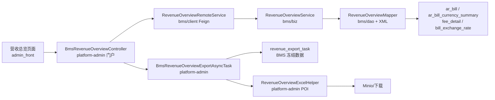

# 2026-08-13 BMS 营收总览需求落地方案及调整计划

**日期：** 2026-08-13
**最后更新：** 2026-08-13（按当前已实现口径更新）
**需求依据：** `aidocs/product-caliber/bms/prd/PRD.账单系统.md` 第 13 章“营收总览”，原型地址 `http://192.168.2.2:10520/#/billing/revenue-overview`，源码原型 `aidocs/product-caliber/bms/prototype/src/billing/views/ReceivableSummaryView.vue`
**适用项目：** `admin_front`（Vue 2.6 + Element UI）、`platform-admin`、`bms`
**文档性质：** 需求落地方案、调整计划与疑问点
**落地状态：** 首版功能已实现并提交；`bms`、`platform-admin`、`admin_front` 编译验证通过；部分数据质量、权限和回归项仍待产品/环境确认

对应提交（本地仓库）：

- `bms`：`5b01626` 新增营收总览页面及异步导出功能
- `platform-admin`：`034b7a66f` 新增营收总览页面及异步导出功能、`dc7108b05` 更新营收概览页面功能和界面优化
- `admin_front`：`5c6fca98` 新增营收总览页面及异步导出功能、`391a8733` 优化营收总览导出任务状态展示与交互、`960efb69` 更新营收概览页面功能和界面优化

## 1. 目标与边界

在 `admin_front` 财务端新增“营收总览”菜单和页面，让财务在顶部已选定供应链范围内，按店铺及其下属客户集中查看应收账单的收款进度。页面只读取 BMS 应收账单已形成的有效结果，不替代账单生成、审核、核销或调账操作。

本期实现范围：

1. 新增“营收总览”菜单，位于“财务日常”分组内、应收账单上方。
2. 新增店铺金额总览（人民币）、客户汇总列表、客户应收账单下钻、异步导出四个核心能力。
3. 查询、下钻、导出均遵循 PRD 口径：店铺指标只受店铺和账期范围影响，客户筛选条件只过滤客户汇总与下钻，不改变店铺总览。
4. 异步导出按“当前查询条件创建任务、后台生成 Excel、页面任务卡片轮询并下载”落地，不替代客户对账报表。

本期不做：

1. 不修改账单生成、审核、核销、调账、汇率快照既有逻辑。
2. 不引入页面侧重新计算费项、汇率或核销金额；页面只读已有账单结果。
3. 不新增账单状态或修改状态机。
4. 不直接修改数据库内容；环境数据仅用于只读核对。

## 2. PRD 口径整理

### 2.1 有效账单与状态

| PRD 状态 | 现有 `ar_bill.bill_status` | 说明 |
| --- | --- | --- |
| 待审核 | `GENERATED` | 计入应收金额，同时单独列示“待审核金额” |
| 待结清 | `PENDING_SETTLEMENT` | 计入总表 |
| 已结清 | `PAID` | 计入总表 |
| 候选/作废/失效 | `DRAFT`、`GENERATING`、`CONFIRMED`、`VOID` 等 | 不进入总表 |

只读核对结论：`tmall_bms.ar_bill` 中 `bill_type='MEMBER_AR' AND is_deleted=0` 当前共 18 张，其中有效状态 17 张（`GENERATED=10`、`PENDING_SETTLEMENT=4`、`PAID=2`），`GENERATING=1`、`CONFIRMED=1` 不进入总表。

### 2.2 指标口径

| 指标 | 口径 |
| --- | --- |
| 应收金额 | 当前有效应收账单各结算币种的应结金额之和 |
| 已收金额 | 当前有效应收账单各结算币种的已结金额之和；只统计有效核销结果 |
| 应收未收金额 | 当前有效应收账单各结算币种的未结金额之和 |
| 逾期未收金额 | 信用期结束日早于当前日期且未结金额大于零的账单未结金额之和 |
| 待审核金额 | `GENERATED` 有效应收账单的应结金额之和，进入应收金额但单独列示 |
| 未结账单数 | 未结金额大于零的有效应收账单数量；同一账单多币种只计一张 |

逾期判定使用实时日期：`credit_period_end_date < CURDATE() AND unpaid_amount > 0`；未逾期为 `unpaid_amount > 0 AND credit_period_end_date >= CURDATE()`（信用期结束日为空的未结账单不进入“逾期”）。

### 2.3 归属、币种与筛选

1. 店铺金额总览按账单店铺快照分组，只受店铺和账期范围影响；客户、结算币种、未收状态筛选不参与店铺总览。
2. 客户汇总按“店铺快照 + 客户主体 + 结算币种”形成一行，同一客户多币种分别成行。
3. 结算币种默认不选，未选择时按币种分别展示；选择后仅筛选客户汇总列表。
4. 月份范围按 `billing_period_end_date` 所属月份筛选；日期范围按 `billing_period_end_date` 落入起止日期筛选。
5. 客户名称、客户编号、会员编码支持关键字模糊查询；客户编号下钻账单明细，账单编号可跳转应收账单详情。
6. 导出必须同时保留店铺人民币汇总、客户结算币种汇总和下钻账单字段；导出为异步任务。

## 3. 现状核查

### 3.1 数据模型

| 表 | 与营收总览的关系 | 关键字段 |
| --- | --- | --- |
| `ar_bill` | 账单主表，提供客户/店铺快照、账期、信用期、状态、账单级金额 | `sc_id/shop_id/user_id`、`member_code/member_name/customer_no/customer_name`、`billing_period_end_date`、`credit_period_end_date`、`bill_status`、`receivable_amount/paid_amount/unpaid_amount` 及 `*_fin` |
| `ar_bill_currency_summary` | 按“账单 + 结算币种”的权威汇总，客户汇总与店铺折算的主数据源 | `bill_no/currency/fin_currency`、`receivable_amount/paid_amount/unpaid_amount`、`receivable_amount_fin/paid_amount_fin/unpaid_amount_fin` |
| `fee_detail` | 兼容历史账单的人民币折算快照来源 | `exchange_rate_to_fin`、`bill_currency/fin_currency` |
| `bill_exchange_rate` | 账单生成时锁定的汇率快照 | `conversion_currency_type='BILL_TO_FIN'`、`conversion_currency/conversion_direction/conversion_rate` |
| `revenue_export_task` | 新增营收总览异步导出任务表 | `task_no/sc_id/shop_id/user_id/task_status/query_snapshot_json/data_snapshot_json/file_key/failure_reason/file_expire_at/finished_at` |

`revenue_export_task` 完整 CREATE TABLE 已归档到 `aidocs/technical-caliber/sql/ar_bill.sql`（约 1382 行起）。导出功能上线前需先在目标库执行该 DDL。

### 3.2 后端

1. `bms` 六模块结构完整：`common/model/dao/biz/client/web` 均已新增营收总览相关文件。
2. BMS 提供 `/api/bms/revenue-overview/*` 查询与导出任务接口，Feign 契约在 `bms/client`。
3. platform-admin 提供 `/portal/bms/revenueOverview/*` 门户接口，从登录态注入 `scId/userId`，前端不传 `scId`。
4. platform-admin 有 `poi-ooxml/EasyExcel` 与 `BmsFinanceExportExcelHelper`，营收总览使用独立 `RevenueOverviewExcelHelper` 生成文件。

### 3.3 前端

1. 路由文件：`admin_front/src/router/billing.js`，新增 `billing/revenueOverview`，`meta.code='revenue_overview'`。
2. API 文件：`admin_front/src/api/billing.js`，统一走 `/platform/portal/bms/revenueOverview/...`，组件无直接 axios 调用。
3. 菜单：`admin_front/src/layout/components/Sidebar/SiderPopup.vue` 的“财务日常”分组中，营收总览位于应收账单上方。
4. 店铺下拉：复用 `getShopDataList`（`@/api/system`）+ `normalizeShopOption`（`@/utils/bmsDisplay`）。
5. 当前供应链：`admin_front` 通过会话 `casSession.currentScId/currentOrgId` 取得，后端 platform-admin 从登录态注入 `scId`，前端请求不传 `scId`。
6. 应收账单详情路由已存在 `/billing/receivableBill`，下钻账单编号直接跳转该路由。

## 4. 差距清单

| 编号 | 差距 | 影响 | 当前状态 |
| --- | --- | --- | --- |
| G1 | 无营收总览查询接口（店铺总览、客户汇总分页、账单下钻分页） | 页面无数据源 | 已实现 |
| G2 | 无人民币折算统一口径；`ar_bill_currency_summary.*_fin` 数据质量不齐 | 店铺总览可能算错或遗漏 | 已实现折算规则，历史数据质量仍待确认 |
| G3 | 无营收总览异步导出任务、导出文件生成和下载入口 | PRD 13.6 异步导出缺失 | 已实现 |
| G4 | 无营收总览页面、路由、API、菜单 | 用户无入口 | 已实现 |
| G5 | 菜单顺序：营收总览需在应收账单上方 | 简单调整 | 已实现 |
| G6 | 下钻账单需跳转应收账单详情 | 复用现有路由即可 | 已实现 |
| G7 | 有效状态筛选需统一常量 | 需新增营收总览状态集合常量 | 已实现 `RevenueOverviewConstants` |
| G8 | `ar_bill`/`ar_bill_currency_summary` 查询没有面向“账期结束月/日区间 + 多状态 + 多币种汇总”的聚合 SQL | 需新增 Mapper/XML | 已实现 |

## 5. 落地方案（当前实现）

### 5.1 总体架构

职责边界：

1. `bms` 负责全部查询口径、状态过滤、人民币折算、客户汇总分页、账单下钻、导出任务创建与冻结数据。
2. `platform-admin` 只做登录态注入（`scId/userId`）、门户转发、异步任务提交、Excel 文件生成与下载。
3. `admin_front` 负责页面交互、查询、下钻、导出任务创建/轮询/下载。

### 5.2 人民币折算口径（统一规则）

店铺金额总览为人民币，按以下优先级折算，禁止直接相加原币金额、禁止使用当前市场汇率重算历史账单：

1. 优先使用 `ar_bill_currency_summary` 的 `receivable_amount_fin/paid_amount_fin/unpaid_amount_fin`，但仅当 `fin_currency='CNY'` 且对应本位币金额非空且不等于 0 时直接采用。
2. 同币种账单（`currency='CNY'` 或 `fin_currency='CNY'` 且 `currency='CNY'`）折算汇率固定为 1。
3. 缺失时读取 `bill_exchange_rate.conversion_currency_type='BILL_TO_FIN'` 的账单级锁定快照；`conversion_direction='MUL'` 直接乘，`DIV` 取倒数。
4. 仍缺失时按 `fee_detail` 中该账单、该结算币种的有效 `exchange_rate_to_fin` 快照折算（费项快照，不重新计算费项金额）。
5. 仍缺失时调用 `CustomerExchangeRateService.resolveConfiguredRate` 按客户/基准/店铺配置兜底，并在响应中记录 `rateFallbackWarnings`，前端提示“部分账单按当前汇率配置折算”。
6. 所有折算结果统一 `BigDecimal.setScale(4, RoundingMode.HALF_UP)`。

该口径只用于店铺总览人民币展示和导出店铺 Sheet；客户汇总保留结算币种原币金额，不做覆盖折算。

### 5.3 后端新增模块（`bms`）

| 文件 | 说明 |
| --- | --- |
| `common/constant/RevenueOverviewConstants.java` | 人民币币种、账期模式、未收状态、导出任务状态、有效应收账单状态集合 |
| `model/dto/RevenueOverviewQueryReqDTO` | 店铺、账期（月份/日期）、客户关键字、结算币种、未收状态、分页；含 `scId/shopId/userId` |
| `model/dto/RevenueOverviewShopSummaryDTO` | 店铺总览：应收、已收、应收未收、逾期未收、待审核、未结账单数、汇率兜底告警 |
| `model/dto/RevenueOverviewShopRowDTO` | 店铺汇总原始行 |
| `model/dto/RevenueOverviewCurrencyAmountDTO` | 店铺 Sheet 按结算币种汇总行 |
| `model/dto/RevenueOverviewCustomerSummaryDTO` | 客户汇总行：店铺、客户、会员编码、币种、金额指标、账单数、未结账单数、最早到期日、状态 |
| `model/dto/RevenueOverviewCustomerRowDTO` | 客户汇总原始行 |
| `model/dto/RevenueOverviewCustomerSummaryPageRespDTO` | 客户汇总分页响应 |
| `model/dto/RevenueOverviewBillDTO` | 下钻账单：账单编号、账期、信用期结束日、应收/已收/应收未收、状态、账单发出时间 |
| `model/dto/RevenueOverviewBillPageRespDTO` | 下钻账单分页响应 |
| `model/dto/RevenueOverviewRateSnapshotDTO` | 汇率快照查询结果 |
| `model/dto/RevenueOverviewExportSnapshotDTO` | 导出数据快照：店铺总览 + 客户汇总 + 下钻账单 |
| `model/dto/RevenueOverviewExportTaskCreateReqDTO` | 异步导出创建请求 |
| `model/dto/RevenueOverviewExportTaskCreateRespDTO` | 创建结果（任务 ID、任务号、状态） |
| `model/dto/RevenueOverviewExportTaskStatusReqDTO` | 任务状态/下载查询请求 |
| `model/dto/RevenueOverviewExportTaskStatusRespDTO` | 任务状态响应 |
| `model/dto/RevenueOverviewExportTaskDetailRespDTO` | 任务详情（含查询/数据快照、文件键、失败原因） |
| `model/dto/RevenueOverviewExportTaskParamDTO` | 异步任务执行参数 |
| `model/dto/RevenueOverviewExportTaskUpdateReqDTO` | 任务状态更新请求 |
| `model/entity/RevenueExportTask.java` | `revenue_export_task` 实体 |
| `dao/mapper/RevenueOverviewMapper.java` + `sqlmap/RevenueOverview-mapper.xml` | 店铺汇总、客户汇总 count/page、下钻 count/page、导出全量数据、汇率快照、任务增改查 |
| `biz/service/RevenueOverviewService.java` + `impl/RevenueOverviewServiceImpl.java` | 查询与折算、导出任务创建/进度/更新 |
| `client/api/RevenueOverviewRemoteService.java` | Feign 契约 |
| `web/controller/RevenueOverviewController.java` | `implements RevenueOverviewRemoteService`，`/api/bms/revenue-overview/*` |

核心 SQL 规则：

1. 店铺总览 `JOIN ar_bill_currency_summary` 聚合，`ar_bill` 条件固定为 `bill_type='MEMBER_AR' AND is_deleted=0 AND bill_status IN (GENERATED,PENDING_SETTLEMENT,PAID)`，再叠加 `sc_id`、`shop_id`、`billing_period_end_date` 区间。
2. 客户汇总以 `(shop_id, member_code, customer_no, member_name, customer_name, currency)` 分组，金额直接取币种汇总字段，逾期金额按“信用期结束日 < 当前日期且未结 > 0”的账单汇总。
3. 未结账单数按“未结金额 > 0 的账单号去重”统计，多币种只计一次。
4. 月份范围转换为 `billing_period_end_date` 所属月份的起止日期；日期范围直接比较 `billing_period_end_date`。
5. 下钻账单按客户汇总行（店铺 + 客户主体 + 币种）分页，默认只列当前筛选范围内的有效应收账单。

### 5.4 platform-admin 调整

| 文件 | 说明 |
| --- | --- |
| `web/controller/BmsRevenueOverviewController.java` | `@RequestMapping("/portal/bms/revenueOverview")`，从登录态注入 `scId/userId`，转发 BMS Feign，提交异步任务 |
| `biz/support/RevenueOverviewExcelHelper.java` | 生成三 Sheet Excel：店铺人民币总览、客户结算币种汇总、客户应收账单 |
| `biz/src/main/java/com/szt/supplychain/admin/asynctask/BmsRevenueOverviewExportAsyncTask.java` | 继承 `EntireFileDownloadTask`，执行器名 `bmsRevenueOverviewExportAsyncTask`，读取冻结数据生成并上传文件 |

门户接口：

| 接口 | 说明 |
| --- | --- |
| `POST /portal/bms/revenueOverview/shop-summary` | 店铺金额总览（人民币） |
| `POST /portal/bms/revenueOverview/customer/page` | 客户结算币种汇总分页 |
| `POST /portal/bms/revenueOverview/bill/page` | 客户应收账单下钻分页 |
| `POST /portal/bms/revenueOverview/export/task/create` | 创建异步导出任务 |
| `POST /portal/bms/revenueOverview/export/task/status` | 查询任务状态 |
| `POST /portal/bms/revenueOverview/export/task/download-url` | 获取临时下载地址（30 分钟有效） |

导出任务状态机沿用 `bill_export_task` 的模式：`WAITING/RUNNING/SUCCESS/PARTIAL_SUCCESS/FAILED/CANCELLED`。当前执行器实际写入 `RUNNING/SUCCESS/FAILED`；`PARTIAL_SUCCESS/CANCELLED` 作为状态机保留值。

### 5.5 异步导出数据方案（已落地）

采用独立 `revenue_export_task` 表，不混用 `bill_export_task`。已归档 DDL 字段：`task_no/sc_id/shop_id/user_id/task_status/query_snapshot_json/data_snapshot_json/file_key/failure_reason/file_expire_at/finished_at`，含逻辑删除和审计字段，索引覆盖任务编号、隔离字段、用户任务列表。

创建流程：

1. 页面点击“导出”，提交当前店铺、账期、客户筛选条件。
2. platform-admin 注入 `scId/userId`，BMS 在事务内冻结查询条件、店铺总览、客户汇总（全量，不受页大小限制）和下钻账单数据。
3. 创建成功后 platform-admin 提交 `BmsRevenueOverviewExportAsyncTask`。
4. 执行器通过 `expectedStatus` 乐观更新任务：`WAITING -> RUNNING -> SUCCESS/FAILED`；成功写入 `file_key`，`file_expire_at` 为 1 天。
5. 页面轮询任务状态；成功后获取 30 分钟临时下载地址并自动触发下载。

当前实现按“创建任务时冻结结果”执行，未实现 PRD 13.6 的“汇总金额与账单明细不一致时阻止导出”的显式一致性校验，该点保留为疑问点。

### 5.6 前端调整（`admin_front`）

| 文件 | 调整 |
| --- | --- |
| `src/views/billing/revenueOverview/index.vue` | 新页面：店铺范围区、店铺金额总览卡片、客户筛选区、客户汇总表格、下钻抽屉、导出任务卡片 |
| `src/api/billing.js` | 新增 `queryRevenueOverviewShopSummary`、`queryRevenueOverviewCustomerPage`、`queryRevenueOverviewBillPage`、`createRevenueOverviewExportTask`、`queryRevenueOverviewExportTaskStatus`、`getRevenueOverviewExportDownloadUrl` |
| `src/router/billing.js` | 新增 `billing/revenueOverview` 路由，`meta.code='revenue_overview'` |
| `src/layout/components/Sidebar/SiderPopup.vue` | “财务日常”分组中在应收账单上方新增“营收总览”，新增 `openRevenueOverview()` |

页面行为（当前已实现）：

1. 店铺默认不选（全部店铺），账期默认月份范围为当前月；月份与日期模式切换后提交查询。
2. 查询、重置按钮统一放在店铺范围区；客户筛选区只保留客户关键字、结算币种、未收状态和导出按钮，不再重复提供查询/重置。
3. 查询一次同时提交店铺范围区和客户筛选区；店铺总览请求与客户汇总请求同条件提交，但客户筛选不参与店铺总览。
4. 客户汇总行“查看账单”打开右侧抽屉，按店铺 + 客户主体 + 币种分页查询账单；抽屉顶部展示客户、会员编码、结算币种、应收未收摘要，账单编号跳转 `/billing/receivableBill`。
5. 导出按钮创建异步任务；页面展示任务卡片（任务号、状态、进度条），导出中禁用导出按钮。
6. 导出进度为前端假进度：创建任务后从 8% 开始每 800ms 随机增加 2%-8%，封顶 95%；轮询到成功直接到 100% 并自动下载，失败/取消/轮询失败也落到 100% 并显示红色异常状态。
7. 任务卡片提供下载文件、重新导出、关闭；失败时展示失败原因。

## 6. 调整清单（按落地顺序）

| 阶段 | 工作项 | 状态 |
| --- | --- | --- |
| 1 | 确认口径与疑问点（见第 9 节） | 疑问点保留，待产品确认 |
| 2 | 新增 `revenue_export_task` 表并归档 DDL | 已完成，DDL 已写入 `ar_bill.sql` |
| 3 | 新增 `RevenueOverview*DTO`、常量、实体 | 已完成 |
| 4 | 新增 `RevenueOverviewMapper` + XML | 已完成 |
| 5 | 新增 `RevenueOverviewService` | 已完成 |
| 6 | 新增 `RevenueOverviewRemoteService`、`RevenueOverviewController` | 已完成 |
| 7 | 新增 platform-admin 门户控制器、异步任务、Excel helper | 已完成 |
| 8 | 新增前端页面、API、路由、菜单 | 已完成 |
| 9 | 前端交互优化：统一查询/重置、导出任务卡片与假进度、下钻抽屉 | 已完成 |
| 10 | 导出 Excel 列宽与冻结表头优化 | 已完成，需重启 platform-admin 后生效 |
| 11 | 编译与联调验证 | 已完成：bms、platform-admin `test-compile`，admin_front Node 14 构建 |

## 7. 实施计划

| 阶段 | 工作项 | 状态 |
| --- | --- | --- |
| P1 | 数据库与 BMS 查询服务 | 已完成：三组 SQL 与人民币折算规则已实现 |
| P2 | Feign 与门户 | 已完成：`/portal/bms/revenueOverview/*` 已接入，`scId` 从登录态注入 |
| P3 | 异步导出 | 已完成：创建任务、冻结数据、生成三 Sheet Excel、上传下载、页面轮询 |
| P4 | 前端页面与菜单 | 已完成：查询、筛选、下钻抽屉、导出卡片 |
| P5 | 数据核对 | 部分完成：当前库已只读核对；正式环境数据核对待产品确认口径后执行 |
| P6 | 回归 | 待执行：有效核销/反核销/审核/作废后页面刷新结果一致 |

## 8. 验收清单

- [x] 菜单“营收总览”位于“财务日常”分组应收账单上方。
- [x] 页面默认账期为当前月，店铺默认全部，可切换月份/日期范围。
- [x] 店铺金额总览（应收、已收、应收未收、逾期未收）为人民币，只受店铺和账期影响。
- [x] 客户筛选（客户关键字、结算币种、未收状态）只影响客户汇总和下钻，不影响店铺总览。
- [x] 客户区无独立查询/重置按钮，统一使用店铺区查询、重置。
- [x] 客户汇总按“店铺 + 客户主体 + 结算币种”成行，同一客户多币种分别成行。
- [x] 未结账单数按账单去重，多币种只计一张。
- [x] 逾期按实时日期 `credit_period_end_date < 当前日期` 判定。
- [x] 下钻账单只列有效应收账单，账单编号可跳转应收账单详情。
- [x] 下钻展示改为右侧抽屉，含客户摘要和账单明细表格。
- [x] 导出为异步任务，导出内容包含店铺人民币总览、客户结算币种汇总、下钻账单字段。
- [x] 导出状态卡片展示任务号/状态/进度，成功直接到 100%，失败展示原因。
- [x] 导出 Excel 已设置固定列宽，客户汇总和账单明细 Sheet 冻结首行。
- [x] 新增表 DDL 完整归档至 `aidocs/technical-caliber/sql/ar_bill.sql`。
- [x] 前端 API 全部位于 `src/api/`，组件无直接 axios 调用。
- [x] BMS 代码通过 `mvn -f bms/pom.xml -pl web -am test-compile`（JDK 8）。
- [x] platform-admin 代码通过 `mvn -f platform-admin/pom.xml -pl web -am test-compile`（JDK 8）。
- [ ] 目标环境已执行 `revenue_export_task` DDL。
- [ ] platform-admin 已重启，导出文件实际列宽验证通过。
- [ ] 正式环境数据核对与回归验收完成。

## 9. 疑问点

### 9.1 数据质量与折算

1. `ar_bill_currency_summary.fin_currency` 为空、`*_fin=0` 或本位币金额异常的历史数据是否需要先行数据修复？当前实现已按“优先快照、缺失时 fee_detail 快照、再兜底当前汇率配置”处理，但兜底金额可能与历史账单生成时口径不一致，需要产品确认是否接受。
2. `bill_exchange_rate` 的 `BILL_TO_FIN` 快照当前只有 4 张账单，多数账单依赖 `fee_detail.exchange_rate_to_fin`；是否要求账单生成链路补齐 `ar_bill_currency_summary` 本位币字段，作为营收总览的正式数据基线？
3. 同币种账单（如 `bill_currency=fin_currency=TWD`）的店铺总览折算汇率按 1 处理，是否仍需要按财务本位币 CNY 显示？PRD 明确店铺总览统一人民币，TWD 非 CNY 时不能按 1 直接相加，需要产品确认“财务本位币”是否统一为 CNY，并确认 TWD 账单在无 `BILL_TO_FIN` 快照时的折算来源。

### 9.2 导出

4. 营收总览导出的下载入口当前放在页面内任务卡片；是否仍需要并入现有“BMS 导出管理”页？若产品要求统一入口，需要新增菜单或改造导出管理，并确认任务记录是否要进入 `bill_export_task` 的导出管理列表。
5. 导出冻结时点当前为“创建任务时冻结查询条件与结果”，导出期间核销/审核发生时页面沿用冻结数据。PRD 13.6 要求“汇总金额与账单明细不一致时阻止导出”，当前实现未做该显式一致性校验，需要产品确认是否补充以及判定规则。
6. 导出成功当前由前端自动调用下载地址；是否需要保留“仅提示已生成、由用户手动下载”的交互，避免自动下载被浏览器拦截。

### 9.3 权限

7. 菜单权限码使用 `revenue_overview`，是否需要在菜单系统/角色权限中同步配置？若需财务管理员与普通财务不同权限，需要明确权限码和按钮码。
8. “财务只能查看顶部已选定供应链及其数据权限范围内的店铺和客户”：当前 `getShopDataList` 与 `getCurrentScId` 已覆盖店铺范围，客户主数据查询涉及跨服务时，需要确认 platform-admin 侧的客户权限过滤来源。

### 9.4 页面细节

9. 客户筛选区支持“客户名称/客户编号/会员编码”任一关键字模糊查询，原型为客户下拉选择；当前已按关键字模糊匹配实现，是否满足产品预期。
10. “最早到期日”取客户汇总范围内未结账单最早的 `credit_period_end_date`，全部结清显示 `-`，与原型一致。
11. 下钻抽屉按 PRD 完整字段展示，包含账单发出时间；原型下钻只展示编号、账期、到期日、未收金额、状态，是否需要精简字段或保持现状。

## 10. 部署与验证注意

1. 导出功能依赖 `revenue_export_task` 表，正式/测试环境需先执行 `aidocs/technical-caliber/sql/ar_bill.sql` 中该表 DDL。
2. `platform-admin` 是 IDE 启动时，Excel helper 修改后必须重启进程才生效。
3. `admin_front` 使用 Node 14 运行，dev 端口 9528；不要用全局 Node 24 启动。
4. 异步导出依赖 async-task-center 与 Minio 配置，需确认目标环境可用。
5. `aidocs/technical-caliber/bms/deployment/env.md` 只用于只读核对，不修改内容。