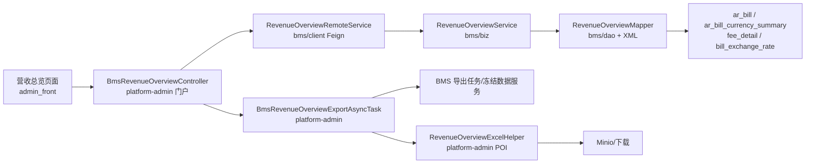

# 2026-08-13 BMS 营收总览需求落地方案及调整计划

**日期：** 2026-08-13
**需求依据：** `aidocs/product-caliber/bms/prd/PRD.账单系统.md` 第 13 章“营收总览”，原型地址 `http://192.168.2.2:10520/#/billing/revenue-overview`，源码原型 `aidocs/product-caliber/bms/prototype/src/billing/views/ReceivableSummaryView.vue`
**适用项目：** `admin_front`（Vue 2.6 + Element UI）、`platform-admin`、`bms`
**文档性质：** 需求落地方案、调整计划与疑问点

## 1. 目标与边界

在 `admin_front` 财务端新增“营收总览”菜单和页面，让财务在顶部已选定供应链范围内，按店铺及其下属客户集中查看应收账单的收款进度。页面只读取 BMS 应收账单已形成的有效结果，不替代账单生成、审核、核销或调账操作。

本期实现范围：

1. 新增“营收总览”菜单，位于“财务日常”分组内、应收账单上方。
2. 新增店铺金额总览（人民币）、客户汇总列表、客户应收账单下钻、异步导出三个核心能力。
3. 查询、下钻、导出均遵循 PRD 口径：店铺指标只受店铺和账期范围影响，客户筛选条件只过滤客户汇总与下钻，不改变店铺总览。
4. 异步导出按“当前查询条件创建任务、后台生成 Excel、导出管理/通知入口下载”落地，不替代客户对账报表。

本期不做：

1. 不修改账单生成、审核、核销、调账、汇率快照既有逻辑。
2. 不引入页面侧重新计算费项、汇率或核销金额；页面只读已有账单结果。
3. 不新增账单状态或修改状态机。
4. 不直接修改数据库内容；环境数据仅用于只读核对。

## 2. PRD 口径整理

### 2.1 有效账单与状态

| PRD 状态 | 现有 `ar_bill.bill_status` | 说明 |
| --- | --- | --- |
| 待审核 | `GENERATED` | 计入应收金额，同时单独列示“待审核金额” |
| 待结清 | `PENDING_SETTLEMENT` | 计入总表 |
| 已结清 | `PAID` | 计入总表 |
| 候选/作废/失效 | `DRAFT`、`GENERATING`、`CONFIRMED`、`VOID` 等 | 不进入总表 |

只读核对结论：`tmall_bms.ar_bill` 中 `bill_type='MEMBER_AR' AND is_deleted=0` 当前共 18 张，其中有效状态 17 张（`GENERATED=10`、`PENDING_SETTLEMENT=4`、`PAID=2`），`GENERATING=1`、`CONFIRMED=1` 不进入总表。

### 2.2 指标口径

| 指标 | 口径 |
| --- | --- |
| 应收金额 | 当前有效应收账单各结算币种的`应结金额`之和 |
| 已收金额 | 当前有效应收账单各结算币种的`已结金额`之和；只统计有效核销结果 |
| 应收未收金额 | 当前有效应收账单各结算币种的`未结金额`之和 |
| 逾期未收金额 | 信用期结束日早于当前日期且`未结金额`大于零的账单未结金额之和 |
| 待审核金额 | `GENERATED` 有效应收账单的`应结金额`之和，进入应收金额但单独列示 |
| 未结账单数 | `未结金额`大于零的有效应收账单数量；同一账单多币种只计一张 |

逾期判定使用实时日期：`credit_period_end_date < CURDATE() AND unpaid_amount > 0`；未逾期为 `unpaid_amount > 0 AND credit_period_end_date >= CURDATE()`（信用期结束日为空的未结账单不进入“逾期”）。

### 2.3 归属、币种与筛选

1. 店铺金额总览按账单`店铺快照`分组，只受店铺和账期范围影响；客户、结算币种、未收状态筛选不参与店铺总览。
2. 客户汇总按`店铺快照 + 客户主体 + 结算币种`形成一行，同一客户多币种分别成行。
3. 结算币种默认不选，未选择时按币种分别展示；选择后仅筛选客户汇总列表。
4. 月份范围按`billing_period_end_date`所属月份筛选；日期范围按`billing_period_end_date`落入起止日期筛选。
5. 客户名称、客户编号、会员编码支持查询；客户编号下钻账单明细，账单编号可跳转应收账单详情。
6. 导出必须同时保留店铺人民币汇总、客户结算币种汇总和下钻账单字段；导出为异步任务。

## 3. 现状核查

### 3.1 数据模型

| 表 | 与营收总览的关系 | 关键字段 |
| --- | --- | --- |
| `ar_bill` | 账单主表，提供客户/店铺快照、账期、信用期、状态、账单级金额 | `sc_id/shop_id/user_id`、`member_code/member_name/customer_no/customer_name`、`billing_period_end_date`、`credit_period_end_date`、`bill_status`、`receivable_amount/paid_amount/unpaid_amount` 及 `*_fin` |
| `ar_bill_currency_summary` | 按“账单 + 结算币种”的权威汇总，客户汇总与店铺折算的主数据源 | `bill_no/currency/fin_currency`、`receivable_amount/paid_amount/unpaid_amount`、`receivable_amount_fin/paid_amount_fin/unpaid_amount_fin` |
| `fee_detail` | 兼容历史账单的人民币折算快照来源 | `exchange_rate_to_fin`、`bill_currency/fin_currency` |
| `bill_exchange_rate` | 账单级锁定汇率快照 | `conversion_currency_type='BILL_TO_FIN'`、`conversion_direction`、`exchange_rate` |
| `base_exchange_rate`、`customer_exchange_rate_rule` | 兜底汇率配置（实时配置，非历史快照） | 源币种/目标币种、生效状态 |
| `payment_writeoff_detail` | 核销明细，用于理解已收口径 | `writeoff_status='NORMAL'` 为有效核销，`REVERSED/VOID` 不计 |

只读核对发现的数据现状（写文档时点）：

1. `ar_bill_currency_summary` 当前 19 行；其中 `fin_currency` 为空 8 行、`receivable_amount_fin=0` 但 `receivable_amount<>0` 共 9 行，即部分历史/测试数据的本位币金额不可直接信任。
2. `bill_exchange_rate` 中 `conversion_currency_type='BILL_TO_FIN'` 且 `enabled=1` 只有 4 张账单有快照；`fee_detail.exchange_rate_to_fin` 覆盖 16 张有效应收账单，可作为缺失时的快照兜底。
3. 多数当前账单为同币种（`bill_currency=fin_currency=CNY` 或 `TWD`），同币种换算固定为 1。
4. `ar_bill_currency_summary` 无 `is_deleted`，按账单唯一键 `(bill_no, currency)` 维护，查询直接全量读取。
5. 已收口径无需重复汇总核销明细：`payment_writeoff_detail` 的冲正/作废已反映在 `ar_bill_currency_summary.paid_amount/unpaid_amount`，总表直接读币种汇总。

### 3.2 后端

1. `bms` 六模块布局完整：`common/model/dao/biz/web/client`。MyBatis SQL 在 `dao/src/main/resources/sqlmap/`。
2. `ArBillMapper` 已有 `selectCurrencySummariesByBillNo(s)`、`selectBillExchangeRatesByType`、`selectFinancialExchangeRatesFromFeeDetail` 等能力，但现有能力面向单张账单详情/导出，不适合直接承担全量营收总览聚合。
3. `CustomerExchangeRateServiceImpl.preview/resolveConfiguredRate` 可按“客户特调 > 基准 > 店铺 > 1”解析当前配置汇率，但属于实时配置，不是历史快照，只能作为最后兜底并记录告警。
4. `platform-admin` 已有 BMS 门户转发模式：`BmsArBillController`、`BmsRefundBillController`、`BmsBillExportController` 等通过 Feign 调 `bms/client`，由 `AdminBaseController.getCurrentScId(request)` 注入供应链，前端统一访问 `/platform/portal/bms/...`。
5. `platform-admin` 已具备异步导出能力：`AsyncTaskService` + `EntireFileDownloadTask` + `MinioFileUploader`，参考 `BmsBillExportAsyncTask`。
6. `bms` 已有 `bill_export_task/...` 异步导出框架，但按“账单类型 + 账单编号 + 冻结单张导出 DTO”设计，`source_entry` 枚举为 `DETAIL/LIST`，与营收总览的“条件查询导出”形态不同。
7. `platform-admin` 有 `poi-ooxml/EasyExcel` 与 `BmsFinanceExportExcelHelper`，可作为新导出文件生成的实现基础。

### 3.3 前端

1. 路由文件：`admin_front/src/router/billing.js`，现有应收路由 `receivableBill`。
2. API 文件：`admin_front/src/api/billing.js`，BMS 接口统一 `/platform/portal/bms/...`，组件不得直接调用 axios。
3. 菜单：`admin_front/src/layout/components/Sidebar/SiderPopup.vue` 中 `billingMenuGroups` 的“财务日常”分组现有应收账单、返款账单、回款管理、调账中心。
4. 店铺下拉：`receivableBill`、`billGenerateTask` 等页面复用 `getShopDataList`（`@/api/system`）+ `normalizeShopOption`（`@/utils/bmsDisplay`）。
5. 当前供应链：`admin_front` 通过会话 `casSession.currentScId/currentOrgId` 取得，后端 platform-admin 从登录态注入 `scId`，前端请求不传 `scId`。
6. 异步导出管理：已有 `billExport` 页面与 `createBillExportTask` 等 API 可参考，但营收总览导出应独立成任务，不混入现有对账报表导出管理。
7. 应收账单详情路由已存在 `/billing/receivableBill`，下钻账单编号可直接跳转该路由。

## 4. 差距清单

| 编号 | 差距 | 影响 |
| --- | --- | --- |
| G1 | 无营收总览查询接口（店铺总览、客户汇总分页、账单下钻分页） | 页面无数据源 |
| G2 | 无人民币折算统一口径；`ar_bill_currency_summary.*_fin` 数据质量不齐 | 店铺总览可能算错或遗漏 |
| G3 | 无营收总览异步导出任务、导出文件生成和下载入口 | PRD 13.6 异步导出缺失 |
| G4 | 无营收总览页面、路由、API、菜单 | 用户无入口 |
| G5 | 菜单顺序：营收总览需在应收账单上方 | 简单调整 |
| G6 | 下钻账单需跳转应收账单详情 | 复用现有路由即可 |
| G7 | 有效状态筛选需统一常量 | 需新增营收总览状态集合常量 |
| G8 | `ar_bill`/`ar_bill_currency_summary` 查询没有面向“账期结束月/日区间 + 多状态 + 多币种汇总”的聚合 SQL | 需新增 Mapper/XML |

## 5. 目标方案

### 5.1 总体架构

职责边界：

1. `bms` 负责全部查询口径、状态过滤、人民币折算、客户汇总分页、账单下钻、导出任务创建与冻结数据。
2. `platform-admin` 只做登录态注入（`scId/userId`）、门户转发、异步任务提交、Excel 文件生成与下载。
3. `admin_front` 负责页面交互、查询、下钻和导出任务创建/进度跳转。

### 5.2 人民币折算口径（统一规则）

店铺金额总览为人民币，按以下优先级折算，禁止直接相加原币金额、禁止使用当前市场汇率重算历史账单：

1. 优先使用 `ar_bill_currency_summary` 的 `receivable_amount_fin/paid_amount_fin/unpaid_amount_fin`，但仅当 `fin_currency='CNY'` 且对应本位币金额非空且不等于 0 时直接采用。
2. 同币种账单（`currency='CNY'` 或 `fin_currency='CNY'` 且 `currency='CNY'`）折算汇率固定为 1。
3. 缺失时读取 `bill_exchange_rate.conversion_currency_type='BILL_TO_FIN'` 的账单级锁定快照；`conversion_direction='MUL'` 直接乘，`DIV` 取倒数。
   - 账单级快照的源币种取 `bill_exchange_rate.conversion_currency`（`BILL_TO_FIN` 行中该列为账单结算币种，`bill_currency` 为财务本位币目标币种）。
4. 仍缺失时按 `fee_detail` 中该账单、该结算币种的有效 `exchange_rate_to_fin` 快照折算（费项快照，不重新计算费项金额）。
5. 仍缺失时调用 `CustomerExchangeRateService.resolveConfiguredRate` 按客户/基准/店铺配置兜底，并在响应中记录 `rateFallbackWarnings`，前端提示“部分账单按当前汇率配置折算”。
6. 所有折算结果统一 `BigDecimal.setScale(4, RoundingMode.HALF_UP)`。

该口径只用于店铺总览人民币展示和导出店铺 Sheet；客户汇总保留结算币种原币金额，不做覆盖折算。

### 5.3 后端新增模块（`bms`）

| 文件 | 说明 |
| --- | --- |
| `model/dto/RevenueOverviewQueryReqDTO` | 店铺、账期（月份/日期）、客户关键字、结算币种、未收状态、分页；含 `scId/shopId/userId` |
| `model/dto/RevenueOverviewShopSummaryDTO` | 店铺总览：应收、已收、应收未收、逾期未收、待审核、未结账单数 |
| `model/dto/RevenueOverviewCustomerSummaryDTO` | 客户汇总行：店铺、客户、会员编码、币种、金额指标、账单数、未结账单数、最早到期日、状态 |
| `model/dto/RevenueOverviewCustomerSummaryPageRespDTO` | 客户汇总分页响应 |
| `model/dto/RevenueOverviewBillDTO` | 下钻账单：账单编号、账期、信用期结束日、应收/已收/应收未收、状态、账单发出时间 |
| `model/dto/RevenueOverviewBillPageRespDTO` | 下钻账单分页响应 |
| `model/dto/RevenueOverviewExportTaskCreateReqDTO` | 异步导出创建请求（携带完整查询条件） |
| `model/dto/RevenueOverviewExportTaskCreateRespDTO` | 创建结果（任务 ID、任务号、状态） |
| `common/constant/BmsConstants` | 新增有效应收状态集合、营收总览导出源标识等常量 |
| `dao/mapper/RevenueOverviewMapper` + `sqlmap/RevenueOverview-mapper.xml` | 店铺汇总、客户汇总 count/page、下钻 count/page、汇率快照查询 |
| `biz/service/RevenueOverviewService(Impl)` | 查询与折算、导出任务创建/进度 |
| `client/api/RevenueOverviewRemoteService` | Feign 契约 |
| `web/controller/RevenueOverviewController` | `implements RevenueOverviewRemoteService` |

核心 SQL 规则：

1. 店铺总览 `JOIN ar_bill_currency_summary` 聚合，`ar_bill` 条件固定为 `bill_type='MEMBER_AR' AND is_deleted=0 AND bill_status IN (GENERATED,PENDING_SETTLEMENT,PAID)`，再叠加 `sc_id`、`shop_id`、`billing_period_end_date` 区间。
2. 客户汇总以 `(shop_id, member_code, customer_no, member_name, customer_name, currency)` 分组，金额直接取币种汇总字段，逾期金额按“信用期结束日 < 当前日期且未结 > 0”的账单汇总。
3. 未结账单数按“未结金额 > 0 的账单号去重”统计，多币种只计一次。
4. 月份范围转换为 `billing_period_end_date` 所属月份的起止日期；日期范围直接比较 `billing_period_end_date`。
5. 下钻账单按客户汇总行（店铺 + 客户主体 + 币种）分页，默认只列当前筛选范围内的有效应收账单。

### 5.4 platform-admin 调整

| 文件 | 说明 |
| --- | --- |
| `web/controller/BmsRevenueOverviewController.java` | `@RequestMapping("/portal/bms/revenueOverview")`，从登录态注入 `scId`，转发 BMS Feign |
| `biz/support/RevenueOverviewExcelHelper.java` | 生成三 Sheet Excel：店铺人民币总览、客户结算币种汇总、下钻账单字段 |
| `biz/asynctask/BmsRevenueOverviewExportAsyncTask.java` | 继承 `EntireFileDownloadTask`，按任务冻结数据生成并上传文件 |

导出任务状态机沿用 `bill_export_task` 的模式：`WAITING/RUNNING/SUCCESS/PARTIAL_SUCCESS/FAILED/CANCELLED`；创建时冻结查询条件和查询结果快照，避免任务执行期间数据变化导致导出与页面不一致。

### 5.5 异步导出数据方案

方案 A（推荐）：新增 `revenue_export_task` 表，字段包含 `task_no/sc_id/shop_id/user_id/query_snapshot_json/data_snapshot_json/task_status/file_key/file_expire_at/finished_at` 及审计字段，隔离字段 `sc_id/shop_id/user_id`、逻辑删除、审计字段齐全，DDL 同步 `aidocs/technical-caliber/sql/ar_bill.sql`。

方案 B（复用 `bill_export_task`）：给现有任务增加 `source_entry=REVENUE_OVERVIEW` 并在任务项快照中冻结营收总览数据。该方案会改动对账报表导出校验、文件命名、执行器分支和导出管理页面，回归面较大，本期不采用。

创建流程：

1. 页面点击“导出”，提交当前店铺、账期、客户筛选条件。
2. platform-admin 注入 `scId/userId`，BMS 在事务内校验权限并冻结查询条件、店铺总览、客户汇总（全量，不受页大小限制）和下钻账单数据。
3. 创建成功后在 platform-admin 提交 `BmsRevenueOverviewExportAsyncTask`。
4. 执行器读取冻结数据生成三 Sheet Excel，上传 Minio，更新任务终态。
5. 页面提供任务号、状态和下载入口；PRD 描述为异步导出，不采用页面同步下载 Blob。

### 5.6 前端调整（`admin_front`）

| 文件 | 调整 |
| --- | --- |
| `src/views/billing/revenueOverview/index.vue` | 新页面：店铺范围区、店铺金额总览卡片、客户筛选区、客户汇总表格、下钻对话框、导出按钮 |
| `src/api/billing.js` | 新增 `queryRevenueOverviewShopSummary`、`queryRevenueOverviewCustomerPage`、`queryRevenueOverviewBillPage`、`createRevenueOverviewExportTask` |
| `src/router/billing.js` | 新增 `billing/revenueOverview` 路由，`meta.code='revenue_overview'` |
| `src/layout/components/Sidebar/SiderPopup.vue` | “财务日常”分组中在应收账单上方新增“营收总览”，新增 `openRevenueOverview()` |

页面行为：

1. 店铺默认不选（全部店铺），账期默认月份范围为当前月；月份与日期模式切换后提交查询。
2. 查询一次同时提交店铺范围区和客户筛选区；店铺总览请求与客户汇总请求同条件提交，但客户筛选不参与店铺总览。
3. 客户汇总行“查看账单”打开下钻对话框，按店铺 + 客户主体 + 币种分页查询账单；账单编号跳转 `/billing/receivableBill`。
4. 导出按钮创建异步任务，成功后提示任务号并提供导出管理/通知入口。

## 6. 调整清单（按落地顺序）

| 阶段 | 工作项 | 涉及文件/模块 |
| --- | --- | --- |
| 1 | 确认口径与疑问点（见第 9 节） | PRD、本文档 |
| 2 | 新增 `revenue_export_task` 表并归档 DDL | `aidocs/technical-caliber/sql/ar_bill.sql` |
| 3 | 新增 `RevenueOverview*DTO`、常量 | `bms/model`、`bms/common` |
| 4 | 新增 `RevenueOverviewMapper` + XML | `bms/dao` |
| 5 | 新增 `RevenueOverviewService` | `bms/biz` |
| 6 | 新增 `RevenueOverviewRemoteService`、`RevenueOverviewController` | `bms/client`、`bms/web` |
| 7 | 新增 platform-admin 门户控制器与导出任务 | `platform-admin` |
| 8 | 新增前端页面、API、路由、菜单 | `admin_front` |
| 9 | 编译与联调验证 | `bms`、`platform-admin`、`admin_front` |

## 7. 实施计划

| 阶段 | 工作项 | 验收点 |
| --- | --- | --- |
| P1 | 数据库与 BMS 查询服务 | 店铺总览、客户汇总、下钻三组 SQL 通过；人民币折算规则实现并记录告警 |
| P2 | Feign 与门户 | `/platform/portal/bms/revenueOverview/*` 可访问，`scId` 从登录态注入，不能信任前端传值 |
| P3 | 异步导出 | 创建任务、冻结数据、生成三 Sheet Excel、上传下载、终态通知/导出管理入口 |
| P4 | 前端页面与菜单 | 页面可查询、筛选、下钻、导出；菜单位置正确 |
| P5 | 数据核对 | 用当前 `tmall_bms` 只读核对店铺总览与客户汇总金额，抽样账单核对 |
| P6 | 回归 | 有效核销/反核销/审核/作废后页面刷新结果一致；不改变既有模块行为 |

## 8. 验收清单

- [ ] 菜单“营收总览”位于“财务日常”分组应收账单上方。
- [ ] 页面默认账期为当前月，店铺默认全部，可切换月份/日期范围。
- [ ] 店铺金额总览（应收、已收、应收未收、逾期未收）为人民币，只受店铺和账期影响。
- [ ] 客户筛选（客户关键字、结算币种、未收状态）只影响客户汇总和下钻，不影响店铺总览。
- [ ] 客户汇总按“店铺 + 客户主体 + 结算币种”成行，同一客户多币种分别成行。
- [ ] 未结账单数按账单去重，多币种只计一张。
- [ ] 逾期按实时日期 `credit_period_end_date < 当前日期` 判定。
- [ ] 下钻账单只列有效应收账单，账单编号可跳转应收账单详情。
- [ ] 导出为异步任务，导出内容包含店铺人民币总览、客户结算币种汇总、下钻账单字段。
- [ ] 新增表 DDL 完整归档至 `aidocs/technical-caliber/sql/ar_bill.sql`。
- [ ] 前端 API 全部位于 `src/api/`，组件无直接 axios 调用。
- [ ] BMS 代码通过 `mvn -f bms/pom.xml -pl web -am test-compile`（JDK 8）。
- [ ] platform-admin 代码通过 `mvn -f platform-admin/pom.xml -pl web -am test-compile`（JDK 8）。

## 9. 疑问点

### 9.1 数据质量与折算

1. `ar_bill_currency_summary.fin_currency` 为空、`*_fin=0` 或本位币金额异常的历史数据是否需要先行数据修复？方案已按“优先快照、缺失时 fee_detail 快照、再兜底当前汇率配置”处理，但兜底金额可能与历史账单生成时口径不一致，需要产品确认是否接受。
2. `bill_exchange_rate` 的 `BILL_TO_FIN` 快照当前只有 4 张账单，多数账单依赖 `fee_detail.exchange_rate_to_fin`；是否要求账单生成链路补齐 `ar_bill_currency_summary` 本位币字段，作为营收总览的正式数据基线？
3. 同币种账单（如 `bill_currency=fin_currency=TWD`）的店铺总览折算汇率按 1 处理，是否仍需要按财务本位币 CNY 显示？PRD 明确店铺总览统一人民币，TWD 非 CNY 时不能按 1 直接相加，需要产品确认“财务本位币”是否统一为 CNY，并确认 TWD 账单在无 `BILL_TO_FIN` 快照时的折算来源。

### 9.2 导出

4. 营收总览导出的下载入口放在页面内，还是并入现有“BMS 导出管理”页？方案默认页面提供任务号/下载入口，同时可复用现有导出管理通知能力；若产品要求统一入口，需要新增菜单或改造导出管理。
5. 导出冻结时点：方案为“创建任务时冻结查询条件与结果”，若导出期间核销/审核发生，页面提示重新查询还是沿用冻结数据？PRD 13.6 要求“汇总金额与账单明细不一致时阻止导出”，需产品确认冻结与一致性的判定规则。

### 9.3 权限

6. 菜单权限码使用 `revenue_overview`，是否需要在菜单系统/角色权限中同步配置？若需财务管理员与普通财务不同权限，需要明确权限码和按钮码。
7. “财务只能查看顶部已选定供应链及其数据权限范围内的店铺和客户”：现有 `getShopDataList` 与 `getCurrentScId` 是否已覆盖该权限？若客户主数据查询涉及跨服务，需要确认 platform-admin 侧的客户权限过滤来源。

### 9.4 页面细节

8. 客户筛选区支持“客户名称/客户编号/会员编码”任一关键字查询，原型为客户下拉选择；后端按关键字模糊匹配，是否满足产品预期？
9. “最早到期日”取客户汇总范围内未结账单最早的 `credit_period_end_date`，若全部结清显示 `-`，与原型一致。
10. 下钻对话框是否还需要展示“账单发出时间”（PRD 列表字段）？原型下钻只展示编号、账期、到期日、未收金额、状态，方案按 PRD 完整字段实现。
