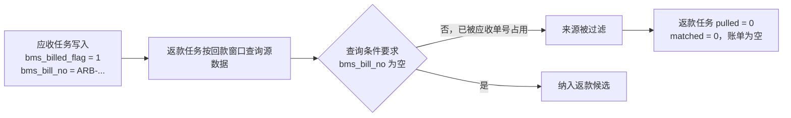
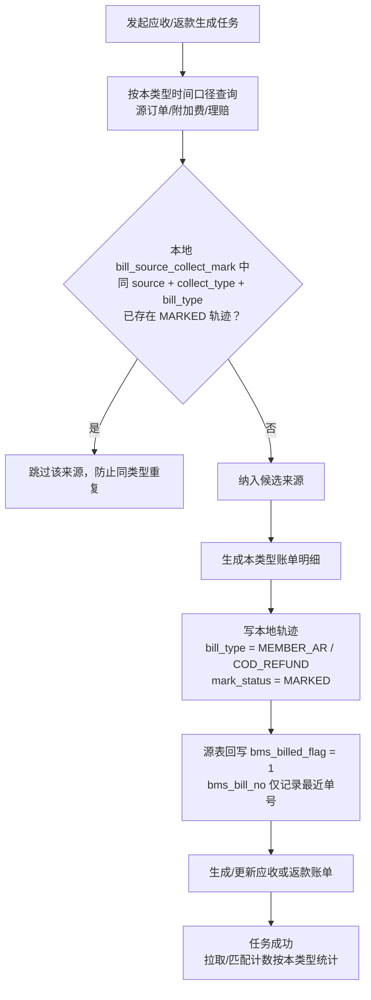

# 2026-08-20 BMS 应收与返款账单源数据打标互斥技术调整方案及实施计划

## 1. 文档目的与范围

### 1.1 目的

本文档用于解决应收账单与返款账单共用同一套源表打标字段导致的“互相占用、互相拉不到数据”问题。

现场现象：客户 OG0271（`member_code=700127`）先生成应收账单，任务 `BMS-TASK-20260820121504-102-1787199304539-86`；随后生成返款账单，任务 `RCB-TASK-20260820122023-31-1787199623758-86`。返款任务拉取源数据数量为 0，最终没有生成有效返款账单。

结论：应收任务将源订单写入 `bms_billed_flag=1`、`bms_bill_no=<应收单号>`，而返款候选查询仍要求 `bms_bill_no` 为空，导致返款窗口内已回款订单被全部过滤。反向场景（返款先生成、应收后生成）同样存在。

### 1.2 范围

1. 只输出问题分析与落地方案，本次不修改 Java、SQL、Mapper 或数据库内容。
2. 数据库只执行 `SELECT`、`SHOW`、`DESC`、`information_schema` 只读核验。
3. 涉及源库 `ofp_ofdb1` 的修复 DDL、历史数据 UPDATE 均列为后续实施项，由 DBA 和后续代码任务处理。
4. 不改变返款本金、扣减项、应返金额、核销、应收金额计算等业务规则。

### 1.3 目标口径

同一订单来源可以分别进入应收账单和返款账单；同一账单类型不能重复拉取同一来源。来源表全局标记只表达“BMS 是否抓取过”，不同账单类型是否已处理以本地 `bill_source_collect_mark.bill_type` 为准。

---

## 2. 业务场景与口径

### 2.1 场景一：应收先生成，返款后生成

1. 应收任务按履约节点拉取订单并生成 `MEMBER_AR` 账单。
2. 应收任务调用 `markOrderSource()` 等打标逻辑，把源订单更新为 `bms_billed_flag=1`、`bms_bill_no=ARB-...`。
3. 返款任务按回款时间窗口拉取同一批订单时，查询条件仍包含 `(e.bms_bill_no IS NULL OR e.bms_bill_no = '')`。
4. 订单虽然已在返款窗口内回款，但仍因 `bms_bill_no` 被应收单号占用而被过滤，返款账单为空。

### 2.2 场景二：返款先生成，应收后生成

1. 返款任务按回款时间窗口拉取订单并生成 `COD_REFUND` 账单。
2. 返款任务把源订单更新为 `bms_billed_flag=1`、`bms_bill_no=PCB-...`。
3. 后续应收任务若账期或补充生成再次覆盖这些订单，同样会被 `bms_bill_no` 或 `bms_billed_flag` 条件过滤，造成应收漏单。
4. 线上已有历史返款单 `PCB-OG0347-20260526`，对应源表 8 条 `sale_order_header_extend` 记录均被写为 `bms_bill_no=PCB-OG0347-20260526`，是该反向影响的实际证据。

### 2.3 口径定义

| 概念 | 当前错误语义 | 目标语义 |
| --- | --- | --- |
| `bms_billed_flag` | 源数据被某一账单类型占用后，其他类型也不可拉取 | 仅表示“该来源至少被 BMS 某一流程抓取过”，不决定其他账单类型是否可拉取 |
| `bms_bill_no` | 作为应收/返款互斥锁使用 | 仅作为最近一次进入账单的单号信息；是否已处理以本地轨迹为准 |
| `bill_source_collect_mark` | 只用于打标补偿，候选查询不使用 | 应收、返款各自防重的权威来源 |
| 应收防重维度 | `bms_billed_flag + bms_bill_no` | `source_system + source_table + source_id + collect_type + bill_type=MEMBER_AR + mark_status` |
| 返款防重维度 | `bms_billed_flag + bms_bill_no` | `source_system + source_table + source_id + collect_type + bill_type=COD_REFUND + mark_status` |

---

## 3. 现状分析

### 3.1 代码现状

#### 3.1.1 源表打标字段共用

应收与返款共用同一组源表字段：

```text
sale_order_header_extend.bms_billed_flag
sale_order_header_extend.bms_bill_no
sale_order_additional_matter.bms_billed_flag
sale_order_additional_matter.bms_bill_no
claim_order.bms_billed_flag
claim_order.bms_bill_no
claim_order.bms_billed_at
```

写入点集中在 `BillGenerateServiceImpl`：

| 方法 | 文件位置 | 现状 |
| --- | --- | --- |
| `markOrderSource()` | `bms/biz/src/main/java/com/szt/supplychain/bms/biz/service/impl/BillGenerateServiceImpl.java:5033` | 写本地轨迹后调用 `markSaleOrderExtendFromSource(orderId, billNo)`，把应收或返款单号写入 `bms_bill_no` |
| `markAdditionalSource()` | 同文件 `:5065` / `:5070` | 写附加费来源轨迹，并写入 `bms_bill_no` |
| `markClaimSource()` | 同文件 `:5110` | 写理赔来源轨迹，并写入 `bms_bill_no` |
| `markSaleOrderExtendFromSource()` | 同文件 `:5469` | `UPDATE sale_order_header_extend SET bms_billed_flag = 1, bms_bill_no = ?` |
| `markAdditionalFromSource()` | 同文件 `:5474` | 对 `sale_order_additional_matter` 写同一组字段 |
| `markClaimFromSource()` | 同文件 `:5479` | 对 `claim_order` 写同一组字段并写 `bms_billed_at` |
| `BillGenerateMapper.markSaleOrderExtend()` | `bms/dao/src/main/java/com/szt/supplychain/bms/dao/mapper/BillGenerateMapper.java:749` | 兜底更新同一组源字段 |
| `BillGenerateMapper.markAdditional()` | 同文件 `:752` | 兜底更新附加费源字段 |

#### 3.1.2 候选查询使用全局字段做防重

`buildOrderWideQuerySql()` 位于 `BillGenerateServiceImpl.java:5686`，当前 SQL 尾部固定追加：

```sql
AND (e.bms_bill_no IS NULL OR e.bms_bill_no = '')
```

`queryRefundOrderRows()` 位于同文件 `:2024`，调用 `queryOrderWideRowsFromSource(..., true)` 时 `includeFetchedWithoutBill=true`，只是不再过滤 `bms_billed_flag=0`，但仍然无法绕过 `bms_bill_no` 条件，因此返款任务拉不到已被应收打标的订单。

同类问题还存在于：

| 查询方法 | 位置 | 当前过滤 |
| --- | --- | --- |
| `buildOrderWideQuerySql()` | `BillGenerateServiceImpl.java:5686` | `includeFetchedWithoutBill=false` 时过滤 `bms_billed_flag=0`；无论是否 include 都过滤 `bms_bill_no` 为空 |
| `buildAdditionalRowsQuerySql()` | 同文件 `:5750` | `COALESCE(a.bms_billed_flag,0)=0` + `COALESCE(a.bms_after_bill_added_flag,0)=0` |
| `buildIncrementalAdditionalQuerySql()` | 同文件 `:5784` | `bms_after_bill_added_flag=1` + `bms_billed_flag=0` + `bms_bill_no` 为空 |
| `buildLedgerAdditionalQuerySql()` | 同文件 `:5843` | `bms_billed_flag=0` + `bms_bill_no` 为空 |
| `buildClaimRowsQuerySql()` | 同文件 `:5888` | `bms_billed_flag=0` + `bms_bill_no` 为空 |

#### 3.1.3 回滚与重跑也按单号全局回写

| 方法 | 位置 | 现状 |
| --- | --- | --- |
| `unmarkSourceByBillNo()` | `BillGenerateServiceImpl.java:5484` | 按 `bms_bill_no=?` 直接清三张源表的 `bms_billed_flag=0, bms_bill_no=NULL` |
| `restoreSourceMarks()` | 同文件 `:5493` | 只按旧单号对应的本地轨迹重新写回 `bms_bill_no`，不区分应收/返款 |
| `prepareReceivableBillForAppend()` | 同文件 `:5542` | 应收重跑时调用全局 `unmarkSourceByBillNo()` |
| `prepareRefundRetryBill()` | 同文件 `:2612` | 返款重试时调用全局 `unmarkSourceByBillNo()` |
| `queryCollectMarksByBillNo()` | `BillGenerateMapper.java:285` | 仅按 `bill_no` 查轨迹，返回 `collect_type`、`source_table`、`source_id`，没有按 bill_type 回写 |

如果应收重跑清理源字段，会把返款已经占用的全局标记一起清掉；反之亦然。这会造成另一侧的历史占用信息丢失，虽然本地轨迹仍存在，但源表状态与真实占用不一致。

### 3.2 本地轨迹表现状

`bill_source_collect_mark` 已经具备按账单类型留痕能力：

```text
UNIQUE KEY uk_source_collect
  (source_system, source_table, source_id, collect_type, bill_type)
```

该唯一键允许同一来源分别记录：

```text
MEMBER_AR + MAIN_ORDER
COD_REFUND + MAIN_ORDER
MEMBER_AR + ADDITIONAL_FEE
COD_REFUND + ADDITIONAL_FEE
```

但候选查询没有引用该表，导致本地轨迹只被当作“跨库打标补偿记录”，没有承担“应收/返款分别防重”的职责。

### 3.3 线上数据证据

#### 3.3.1 生成任务

| 任务 ID | 任务编号 | 账单类型 | 状态 | 拉取数 | 匹配数 | 账期 |
| --- | --- | --- | --- | --- | --- | --- |
| 366 | `BMS-TASK-20260820121504-102-1787199304539-86` | `MEMBER_AR` | `SUCCESS` | 1 | 1 | 2026-08-17 ~ 2026-08-23 |
| 367 | `RCB-TASK-20260820122023-31-1787199623758-86` | `COD_REFUND` | `SUCCESS` | 0 | 0 | 2026-08-18 ~ 2026-08-20 |

#### 3.3.2 应收账单与主订单

| 账单 | 状态 | 客户 | 账期 |
| --- | --- | --- | --- |
| `ARB-OG0271-20260817-81FF` | `GENERATED` | `OG0271 / 700127` | 2026-08-17 ~ 2026-08-23 |

该应收账单 `main_order` 共 5 条，业务订单号：`VIP26080708`、`VIP26080707`、`VIP26080702`、`VIP260806004`、`VIP260820001`，对应源订单 ID：`20517810`、`20517811`、`20517813`、`20517866`、`20519400`。

说明：任务 366 是应收账单的增量补充任务，账单主体在 12:10 左右已创建，任务 366 于 12:15~12:16 追加 `20519400`，因此任务计数为 1、最终主订单为 5 条。

#### 3.3.3 源表打标

源表 `ofp_ofdb1.sale_order_header_extend` 核验结果：

| 源订单 ID | 订单号 | `bms_billed_flag` | `bms_bill_no` | `recovery_time` |
| --- | --- | --- | --- | --- |
| 20517810 | PF619253411711811584 | 1 | ARB-OG0271-20260817-81FF | NULL |
| 20517811 | PF619253411736977408 | 1 | ARB-OG0271-20260817-81FF | 2026-08-19 16:59:27 |
| 20517813 | PF619253412374511616 | 1 | ARB-OG0271-20260817-81FF | 2026-08-19 15:51:37 |
| 20517866 | PF619959880442707968 | 1 | ARB-OG0271-20260817-81FF | NULL |
| 20519400 | PF623590588180594688 | 1 | ARB-OG0271-20260817-81FF | 2026-08-20 11:45:03 |

其中 `20517811`、`20517813`、`20519400` 的 `recovery_time` 均落在返款账期 2026-08-18 ~ 2026-08-20 内，按返款口径应进入本次返款候选。

#### 3.3.4 现场复现查询

按返款查询条件执行只读核验：

```sql
SELECT h.id, h.order_code, e.bms_billed_flag, e.bms_bill_no, e.recovery_time
FROM sale_order_header h
LEFT JOIN sale_order_header_extend e ON e.sale_order_id = h.id
WHERE h.member_code = '700127'
  AND e.recovery_time >= '2026-08-18 00:00:00'
  AND e.recovery_time <  '2026-08-21 00:00:00'
  AND (e.bms_bill_no IS NULL OR e.bms_bill_no = '')
ORDER BY h.id;
```

结果：`count = 0`。这完整复现了任务 367 返款账单为空的现象。

#### 3.3.5 反向证据

历史返款单 `PCB-OG0347-20260526` 在源表存在 8 条 `sale_order_header_extend` 记录，均被写入 `bms_bill_no=PCB-OG0347-20260526`。这些订单后续如果进入应收补充生成或重跑，也会被当前应收查询过滤。

---

## 4. 根因结论

1. 源表打标字段是“全局单一占用”，不是“按账单类型占用”：
   - 应收写入 `ARB-...` 后，返款查询看到 `bms_bill_no` 非空。
   - 返款写入 `PCB-...` 后，应收查询看到 `bms_bill_no` 非空。
2. 候选查询把“有没有被 BMS 拉过”当成“本类型是否已经处理”，且 `includeFetchedWithoutBill=true` 只豁免了 `bms_billed_flag`，没有豁免 `bms_bill_no`。
3. 本地 `bill_source_collect_mark` 已具备 `bill_type` 维度的唯一键和轨迹，但候选查询没有使用，防重能力没有被落地。
4. 回滚/重跑也基于 `bms_bill_no` 全局回写，无法区分应收、返款各自的占用。

因此应收和返款形成双向互斥：谁先生成，谁就把源数据“锁死”，另一类账单再也拉不到。

---

## 5. 目标落地方案

### 5.1 总体策略

推荐采用“最小改动方案”：

1. 源表字段不再承担按账单类型防重。
2. 应收、返款候选查询只按本地 `bill_source_collect_mark.bill_type` 排除本类型已处理来源。
3. 全局 `bms_billed_flag` 保留为“至少被 BMS 抓取过”的审计/监控语义。
4. `bms_bill_no` 降级为信息字段，不作为查询条件。
5. 打标、回滚、重跑全部改为类型感知。
6. `bill_source_collect_mark` 在 `tmall_bms`、源数据在 `ofp_ofdb1`，两库分离；候选过滤采用“BMS 本地查轨迹 + 应用层过滤”，不在源库 SQL 中引用 `tmall_bms`。

远期可升级为“源表按账单类型分字段”的更彻底方案，见 5.7。

#### 5.1.1 现状问题流程



#### 5.1.2 目标方案流程



应收和返款共用上面的目标流程，只差异在 `bill_type`、时间口径和 `collect_type`；任一类型打标后，另一类型仍可按自己的 `bill_type` 拉取同一来源。

### 5.2 语义定义

| 字段 | 新语义 |
| --- | --- |
| `bms_billed_flag` | 该来源至少被任一 BMS 流程抓取过；`1` 不代表不可被其他账单类型拉取 |
| `bms_bill_no` | 最近一次进入账单的单号，仅供展示/排查；不参与候选过滤 |
| `bill_source_collect_mark` | 权威防重源，按 `(source_system, source_table, source_id, collect_type, bill_type)` 记录 |
| `mark_status` | `MARKED` 表示该账单类型已成功占用；`PENDING/FAILED/REGENERATED` 不阻塞重新处理 |

### 5.3 候选查询改造

两个库不同，所有候选查询统一按以下顺序处理，不再在源库 SQL 中引用 `tmall_bms`：

1. BMS 本地连接查询 `bill_source_collect_mark`，取当前账单类型已 `MARKED` 的 `source_id`。
2. 源库连接按本类型时间口径取候选数据，不再把 `bms_billed_flag` / `bms_bill_no` 作为过滤条件。
3. 应用层用第一步的 `source_id` 集合过滤第二步结果，命中 `MARKED` 的跳过。

时间口径说明：

`bill_source_collect_mark` 不保存、也不判定“什么时候该拉取”，时间窗口始终由源库 SQL 按任务自己的时间字段决定：

1. 应收任务按自己的履约时间字段（如出库、签收、完结等）拉取。
2. 返款任务按 `recovery_time` 拉取。
3. 源查询命中的候选行，才用本地轨迹做“本类型是否已处理”的去重。

各链路的时间字段由源库 SQL 或数据源配置决定，本地轨迹不重复保存：

| 链路 | 时间字段 | 说明 |
| --- | --- | --- |
| 应收主订单 | 费项数据源配置的履约节点时间字段 | 按配置的出库、签收、完结、收到等时间归集 |
| 返款主订单（RECEIVED 模式） | `sale_order_header_extend.recovery_time` | 回款时间落入返款账期才拉取 |
| 附加费 | 费项数据源配置的附加费时间字段 | 如 `handle_time` / `create_time` |
| 记账单附加费 | `sale_order_additional_matter.create_time` | 固定按创建时间归集 |
| 理赔 | `claim_order.update_time` | 固定按更新时间归集 |

示例：订单 X 先被应收按出库时间拉到，写入 `MEMBER_AR` 轨迹；之后 `recovery_time` 落入返款窗口，返款源查询会再次命中 X，本地轨迹只有 `MEMBER_AR`、没有 `COD_REFUND`，因此返款仍会处理 X。

#### 5.3.1 主订单宽表查询

`buildOrderWideQuerySql()` 取消 `includeFetchedWithoutBill` 的当前语义，改为传入当前账单类型和归集类型。

第一步：BMS 本地查询主订单已占用轨迹：

```sql
SELECT source_id
FROM tmall_bms.bill_source_collect_mark
WHERE source_system = 'OFP'
  AND source_database = 'ofp_ofdb1'
  AND source_table = 'sale_order_header_extend'
  AND collect_type = 'MAIN_ORDER'
  AND bill_type = ?
  AND mark_status = 'MARKED'
  AND sc_id = ?
  AND shop_id = ?
  AND user_id = ?
  AND member_code = ?;
```

第二步：源库查询不再带全局标记条件：

```sql
SELECT h.id, h.order_code, e.recovery_time
FROM sale_order_header h
LEFT JOIN sale_order_header_extend e ON e.sale_order_id = h.id
WHERE h.member_code = ?
  AND h.shop_id = ?
  AND (h.sc_id = ? OR h.sc_id IS NULL)
  AND <本类型账单时间字段> >= ?
  AND <本类型账单时间字段> < ?
ORDER BY h.id LIMIT ? OFFSET ?;
```

第三步：应用层用第一步的 `source_id` 集合过滤，命中 `MARKED` 的跳过。

分页要求：

1. 源查询继续按现有日窗口 + offset 翻页，不能因为某一页过滤后不足 `pageSize` 就提前结束，必须继续翻到源窗口结束或收集到足够未标记行。
2. 若历史 `MARKED` 集合较小，可把 `source_id` 分片拼成源 SQL 的 `NOT IN` 下推，但需控制 SQL 长度，不作为默认方案。

说明：

1. 应收传 `bill_type='MEMBER_AR'`，返款传 `bill_type='COD_REFUND'`。
2. 不再使用 `bms_billed_flag` 和 `bms_bill_no` 作为候选过滤条件。
3. `includeFetchedWithoutBill` 参数可以删除或重命名为 `billType`。
4. 源查询中不出现 `tmall_bms.bill_source_collect_mark`。

#### 5.3.2 附加费查询

`buildAdditionalRowsQuerySql()` 去掉 `bms_billed_flag=0`，保留 `bms_after_bill_added_flag`。轨迹过滤按同样的两段式：

1. BMS 本地查询 `source_table='sale_order_additional_matter'`、`collect_type='ADDITIONAL_FEE'`、当前 `bill_type` 的 `MARKED` 轨迹。
2. 源查询去掉 `bms_billed_flag` 和 `bms_bill_no` 条件。
3. 应用层按 `source_id` 过滤。

`bms_after_bill_added_flag` 表示“是否属于账期后追加费项”，不是应收/返款互斥字段，保留不动。

#### 5.3.3 增量附加费查询

`buildIncrementalAdditionalQuerySql()` 去掉 `bms_billed_flag=0` 和 `bms_bill_no` 为空条件，改为按 `collect_type='ADDITIONAL_INCREMENT'` 查本地轨迹后过滤，`bms_after_bill_added_flag=1` 条件保留。

#### 5.3.4 记账单附加费查询

`buildLedgerAdditionalQuerySql()` 做同样改造，`collect_type` 使用 `LEDGER_ADDITIONAL_FEE`，去掉 `bms_billed_flag` 和 `bms_bill_no` 条件。

#### 5.3.5 理赔查询

`buildClaimRowsQuerySql()` 去掉 `bms_billed_flag=0` 和 `bms_bill_no` 为空条件，改为按 `claim_order` 来源和 `CLAIM_ORDER` 归集类型查本地轨迹后过滤。当前返款不采集理赔时，该方法继续只服务应收。

### 5.4 打标与回滚改造

#### 5.4.1 打标

保留现有 `bill_source_collect_mark` 写入和补偿逻辑，但源表更新语义调整为：

```sql
UPDATE sale_order_header_extend
SET bms_billed_flag = 1,
    bms_bill_no = ?
WHERE sale_order_id = ?
```

`bms_billed_flag=1` 表示该来源已被 BMS 抓取；`bms_bill_no` 写入当前单号仅作最近入账单号信息。应收、返款各自写入自己的单号，互不阻塞。

#### 5.4.2 类型感知回滚

新增或调整方法 `unmarkSourceByBillType(...)`，入参包含 `billNo`、`billType`：

1. 先把本地轨迹中该 `bill_no + bill_type` 的 `mark_status` 更新为 `REGENERATED`。
2. 查询该来源是否还有其他账单类型的 `MARKED` 轨迹。
3. 如果还有，则源表保留 `bms_billed_flag=1`，不清 `bms_bill_no`。
4. 如果没有其他 `MARKED` 轨迹，再把 `bms_billed_flag=0`、`bms_bill_no=NULL` 回写。

`restoreSourceMarks()` 同样按 `bill_type` 恢复，并同时把本地轨迹 `mark_status` 恢复为 `MARKED`；不能只回写源表，否则新防重会失效（见 12）。

`prepareReceivableBillForAppend()` 和 `prepareRefundRetryBill()` 都改为调用类型感知回滚，避免清理对方类型占用。

#### 5.4.3 本地轨迹查询扩展

`queryCollectMarksByBillNo()` 补充返回 `bill_type`，并按 `bill_no + bill_type` 查询；重跑恢复时只处理属于当前账单类型的轨迹。

### 5.5 幂等与并发

1. 同一账单类型的重复拉取由 `uk_source_collect(source_system, source_table, source_id, collect_type, bill_type)` 兜底。
2. 同一来源进入应收、返款分别留痕，唯一键允许两条记录。
3. 同任务内 `validateUniqueBusinessOrderNos` 继续保证业务订单号不重复。
4. 应收与返款若允许同一客户同时并发执行，需要额外考虑竞态：
   - 方式一：任务调度层保证同一客户应收、返款任务串行。
   - 方式二：候选查询在本地轨迹写入前先做“本类型未存在 MARKED”的占用检查，并依赖唯一键失败回滚。
   - 方式三：远期采用 5.7 的源表分类型字段，直接用源表做乐观占用。
5. 上线前必须落实任务串行或本地轨迹行锁，不能只依赖“先查后写 + 唯一键”，否则应收/返款或同类型重跑并发时可能重复生成（见 12）。

### 5.6 任务快照与监控

1. `bill_generate_task.order_source_sql`、`additional_source_sql` 快照继续保存最终执行的 SQL；由于过滤发生在应用层，还需记录 `bill_type`、`collect_type`、过滤版本或候选 ID，否则快照无法完整复现（见 12）。
2. `pulled_order_count`、`matched_order_count` 语义不变：表示本账单类型实际拉取和匹配数量。
3. 源数据打标诊断日志继续保留，便于核对应收、返款各自轨迹。

### 5.7 可选远期方案：源表分账单类型字段

如果产品要求源表同时展示应收单号和返款单号，或需要更强的并发隔离，可在三张源表新增：

```text
sale_order_header_extend:
  bms_ar_billed_flag
  bms_ar_bill_no
  bms_refund_billed_flag
  bms_refund_bill_no

sale_order_additional_matter:
  bms_ar_billed_flag
  bms_ar_bill_no
  bms_refund_billed_flag
  bms_refund_bill_no

claim_order:
  按实际账单类型是否需要采集决定字段
```

优点：

1. 应收、返款在源表各自占用，互不干扰。
2. 查询可以继续使用源表条件，不需要跨库查 `bill_source_collect_mark`。
3. 并发占用更直观，可以用 `UPDATE ... WHERE bms_refund_billed_flag=0` 做原子占用。

缺点：

1. 源库属于 OFP 等外部系统，DDL 需要跨团队协调。
2. 需要同步改造所有打标、回滚、重跑、补偿和快照逻辑。
3. 历史数据迁移成本高于 5.3 方案。

建议近期采用 5.3 的最小方案，远期需要“源表双单号展示/原子占用”时再升级。

---

## 6. 数据库与权限

### 6.1 方案 A 的数据库结论

1. `bill_source_collect_mark` 不需要新增字段，现有 `uk_source_collect` 已支持按 `bill_type` 分别留痕。
2. 现有索引 `idx_collect_bill_type(bill_type, bill_id, collect_type, mark_status)` 可支撑按类型查轨迹。
3. 不新增 BMS 表，不修改 `ar_bill.sql`。

### 6.2 双库隔离下的轨迹过滤实现

`bill_source_collect_mark` 在 `tmall_bms`，源数据在 `ofp_ofdb1`，默认不依赖跨库 SQL。

默认实现：

1. BMS 本地连接查询 `bill_source_collect_mark`，取当前 `bill_type` 已 `MARKED` 的 `source_id`。
2. 源库连接只查候选来源，不带全局打标条件。
3. 应用层用 `source_id` 集合过滤候选，不要求 OFP 连接账号访问 `tmall_bms`。
4. 需要配套打标对账/补偿机制，避免“源表已标记但本地轨迹非 `MARKED`”造成漏防重（见 12）。

可选优化：

1. 若确认 OFP 源连接账号具备 `tmall_bms` 只读权限，可把 `source_id` 分片拼成源 SQL 的 `NOT IN` 下推。
2. 拼入前需按参数数量和 SQL 长度分片，避免超过 `max_allowed_packet`。
3. 不推荐把 `tmall_bms.bill_source_collect_mark` 直接写在源查询里，因为两库分离后会让源查询依赖 BMS 库权限和连接配置。

### 6.3 方案 B 的数据库结论

如果选择 5.7 分字段方案：

1. 三张源表 DDL 由源库 DBA 执行。
2. 因为字段属于源库 `ofp_ofdb1`，不在 `aidocs/technical-caliber/sql/ar_bill.sql` 的 BMS 表范围内，但需要在 BMS 技术文档中记录完整结构。
3. 存量数据迁移由 DBA 按 `bill_source_collect_mark` 回填分类型字段。

### 6.4 `bill_source_collect_mark` 表结构（带库前缀）

当前开发环境已存在 `tmall_bms.bill_source_collect_mark`，且有轨迹数据，因此方案不新增该表。以下为带库前缀的完整表结构，作为方案、归档和后续核对基线：

```sql
CREATE TABLE `tmall_bms`.`bill_source_collect_mark` (
  `id` bigint(20) unsigned NOT NULL AUTO_INCREMENT COMMENT 'ID',
  `collect_no` varchar(64) NOT NULL COMMENT '归集标记编号',
  `collect_type` varchar(32) NOT NULL COMMENT '归集类型：MAIN_ORDER主订单，ADDITIONAL_FEE附加费，ADDITIONAL_INCREMENT附加费增量，CLAIM_ORDER理赔，NON_FEE_FETCH非费项已抓取，LEDGER_ADDITIONAL_FEE记账单附加费',
  `source_system` varchar(64) NOT NULL COMMENT '来源系统，如OFP',
  `source_database` varchar(64) DEFAULT NULL COMMENT '来源库',
  `source_table` varchar(128) NOT NULL COMMENT '来源表',
  `source_id` varchar(128) NOT NULL COMMENT '来源数据ID',
  `source_biz_no` varchar(128) DEFAULT NULL COMMENT '来源业务单号',
  `source_order_id` varchar(128) DEFAULT NULL COMMENT '来源订单ID',
  `source_order_no` varchar(128) DEFAULT NULL COMMENT '来源订单号',
  `bill_id` bigint(20) unsigned DEFAULT NULL COMMENT '账单ID；NON_FEE_FETCH未进入账单时为空',
  `bill_no` varchar(64) DEFAULT NULL COMMENT '账单编号；NON_FEE_FETCH未进入账单时为空',
  `bill_type` varchar(32) NOT NULL DEFAULT 'MEMBER_AR' COMMENT '账单类型：MEMBER_AR/COD_REFUND/COST_AP',
  `bill_config_id` bigint(20) unsigned NOT NULL COMMENT '账单配置ID',
  `generate_task_id` bigint(20) unsigned DEFAULT NULL COMMENT '生成任务ID',
  `sc_id` bigint(20) NOT NULL COMMENT '供应链/组织ID',
  `shop_id` bigint(20) NOT NULL COMMENT '店铺ID',
  `user_id` bigint(20) NOT NULL COMMENT '用户ID',
  `member_code` varchar(64) NOT NULL COMMENT '会员/客户编码',
  `mark_status` varchar(32) NOT NULL DEFAULT 'PENDING' COMMENT '源表打标状态：PENDING待打标，MARKED已打标，FAILED打标失败',
  `marked_at` datetime DEFAULT NULL COMMENT '源表打标成功时间',
  `retry_count` int(11) NOT NULL DEFAULT '0' COMMENT '打标重试次数',
  `last_retry_at` datetime DEFAULT NULL COMMENT '最近重试时间',
  `last_error_message` varchar(2000) DEFAULT NULL COMMENT '最近失败原因',
  `source_snapshot_json` json DEFAULT NULL COMMENT '来源数据关键字段快照',
  `created_at` datetime NOT NULL DEFAULT CURRENT_TIMESTAMP COMMENT '创建时间',
  `updated_at` datetime NOT NULL DEFAULT CURRENT_TIMESTAMP ON UPDATE CURRENT_TIMESTAMP COMMENT '更新时间',
  PRIMARY KEY (`id`),
  UNIQUE KEY `uk_collect_no` (`collect_no`),
  UNIQUE KEY `uk_source_collect` (`source_system`,`source_table`,`source_id`,`collect_type`,`bill_type`),
  KEY `idx_collect_bill` (`bill_id`,`collect_type`,`mark_status`),
  KEY `idx_collect_task` (`generate_task_id`,`mark_status`),
  KEY `idx_collect_subject` (`sc_id`,`shop_id`,`user_id`,`member_code`,`mark_status`),
  KEY `idx_collect_source_order` (`source_order_id`,`source_order_no`),
  KEY `idx_collect_retry` (`mark_status`,`retry_count`,`updated_at`),
  KEY `idx_collect_bill_type` (`bill_type`,`bill_id`,`collect_type`,`mark_status`)
) ENGINE=InnoDB DEFAULT CHARSET=utf8mb4 ROW_FORMAT=DYNAMIC COMMENT='账单来源归集标记/跨库打标补偿记录';
```

说明：

1. 唯一键 `uk_source_collect(source_system, source_table, source_id, collect_type, bill_type)` 是应收、返款分别防重的核心依据。
2. 该表属于 `tmall_bms`，所有 BMS 侧查询、更新均建议显式写 `tmall_bms.bill_source_collect_mark`。
3. 本方案不新增字段、不新增索引，也不需要重新执行该 DDL。

---

## 7. 存量数据核对与处理

### 7.1 本次现场数据

任务 367 的源数据阻塞原因已确认是应收单号占用。代码按 5.3 改造后，返款候选查询只看 `COD_REFUND` 轨迹，不看 `bms_bill_no`，因此无需清理本次源表数据，直接对任务 367 所在账期重新发起返款生成即可拉回订单。

### 7.2 只读巡检 SQL

建议上线前用只读 SQL 排查受影响的空任务：

```sql
SELECT id, task_no, bill_type, member_code, customer_no,
       billing_period_start_date, billing_period_end_date,
       task_status, pulled_order_count, matched_order_count,
       created_at, finished_at
FROM tmall_bms.bill_generate_task
WHERE task_status = 'SUCCESS'
  AND pulled_order_count = 0
  AND matched_order_count = 0
  AND bill_type = 'COD_REFUND'
ORDER BY id DESC
LIMIT 200;
```

排查“应收漏单”方向：

```sql
SELECT id, task_no, bill_type, member_code, customer_no,
       billing_period_start_date, billing_period_end_date,
       task_status, pulled_order_count, matched_order_count,
       created_at, finished_at
FROM tmall_bms.bill_generate_task
WHERE task_status = 'SUCCESS'
  AND pulled_order_count = 0
  AND matched_order_count = 0
  AND bill_type = 'MEMBER_AR'
ORDER BY id DESC
LIMIT 200;
```

核对同一来源是否已有应收、返款两类轨迹：

```sql
SELECT source_system, source_database, source_table, source_id,
       collect_type, bill_type, mark_status, bill_no
FROM tmall_bms.bill_source_collect_mark
WHERE source_order_id IN ('20517810','20517811','20517813','20517866','20519400')
  AND source_table = 'sale_order_header_extend'
ORDER BY source_id, bill_type;
```

### 7.3 数据修正边界

1. 本次不执行任何源表 UPDATE/DELETE。
2. 若在代码修复前需要临时恢复某批返款任务，应由 DBA 单独评估，不建议手工清 `bms_bill_no`，因为会同时破坏应收占用的可追溯性。
3. 正确顺序是先上代码修复，再重跑受影响任务。
4. 历史空任务是否需要自动重跑，由业务确认范围，默认只处理 DRAFT/UNDER_REVIEW/未生成等允许重跑状态的场景。

---

## 8. 调整计划

### 阶段一：实施前核验

1. 确认双库方案采用“BMS 本地查轨迹 + 应用层过滤”，不依赖 OFP 源连接账号跨库查询 `tmall_bms`。
2. 确认应收、返款任务对同一客户是否可能并发执行。
3. 收集历史 `pulled_order_count=0` 的应收/返款任务清单。

### 阶段二：候选查询改造

1. 修改 `buildOrderWideQuerySql()`，去掉 `bms_bill_no` 过滤，增加按 `bill_type` 的本地轨迹排除。
2. 修改 `buildAdditionalRowsQuerySql()`、`buildIncrementalAdditionalQuerySql()`、`buildLedgerAdditionalQuerySql()`、`buildClaimRowsQuerySql()`。
3. 同步调整 snapshot 查询和任务源 SQL 记录。

### 阶段三：打标与回滚改造

1. 打标逻辑保持本地轨迹 + 源表全局标记。
2. 新增类型感知回滚，替换 `unmarkSourceByBillNo()` 在应收/返款重跑中的调用。
3. `restoreSourceMarks()` 按 `bill_type` 恢复。
4. 扩展 `queryCollectMarksByBillNo()` 返回 `bill_type`。

### 阶段四：测试

1. 场景一：应收先生成，返款后生成，返款能拉到已回款订单。
2. 场景二：返款先生成，应收后生成，应收能拉到未进应收的订单。
3. 场景三：同类型重跑不重复拉取。
4. 场景四：应收重跑不清理返款占用，返款重跑不清理应收占用。
5. 附加费、增量附加费、记账单附加费、理赔回归。

### 阶段五：发布与回放

1. 后端发布。
2. 对本次任务 367 所在账期重新发起返款生成。
3. 对历史空任务清单按业务确认逐批重跑。
4. 核对生成账单、主订单、`bill_source_collect_mark` 和源表标记。

### 阶段六：文档同步

1. 更新 `aidocs/technical-caliber/bms/dev-specs/bms-bill-generation-task-current-flow.md`。
2. 更新 `bms-cod-refund-bill-*` 设计文档中的打标语义描述。
3. 若涉及 BMS 表结构调整，同步 `aidocs/technical-caliber/sql/ar_bill.sql`；本次默认无 BMS 表 DDL。

---

## 9. 测试与验收

### 9.1 验收场景

| 场景 | 前置 | 预期 |
| --- | --- | --- |
| 应收后返款 | 先生成 AR，订单在返款窗口已回款 | 返款任务 `pulled_order_count>0`，生成有效 `COD_REFUND` 账单 |
| 返款后应收 | 先生成返款，订单在应收账期履约 | 应收任务能拉取未进应收的订单，不因 `bms_bill_no=PCB-...` 被过滤 |
| 同类型重跑 | 同一账单类型已 `MARKED` | 不会再次拉取同一来源 |
| 跨类型回滚 | 应收重跑时返款已 `MARKED` | 不清理返款轨迹，源表全局标记保留 |
| 非费项抓取 | 非费项来源已抓取 | 不阻塞应收或返款各自取数 |
| 任务快照 | 新任务发起 | 快照 SQL 包含新过滤条件，可直接复现 |

### 9.2 自动化/手工测试

1. 接口级：同一客户先后创建应收、返款任务，核对任务计数和账单明细。
2. 数据级：核对 `bill_source_collect_mark` 中应收、返款各自只有一条 `MARKED`。
3. 回归级：已有应收客户按原账期重跑，账单金额与明细不变。

---

## 10. 风险与控制

| 风险 | 影响 | 控制 |
| --- | --- | --- |
| `bill_source_collect_mark` 与源数据分属两个库 | 源 SQL 不能直接 JOIN/NOT EXISTS `tmall_bms` | 统一走 BMS 本地查轨迹 + 应用层过滤，不依赖跨库权限 |
| 应收/返款并发执行 | 同类型或跨类型竞态 | 调度串行；依赖唯一键；远期分字段 |
| `bms_bill_no` 被另一类型覆盖 | 源表展示只保留最近单号 | 展示层改为以 `bill_source_collect_mark` 为准；源表字段仅作参考 |
| 旧任务快照不含新过滤 | 历史任务重放行为不一致 | 重跑重新生成快照，不直接复用旧快照 |
| 本地轨迹集合过大/分页过滤 | 查询变慢、候选翻页不完整 | 按隔离字段和 `bill_type` 缩小；`source_id IN` 精确查询；分页继续翻到源窗口结束 |
| 存量空任务重跑范围过大 | 业务账单被批量重建 | 仅重跑允许状态，逐批确认 |

---

## 11. 疑问点

1. 是否统一采用纯双库方案（BMS 本地查轨迹 + 应用层过滤）？跨库 SQL 仅作为可选优化，是否需要保留？
2. 同一客户的应收任务和返款任务是否允许并发发起？当前调度是否已按客户/配置串行？
3. `bms_bill_no` 在源表展示中是否必须同时体现应收单号和返款单号？如果需要，则采用 5.7 分字段方案。
4. 历史 `pulled_order_count=0` 的应收/返款空任务，重跑范围由谁确认？
5. `claim_order` 是否已有或未来会有返款采集场景？如果没有，理赔查询按应收专用改造即可。

---

## 12. 代码与方案复核发现的其他风险与漏洞

结合 `BillGenerateServiceImpl` 与 `BillGenerateMapper` 复核后，除已写入 5.3 / 5.4 的应收、返款互斥问题外，还发现以下需要随方案一起处理的风险。本次只补充方案，不调整代码。

### 12.1 问题清单

| # | 级别 | 问题 | 位置 | 影响 |
| --- | --- | --- | --- | --- |
| 1 | P0 | 重跑失败恢复只回写源表，不恢复本地轨迹 `MARKED` | `BillGenerateServiceImpl.regenerate()` 1602-1650；`restoreSourceMarks()` 5493 | 新方案以本地轨迹防重，恢复后仍是 `REGENERATED`，后续同类型任务会重复拉取 |
| 2 | P1 | 跨库打标无分布式事务 | `markSourceWithCompensation()` 5144-5154；`upsertSourceCollectFailed()` 560-570 | 源表已标记但本地非 `MARKED`，新方案会把该来源重新拉取 |
| 3 | P1 | 并发任务先查后写无锁 | `queryOrderWideRowsFromSource()` 5210；`markOrderSource()` 5033 | 同类型或应收/返款并发时都可能重复生成，唯一键无法阻止先写明细 |
| 4 | P1 | 轨迹 upsert 会覆盖已有 `MARKED` 的账单关联 | `upsertSourceCollectPending()` 538-547；`upsertSourceCollectFailed()` 560-570 | 重复处理会把旧轨迹的 `bill_no/bill_id/bill_type` 改成新账单，审计和防重失真 |
| 5 | P2 | `markCollectRegenerated` 只按 `bill_no` 全局更新 | `BillGenerateMapper.markCollectRegenerated()` 717 | 未按 `bill_type` 隔离，同号轨迹存在误置风险 |
| 6 | P2 | `collect_no` 截断拼接存在碰撞隐患 | `buildCollectNo()` 6355；`limit()` 6473 | 同一来源同一单号前缀时可能生成相同 `collect_no`，触发 `uk_collect_no` 冲突或更新错行 |
| 7 | P2 | 空任务仍返回 SUCCESS，无告警 | `BillGenerateServiceImpl.executePendingTasks()` 1727；SUCCESS 完成点在 334/405 | `pulled_order_count=0` 且 `matched_order_count=0` 时问题静默，类似本次故障不会被及时发现 |
| 8 | P2 | 任务快照无法复现应用层过滤 | `buildOrderWideQuerySqlSnapshot()` 5735；`buildRefundOrderSourceSqlSnapshot()` 2007 | `order_source_sql` 只记录源 SQL，新过滤在应用层，重放快照结果不一致 |
| 9 | P2 | `uk_source_collect` 不含 `bill_config_id` | `bill_source_collect_mark` 唯一键 | 同一来源同类型被多个配置处理时无法分别留痕，历史文档已提示过 |

### 12.2 重点说明

#### 12.2.1 P0：重跑失败恢复只回写源表

`regenerate()` 当前流程：

```text
查询 bill_source_collect_mark 中 bill_no = oldBillNo 且 MARKED 的轨迹
-> unmarkSourceByBillNo(oldBillNo)
-> 删除明细/汇总/汇率/主订单
-> markCollectRegenerated(oldBillNo)
-> 归档旧账单并创建新任务
-> 失败时 restoreSourceMarks(oldBillNo, sourceMarks)
```

`restoreSourceMarks()` 只执行三张源表的 UPDATE，不会把本地轨迹从 `REGENERATED` 改回 `MARKED`。按新方案“本地轨迹是防重权威”后，下次同类型任务会再次拉取该来源，可能造成重复出账或重复处理。

方案调整：`restoreSourceMarks()` 必须同时按 `bill_no + bill_type` 恢复 `bill_source_collect_mark.mark_status='MARKED'`；或在 `markCollectRegenerated` 前保存完整轨迹，失败时原样恢复。

#### 12.2.2 P1：跨库打标无分布式事务

源表 `ofp_ofdb1` 与轨迹表 `tmall_bms` 是两个库，`markSourceWithCompensation()` 先写本地 `PENDING`，再更新源表，再更新本地 `MARKED`。如果源表更新成功但本地成功标记失败，本地会被置为 `FAILED`。

新方案中 `FAILED` 不阻塞候选，后续任务会重新拉取该来源；如果第一次处理已写入部分账单数据，就会重复。

方案调整：

1. 增加打标对账/补偿任务，扫描源表 `bms_billed_flag=1` 且本地轨迹非 `MARKED` 的差异。
2. 对“源表已标记、本地无对应 MARKED”的记录，按 `bill_no + bill_type + source_id` 补 `MARKED`，或标记人工复核。
3. 候选任务开始时先做一次差异检查，不能直接把 `FAILED` 一律当未处理。

#### 12.2.3 P1：并发先查后写无锁

去掉源表 `bms_bill_no` 全局锁后，两个任务可能同时通过本地 `MARKED` 检查，随后都生成明细。`uk_source_collect` 只能约束轨迹表，不能阻止两任务在写轨迹前已经写账单明细。

方案调整：

1. 上线前确认同一客户应收、返款任务串行执行。
2. 或在写 `bill_source_collect_mark` 前对目标行执行 `SELECT ... FOR UPDATE`，确认不存在 `MARKED` 后再生成明细。
3. 或直接采用 5.7 的源表分类型字段做原子占用。

#### 12.2.4 P1：轨迹 upsert 覆盖已有 MARKED 关联

`upsertSourceCollectPending()` 在 `ON DUPLICATE KEY UPDATE` 中无条件更新 `bill_id`、`bill_no`、`bill_type`、`generate_task_id`，即使已有记录是 `MARKED`。重复处理时会把原账单的轨迹归属改成新账单。

方案调整：

1. `mark_status='MARKED'` 时不再更新 `bill_id/bill_no/bill_type/generate_task_id`。
2. 重复命中已有 `MARKED` 时记录告警并跳过，而不是静默覆盖。
3. `markSourceCollectSuccess()` 和 `markCollectRegenerated()` 的 WHERE 都增加 `bill_type`。

#### 12.2.5 P2：collect_no 截断碰撞

`buildCollectNo()` 使用字符串拼接再 `limit(64)`，主订单单号样例实际长度约 77 字符，会截掉账单号尾部。同一来源、同一类型、同一账单号前缀时，可能生成相同的 `collect_no`。

方案调整：改为 UUID/雪花/哈希生成 `collect_no`，或把 `source_id` 与 `bill_no` 的哈希放在截断保位之前；`collect_no` 不再承担业务可读性。

#### 12.2.6 P2：空任务成功无告警

本次任务 367 就是 `SUCCESS + pulled_order_count=0 + matched_order_count=0`，如果任务监控能把这类结果识别为异常，问题会更早暴露。

方案调整：应收/返款任务结果增加 `NEED_REVIEW` 或告警条件：

```text
task_status = SUCCESS
AND pulled_order_count = 0
AND matched_order_count = 0
```

#### 12.2.7 P2：快照无法完整复现

新方案中源 SQL 不再包含防重条件，过滤发生在应用层，因此 `order_source_sql` 单独执行无法得到相同候选。

方案调整：任务快照增加 `bill_type`、`collect_type`、过滤逻辑版本；可选把过滤后的候选 `source_id` 或已标记集合摘要写入任务扩展字段，便于事后复现。

---

## 13. 附录

### 13.1 本次只读核验范围

1. `tmall_bms.bill_generate_task`：任务 366、367 状态与计数。
2. `tmall_bms.ar_bill`：应收账单 `ARB-OG0271-20260817-81FF`。
3. `tmall_bms.main_order`：应收账单主订单 5 条。
4. `tmall_bms.bill_source_collect_mark`：应收账单轨迹 `MEMBER_AR`。
5. `ofp_ofdb1.sale_order_header_extend`：5 个源订单的 `bms_billed_flag`、`bms_bill_no`、`recovery_time`。
6. `ofp_ofdb1.sale_order_header_extend`：历史返款单 `PCB-OG0347-20260526` 的 8 条反向占用证据。
7. 未执行任何 INSERT、UPDATE、DELETE、DDL。

### 13.2 关键代码位置

| 位置 | 说明 |
| --- | --- |
| `bms/biz/src/main/java/com/szt/supplychain/bms/biz/service/impl/BillGenerateServiceImpl.java:2024` | `queryRefundOrderRows()`，返款主订单查询入口 |
| 同文件 `:5033` | `markOrderSource()` |
| 同文件 `:5065` / `:5070` | `markAdditionalSource()` |
| 同文件 `:5110` | `markClaimSource()` |
| 同文件 `:5469` | `markSaleOrderExtendFromSource()` |
| 同文件 `:5474` | `markAdditionalFromSource()` |
| 同文件 `:5479` | `markClaimFromSource()` |
| 同文件 `:5484` | `unmarkSourceByBillNo()` |
| 同文件 `:5493` | `restoreSourceMarks()` |
| 同文件 `:5542` | `prepareReceivableBillForAppend()` |
| 同文件 `:2612` | `prepareRefundRetryBill()` |
| 同文件 `:5686` | `buildOrderWideQuerySql()` |
| 同文件 `:5750` | `buildAdditionalRowsQuerySql()` |
| 同文件 `:5784` | `buildIncrementalAdditionalQuerySql()` |
| 同文件 `:5843` | `buildLedgerAdditionalQuerySql()` |
| 同文件 `:5888` | `buildClaimRowsQuerySql()` |
| `bms/dao/src/main/java/com/szt/supplychain/bms/dao/mapper/BillGenerateMapper.java:285` | `queryCollectMarksByBillNo()` |
| 同文件 `:749` | `markSaleOrderExtend()` |
| 同文件 `:752` | `markAdditional()` |

### 13.3 相关历史文档

1. `2026-07-29-bms-应收账单非费项过滤需求落地方案及调整计划.md`：已提出“不同账单类型是否已处理以 `bill_source_collect_mark.bill_type` 为准”，但当前实现未完全落地。
2. `bms-cod-refund-bill-db-design-based-on-ar-bill.md`：返款复用时已提示源表字段和轨迹需要支持两类账单分别留痕。
3. `bms-cod-refund-bill-development-plan.md`：返款开发计划中已列出扩字段/改唯一键方向。
4. `2026-08-19-bms-回款返款一票多件任一包裹回款触发整单归集需求落地方案及调整计划.md`：明确“订单已生成返款后，来源订单被 `e.bms_bill_no` 等标记占用，后续任务不会再次拉取”，说明当前互斥语义已被既有方案意识到。
