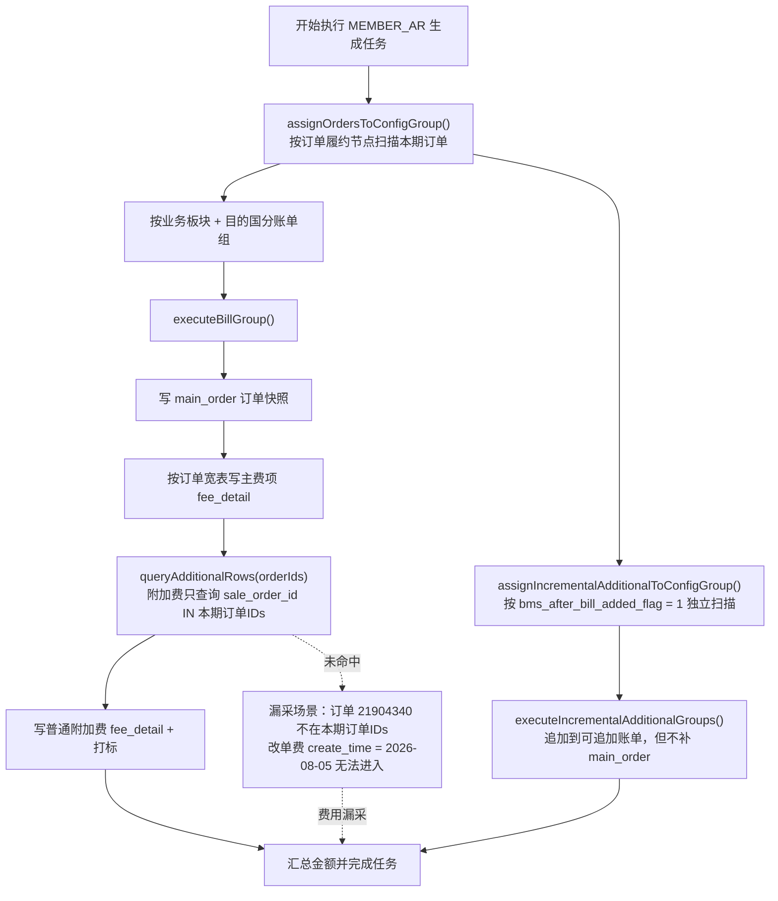
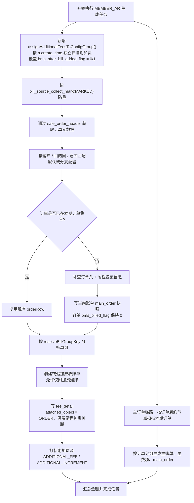

# 2026-08-25 BMS 应收账单附加费独立按创建时间采集需求落地方案及调整计划

## 0. 实施状态

本文档已完成需求落地方案、调整计划和疑问点确认；代码调整已按本方案实施，生产数据不修改。

目前已收到产品/技术确认：

1. 附加费固定按 `a.create_time` 独立采集。
2. 普通/增量附加费统一走独立采集，通过 `bill_source_collect_mark` 防重。
3. 补挂订单时，订单自身 `bms_billed_flag` 保持 0。
4. 接受同一订单出现在多张账单。
5. 附加费挂靠对象改为 `ORDER`，同时保留订单与尾程包裹的关联信息。
6. 订单头缺失时跳过并输出日志。
7. 仅存在附加费时允许直接创建应收账单。
8. 方案中补充源表索引创建 SQL。
9. 生产 8 条改单费本次不处理。
10. 已确认：应收附加费完全拆成独立链路，旧 `ADDITIONAL_FEE` 随订单分组查询不再作为正式采集路径。

## 1. 背景与目标

### 1.1 问题背景

生产环境应收账单漏采“改单费”：

- 生成任务：`BMS-TASK-20260824114442-78-1787543082685-86`
- 应收账单：`ARB-OG1130-20260801-81FF`
- 客户：`81815 / OG1130`
- 订单：`PF602986922247360512`（`sale_order_header.id=21904340`）
- 改单费：8 条 `sale_order_additional_matter`，每条 30 TWD，合计 240 TWD / 48 CNY，创建时间 `2026-08-05`

该订单 `delivery_time / measure_time` 均为 `2026-06-25`，属于 6 月账期，不在 8 月任务的订单候选集合内。当前普通附加费链路按“本期订单 ID 集合 + 附加费时间窗口”取数，因此这 8 条费用没有被 8 月账单采集。

### 1.2 需求目标

1. 应收账单附加费改为独立采集：不再以“当前账期订单集合”作为附加费候选的硬过滤条件，统一按附加费 `a.create_time` 落在任务账期内取数。
2. 取到附加费后，若其 `sale_order_id` 对应的订单不在当前订单候选集合中，需要补充拉取该订单的订单头信息，并写入 `main_order` 订单快照，把附加费挂靠到该订单上，保证后续订单信息、费用明细和关联查询可用。
3. 保留来源防重、打标、账期账单追加、分支配置归属和金额汇总能力。

### 1.3 需求边界

- 本次仅调整 `MEMBER_AR` 应收账单链路。
- `COD_REFUND` 返款账单继续按“本期回款订单关联附加费”的现有口径，不在本次范围。
- 记账单附加费（`order_type='BILL'` 虚拟订单）已有独立链路，本次不强制合并，待产品确认后再决定是否统一。
- 已归集后上游修改金额、来源版本化、后续调整中心等目标模型能力不在本次范围。

## 2. 现状分析

### 2.1 当前主流程

`BillGenerateServiceImpl.executeTaskInternal()` 当前执行顺序：

```text
assignOrdersToConfigGroup()
  -> 按订单履约节点时间扫描本期订单
  -> 按订单 ID 分组
  -> executeConfigOrderGroups()
      -> executeBillGroup()
          -> 写 main_order
          -> 按订单宽表写主费项
          -> queryAdditionalRows(orderIds, ...)
              -> 只查询 sale_order_id IN (本期订单IDs) 的附加费
          -> 写附加费 fee_detail 并打标
  -> assignIncrementalAdditionalToConfigGroup()
      -> queryIncrementalAdditionalRows(...)
          -> 按 bms_after_bill_added_flag = 1 独立扫描
  -> executeIncrementalAdditionalGroups()
```

### 2.2 普通附加费

普通附加费 SQL 见 `BillGenerateServiceImpl.buildAdditionalRowsQuerySql()`：

```sql
WHERE a.sale_order_id IN (本期订单ID集合)
  AND a.fee_amount IS NOT NULL AND a.fee_amount <> 0
  AND a.fee_pay_status IN ('waiting_pay', 'waiting_settlement')
  AND a.fee_pay_method = 'account_period_payment'
  AND a.create_time >= 账期开始 AND a.create_time < 账期结束
  AND COALESCE(a.bms_after_bill_added_flag, 0) = 0
```

问题：

1. 附加费候选被“本期订单 ID 集合”限制，订单不在本账期时费用不会进入。
2. 附加费还同时被 `a.create_time` 窗口限制，两个维度必须同时满足。
3. `markAdditionalSource()` 只回写附加费源表标记，订单仍由 `markOrderSource()` 单独处理；如果订单不在本期订单集合，则不会生成该订单的 `main_order` 快照。

### 2.3 增量附加费

增量附加费 SQL 见 `BillGenerateServiceImpl.buildIncrementalAdditionalQuerySql()`：

```sql
WHERE h.member_code = ?
  AND h.shop_id = ?
  AND (h.sc_id = ? OR h.sc_id IS NULL)
  AND a.fee_pay_status IN ('waiting_pay', 'waiting_settlement')
  AND a.fee_pay_method = 'account_period_payment'
  AND COALESCE(a.bms_after_bill_added_flag, 0) = 1
  AND a.fee_amount IS NOT NULL AND a.fee_amount <> 0
  AND a.create_time >= 账期开始 AND a.create_time < 账期结束
```

该链路已经没有 `a.sale_order_id IN (...)` 限制，但它要求 `bms_after_bill_added_flag=1`，且当前问题中的 8 条改单费为 `0`，因此无法命中。

另外，增量链路虽然 join 了 `sale_order_header` 并携带 `h_*` 字段，但 `executeIncrementalAdditionalGroup()` 没有像 `executeBillGroup()` 一样调用 `insertMainOrder()`，所以“订单不在本期订单集合”时，`main_order` 中仍缺少该订单快照。

### 2.4 生产数据现状

当前 8 条改单费状态：

```text
bms_billed_flag = 0
bms_bill_no = ''
bms_after_bill_added_flag = 0
fee_pay_status = waiting_pay
fee_pay_method = account_period_payment
create_time = 2026-08-05
```

`bill_source_collect_mark` 中没有这 8 条附加费的 `MARKED` 轨迹；任务 171 的 `additional_source_sql` 普通附加费部分只包含 87 个订单 ID，`21904340` 不在其中。

### 2.5 现有实现流程图



## 3. 推荐落地方案

### 3.1 核心口径

应收账单附加费改为：

```text
采集维度 = 附加费创建时间（a.create_time）落在任务账期
归属维度 = 附加费关联订单（sale_order_header）的客户、店铺、供应链、业务板块、目的国、仓库
防重维度 = bill_source_collect_mark(MARKED) + 源表 bms_billed_flag / bms_bill_no
```

这里的“不要订单维度”指：**不再用当前账期订单 ID 集合作为附加费候选过滤条件**。仍需要通过 `sale_order_header` join 获取订单元数据，因为分支配置、账单分组、订单快照都必须依赖订单头信息。

### 3.2 目标取数 SQL

新增应收附加费独立采集 SQL：

```sql
SELECT a.id AS a_id,
       a.sale_order_id AS a_sale_order_id,
       a.fee_item_type AS a_fee_item_type,
       a.fee_amount AS a_fee_amount,
       a.fee_amount_currency AS a_fee_amount_currency,
       a.convert_fee_amount AS a_convert_fee_amount,
       a.convert_fee_amount_currency AS a_convert_fee_amount_currency,
       a.fee_pay_status AS a_fee_pay_status,
       a.create_time AS a_create_time,
       a.handle_time AS a_handle_time,
       a.shop_id AS a_shop_id,
       a.country_short_code AS a_country_short_code,
       a.sub_bill_waybill_no AS a_sub_bill_waybill_no,
       a.bill_waybill_no AS a_bill_waybill_no,
       h.id AS h_id,
       h.order_code AS h_order_code,
       h.biz_order_no AS h_biz_order_no,
       h.delivery_order_code AS h_delivery_order_code,
       h.order_type AS h_order_type,
       h.member_code AS h_member_code,
       h.shop_id AS h_shop_id,
       h.sc_id AS h_sc_id,
       h.member_name AS h_member_name,
       h.country_code AS h_country_code,
       h.country AS h_country,
       h.warehouse_code AS h_warehouse_code,
       h.warehouse_name AS h_warehouse_name,
       h.waybill_no AS h_waybill_no,
       h.master_waybill_no AS h_master_waybill_no,
       h.currency_code AS h_currency_code,
       h.currency AS h_currency
FROM sale_order_additional_matter a
LEFT JOIN sale_order_header h ON h.id = a.sale_order_id
LEFT JOIN sale_order_header_extend e ON e.sale_order_id = h.id
WHERE (h.id IS NULL OR (h.member_code = ?
  AND h.shop_id = ?
  AND (h.sc_id = ? OR h.sc_id IS NULL)
  AND COALESCE(h.order_type, '') <> 'BILL'
  -- AND h.order_type IN (?) -- 按配置展开，可为空
  ))
  AND a.fee_pay_status IN ('waiting_pay', 'waiting_settlement')
  AND a.fee_pay_method = 'account_period_payment'
  AND a.fee_amount IS NOT NULL AND a.fee_amount <> 0
  AND a.create_time >= ? AND a.create_time < ?
  AND COALESCE(a.bms_billed_flag, 0) = 0
  AND (a.bms_bill_no IS NULL OR a.bms_bill_no = '')
ORDER BY a.id
LIMIT ? OFFSET ?
```

说明：

1. 不再接收 `orderIds`，不再拼 `a.sale_order_id IN (...)`。
2. 保留 `h.member_code / shop_id / sc_id` 作为客户和租户隔离。
3. 分支配置归属继续使用 `h_country_code / h_warehouse_code` 等字段匹配。
4. `bms_after_bill_added_flag` 建议放开 0/1，统一由 `bill_source_collect_mark` 防重；如产品要求保留区分，见第 8 节疑问点。
5. 时间字段本次建议固定为 `a.create_time`，不再受 `source_time_column / incremental_time_column` 或公共配置覆盖；如需支持 `handle_time` 等特殊费项，另行确认。
6. 使用 `LEFT JOIN` 保留订单头缺失的附加费候选，建账阶段按兜底策略跳过并输出 `warn` 日志，避免费用被静默丢弃。

### 3.3 缺失订单信息补齐

目标流程：

```text
独立扫描附加费
  -> 对每条附加费取得 a.sale_order_id
  -> 如果该订单已在当前任务 orderRows 中，复用订单宽表行
  -> 如果不在，按 sale_order_id 补查 sale_order_header / sale_order_header_extend
  -> 组装成与订单宽表同结构的 Map（h_* 字段）
  -> 按 h_country_code / h_warehouse_code 匹配默认/分支配置
  -> 按 resolveBillGroupKey() 分账单组
  -> 写入该账单组的 main_order 快照
  -> 写入附加费 fee_detail
  -> 打标附加费源
```

具体实现建议：

1. 新增 `supplementMissingOrderRows(feeRows, existingOrderRows)`：收集缺失 `sale_order_id`，批量查询订单头和订单扩展表，复用 `buildMainOrder()` 所需的 `h_*` 字段。
2. 补查结果继续调用 `enrichOrderRowsWithCxmsWaybills()`，保证 `last_mile_waybill_no` 和 `bill_order_waybill_snapshot` 尽量与主订单一致。
3. 对每条附加费生成费用前，先对补充订单执行 `insertMainOrder(buildMainOrder(...))`，再用同一个 `orderRow` 调用 `buildAdditionalFee()`。
4. 如果 `a.sale_order_id` 有值但订单头查不到，跳过该费用并输出诊断日志，由人工跟进。
5. 建账前先过滤可处理行；分组内所有附加费都被跳过时不创建空账单。

### 3.4 main_order 挂靠语义

当前 `main_order` 唯一键：

```text
uk_main_order_bill_order (bill_type, bill_no, order_no)
```

因此同一 `order_no` 可以分别挂到不同 `bill_no` 的账单快照中。建议：

1. 补充订单快照时使用当前任务的目标 `bill_id / bill_no / generate_task_id / 账期`。
2. 订单自身的 `sale_order_header_extend.bms_billed_flag` **不置 1**，避免该订单后续在自己的履约账期无法正常生成主账单。
3. 不调用 `markOrderSource()`；只对附加费调用 `markAdditionalSource()`。
4. 若同一订单已经在当前账单内，`insertMainOrder` 的 `ON DUPLICATE KEY UPDATE` 会刷新当前账单的快照，不会产生重复。
5. 若该订单后续进入自己的履约账期，会生成另一条 `bill_no` 对应的 `main_order`，两条快照共存，分别服务“附加费所属账单”和“订单主账单”的查询。

### 3.5 任务编排调整

`executeTaskInternal()` 建议调整为：

```text
1. assignOrdersToConfigGroup()
2. assignAdditionalFeesToConfigGroup()   // 新增，按 create_time 独立扫描
3. assignIncrementalAdditionalToConfigGroup()  // 若未合并，保留
4. assignLedgerAdditionalToConfigGroup()
5. 先执行主订单账单分组
6. 再执行附加费账单分组（含补充订单 main_order）
```

已确认合并普通/增量附加费链路：第 2 步同时覆盖 `bms_after_bill_added_flag=0/1`，按源表标记选择 `collect_type = ADDITIONAL_FEE / ADDITIONAL_INCREMENT`；不再保留 `assignIncrementalAdditionalToConfigGroup()` 作为正式取数路径。

### 3.6 打标与防重

1. 附加费候选继续按 `bill_source_collect_mark` 中 `MEMBER_AR` 的 `MARKED` 来源 ID 做应用层过滤。
2. 成功写入 `fee_detail` 后，继续使用 `markAdditionalSource()` 回写源表 `bms_billed_flag / bms_bill_no` 并记录轨迹。
3. 建议在源 SQL 中显式增加 `bms_billed_flag = 0` 和 `bms_bill_no IS NULL`，避免历史轨迹缺失导致重复归集。
4. `fee_detail.dedupe_key` 逻辑保持不变，同一账单内按 `fee_code + source_id` 防重。

### 3.7 非费项、理赔与记账单

- 非费项附加费规则：沿用独立扫描，只做 `NON_FEE_FETCH` 留痕，不写 `fee_detail`，不创建空账单。
- 理赔：维持现有 `claim_order` 规则，不在本次调整。
- 记账单附加费：当前独立链路已经按 `create_time` 扫描，本次优先不动；后续可评估统一。

### 3.8 前端、接口与表结构

- 不新增前端页面。
- 不新增对外 API。
- 暂不新增 BMS 表结构；`main_order` 复用现有表。
- 已确认在方案中提供 OFP 侧索引创建 SQL，见 3.9。

### 3.9 已确认口径与索引建议

已确认口径：

1. 应收附加费时间字段固定为 `a.create_time`。
2. `bms_after_bill_added_flag` 放开 0/1，统一独立采集；通过 `bill_source_collect_mark` 防重，打标类型保留 `ADDITIONAL_FEE / ADDITIONAL_INCREMENT`。
3. 补挂订单快照时，订单自身 `bms_billed_flag` 保持 0，不调用 `markOrderSource()`。
4. 接受同一订单出现在多张账单，查询和报表按账单维度隔离。
5. `fee_detail.attached_object` 调整为 `ORDER`，但必须保留 `business_order_no`、`source_order_id`、`last_mile_waybill_no`、`first_mile_waybill_no` 和 `bill_order_waybill_snapshot`，保证通过订单仍能关联尾程包裹信息。
6. 订单头缺失时跳过并打印日志。
7. 仅存在附加费、没有本期主订单时，允许直接创建应收账单。
8. 生产 8 条改单费本次不处理。

OFP 源表索引建议：

当前 `ofp_ofdb1.sale_order_additional_matter` 只有 `idx_sale_order_id`、`idx_shop_id`、`idx_fee_item_type`、`idx_fee_pay_method`、`idx_bms_bill_additional`，没有 `create_time` 索引。独立按 `a.create_time` 扫描后，建议由 OFP/DBA 评估并执行：

```sql
ALTER TABLE ofp_ofdb1.sale_order_additional_matter
    ADD INDEX idx_sale_order_additional_matter_create_time (create_time);
```

说明：

1. 该 DDL 属于 OFP 源库，不是 BMS 表结构变更，不写入 `aidocs/technical-caliber/sql/ar_bill.sql`。
2. 上线前需由 DBA 核对执行窗口和锁表影响。
3. 若后续查询仍慢，可再评估 `(create_time, fee_pay_status, fee_pay_method)` 复合索引或分页游标方案。

### 3.10 改进后实现流程图



改进说明：

1. 主订单链路仍按订单履约节点生成主账单，但不再在主订单分组内查询普通附加费。
2. 应收附加费由独立链路按 `a.create_time` 扫描，覆盖 `bms_after_bill_added_flag = 0/1`。
3. 附加费关联订单不在本期订单集合时，补查订单头并写 `main_order`，订单自身 `bms_billed_flag` 保持 0。
4. 仅存在附加费时允许直接创建应收账单。

## 4. 代码调整清单

### 4.1 `BillGenerateServiceImpl`

1. 新增 `assignAdditionalFeesToConfigGroup()`：独立扫描应收附加费并按配置归属。
2. 新增 `queryAdditionalFeesByCreateTime()`：替代当前 `queryAdditionalRows()` 的订单 ID 维度。
3. 新增 `supplementMissingOrderRows()`：批量补查订单头并组装 `h_*` 行。
4. 新增 `executeAdditionalFeeGroup()`：可复用 `executeIncrementalAdditionalGroup()` 的主体，增加补充订单 `insertMainOrder()` 逻辑。
5. 调整 `executeTaskInternal()`：把普通附加费从 `executeBillGroup()` 中完全拆出，改为独立调用。
6. 调整 `buildAdditionalFeesQuerySql()` / `buildAdditionalFeesQuerySqlSnapshot()`：去掉 `orderIds` 参数，固定按 `a.create_time` 扫描；旧 `buildAdditionalRowsQuerySql()` 系列仅供历史 SQL 快照展示或下线，不作为正式采集路径。
7. 调整非费项附加费：走独立扫描，只做 `NON_FEE_FETCH` 留痕，不写 `fee_detail`。
8. 调整任务统计：`pulled_order_count` 增加附加费补充订单的去重数量；`additional_fee_count` 语义不变。
9. 更新 `additional_source_sql` 快照，记录新的独立采集 SQL。
10. 应收附加费 `attached_object` 统一调整为 `ORDER`，同时保留订单号、来源订单 ID、首末程运单号及尾程快照字段。
11. 沿用返款直扣/需聚合费项过滤：独立链路继续执行 `isRefundDirectDeductFee()` / `isRefundRequiredAggregateFee()`，避免从主订单分组拆出后应收口径发生变化。

### 4.2 Mapper

如采用“独立 SQL join 订单头”的方式，当前 `BillGenerateMapper` 不需要新增主方法；如采用“先查附加费、再按 ID 批量补订单头”，需新增只读查询方法。

### 4.3 文档

1. 更新 `aidocs/technical-caliber/bms/dev-specs/bms-bill-generation-task-current-flow.md`。
2. 如后续实施，同步更新 `aidocs/bms/design/bms-bill-generation-design.md` 和 `aidocs/bms/design/bms-fee-source-dataset-design.md`。
3. 不涉及 `aidocs/technical-caliber/sql/ar_bill.sql`，除非确认新增表或字段。

## 5. 调整计划

### 阶段一：口径确认

- 已确认：附加费按 `a.create_time` 进入费用创建所在账期。
- 已确认：`bms_after_bill_added_flag` 0/1 都纳入独立采集，通过 `bill_source_collect_mark` 防重。
- 已确认：允许同一订单出现在多张账单。
- 已确认：`fee_detail.attached_object` 调整为 `ORDER`，保留尾程包裹关联信息。
- 已确认：完全拆成独立链路，旧 `ADDITIONAL_FEE` 随订单分组查询不再作为正式采集路径。

### 阶段二：设计与开发

- 按第 3 节方案改造 `BillGenerateServiceImpl`。
- 已按第 3 节方案完成改造，旧随订单分组查询方法已下线，不再保留配置开关。
- `biz` 模块 `test-compile` 已验证通过。

### 阶段三：测试与回归

- 覆盖普通附加费、增量附加费、非费项、仅附加费建账、分支配置、多订单补充快照等场景。
- 使用生产 8 条改单费做回归：订单 `21904340` 不在 8 月订单集合，但费用创建时间 `2026-08-05` 在账期内，应进入 8 月账单。

### 阶段四：生产数据修复

- 功能上线后，确认这 8 条改单费源状态，触发 8 月账期重跑或增量任务。
- 验证 `fee_detail` 出现 8 条改单费，且 `main_order` 存在订单 `21904340` 对应的 8 月账单快照。
- 6 月 VOID 账单唯一键问题按另一条链路处理，不阻塞本次附加费独立采集改造。

## 6. 验证方案

### 6.1 功能验证

场景一：订单在 6 月履约、附加费 8 月创建，8 月任务应采集到附加费。

场景二：订单在 8 月履约、附加费 8 月创建，普通主链路仍应采集，且不产生重复 `main_order`。

场景三：同一订单同一账期多条附加费，全部进入同一账单。

场景四：附加费关联订单不存在时，按确认后的兜底策略跳过或报错。

场景五：分支配置按目的国/仓库命中，附加费进入对应分支账单。

场景六：`bms_after_bill_added_flag=1` 的附加费继续使用 `ADDITIONAL_INCREMENT` 打标。

场景七：同一附加费已被其他任务打标，独立扫描不重复采集。

### 6.2 生产核对 SQL

```sql
SELECT a.id, a.sale_order_id, a.fee_item_type, a.fee_amount,
       a.create_time, a.bms_billed_flag, a.bms_after_bill_added_flag
FROM ofp_ofdb1.sale_order_additional_matter a
WHERE a.sale_order_id = 21904340
  AND a.fee_item_type = 'change_order';

SELECT id, bill_no, fee_code, fee_name, source_id, source_order_id,
       business_order_no, amount_bill_currency
FROM tmall_bms.fee_detail
WHERE bill_no = 'ARB-OG1130-20260801-81FF'
  AND fee_code = 'FEE0036';

SELECT id, bill_no, order_no, bill_id, generate_task_id,
       billing_period_start_date, billing_period_end_date
FROM tmall_bms.main_order
WHERE order_no = 'SJTM2026050844-1'
  AND bill_no = 'ARB-OG1130-20260801-81FF';
```

## 7. 风险与回归

1. 独立扫描可能拉取到大量历史未归集附加费，需确认账期窗口和分页性能。
2. 同一订单出现在多张 `main_order` 快照后，现有订单维度报表可能重复，需与报表团队确认查询口径。
3. 合并普通/增量链路后，`data_pull_type` 和任务快照语义可能变化，需保持 `additional_source_sql` 可追溯。
4. 源表 `bms_billed_flag` 与 `bill_source_collect_mark` 不一致的历史数据需要数据核对脚本。
5. 涉及金额和账单归属，必须按大需求流程完成评审后再编码。

## 8. 疑问点确认结果

1. 已确认：附加费时间字段固定为 `a.create_time`。
2. 已确认：放开 `bms_after_bill_added_flag` 0/1，统一独立采集，通过 `bill_source_collect_mark` 防重，打标类型保留 `ADDITIONAL_FEE / ADDITIONAL_INCREMENT`。
3. 已确认：补挂订单时订单自身 `bms_billed_flag` 保持 0。
4. 已确认：接受同一订单出现在多张账单 `main_order` 中，查询和报表按账单维度隔离。
5. 已确认：`fee_detail.attached_object` 调整为 `ORDER`，但必须保留订单与尾程包裹的关联字段和快照。
6. 已确认：订单头缺失时跳过并打印日志。
7. 已确认：完全拆成独立链路，旧 `ADDITIONAL_FEE` 随订单分组写入的方式不再作为正式采集路径；说明见下方。
8. 已确认：仅存在附加费、没有本期主订单时，允许直接创建应收账单。
9. 已确认：在方案中提供 OFP 索引创建 SQL。
10. 已确认：生产 8 条改单费本次不处理，后续按新链路另行评估。

### 第 7 点说明

“保留 `ADDITIONAL_FEE` 随订单分组写入”指当前普通附加费不是独立扫描，而是在 `executeBillGroup()` 生成主订单账单时，用本期订单 ID 集合顺带查询附加费并写入同一账单。

“完全拆成独立链路”指应收附加费单独扫描、单独分组、单独建账或追加，不再依赖当前账期订单 ID 集合；即使本期没有主订单，也可以创建只含附加费的账单。

两者不能同时作为正式取数口径，否则会出现两套规则：独立链路负责所有 `create_time` 在账期内的附加费，旧随订单分组查询也负责一部分，容易造成重复或口径不一致。推荐按确认后的方案完全拆出，旧 `ADDITIONAL_FEE` 随订单分组查询不再作为正式采集路径。
