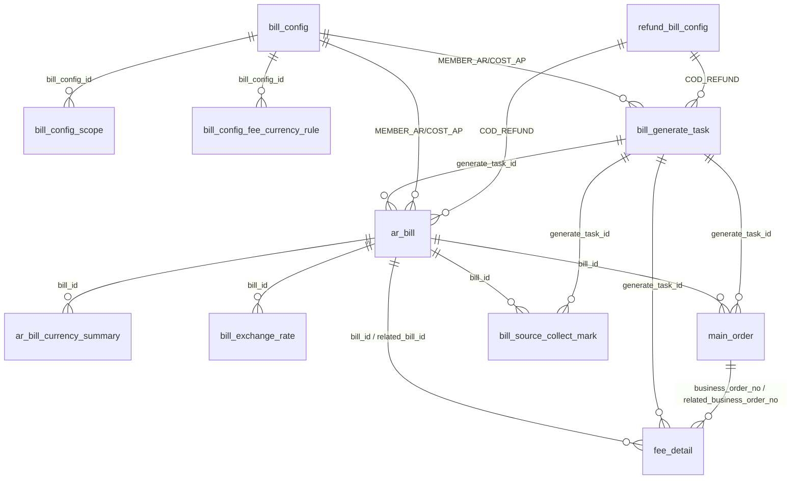
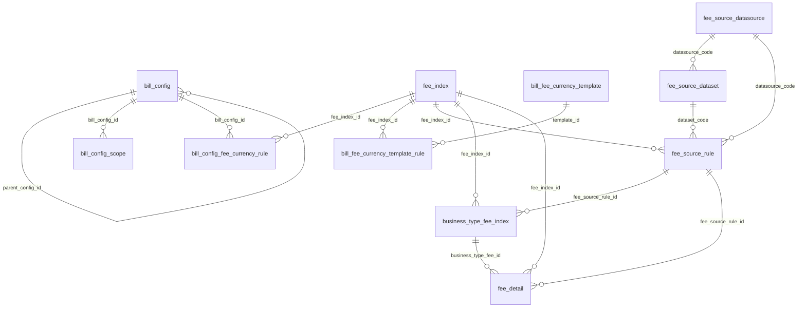
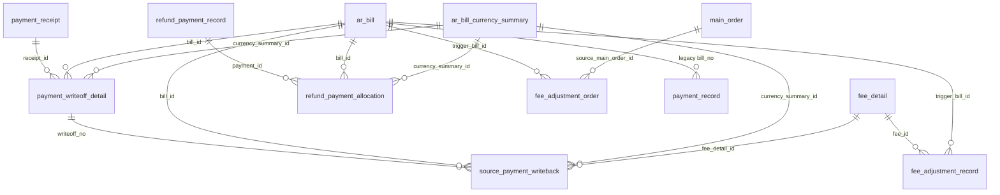
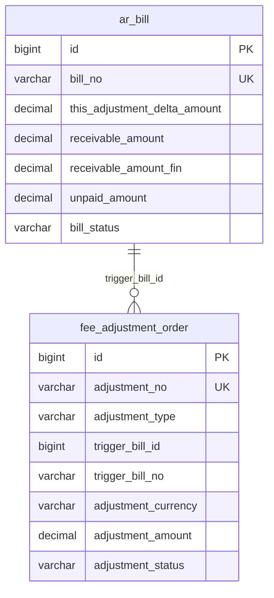
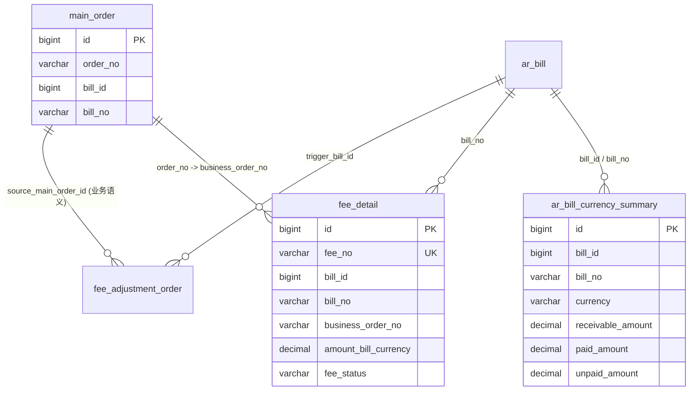
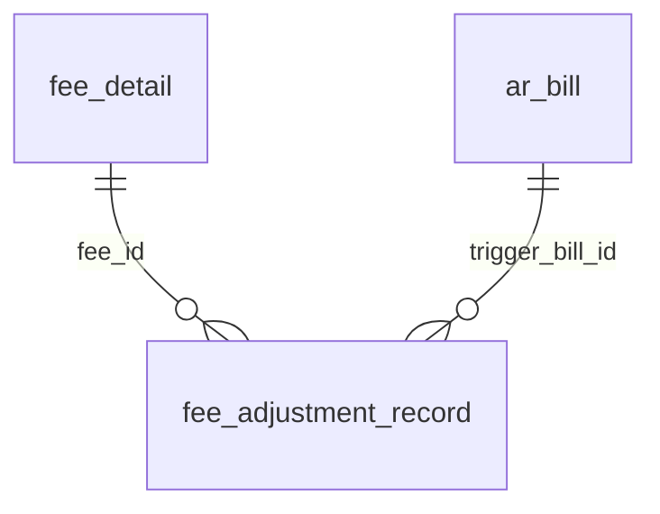

# BMS `ar_bill.sql` 关联关系图

## 1. 文档范围

- 数据来源：`aidocs/technical-caliber/sql/ar_bill.sql`
- 梳理时间：`2026-06-24`
- 范围说明：基于当前 DDL 中的表结构、字段命名、注释和索引推断关系

说明：

1. 当前库结构没有定义物理外键。
2. 下文中的关联关系属于“结构推断关系”，主要依据 `*_id`、`*_no`、`*_code`、唯一索引和字段注释整理。
3. `bill_config_id` 是一个带业务类型语义的复用字段：
   - `bill_type in (MEMBER_AR, COST_AP)` 时，通常关联 `bill_config.id`
   - `bill_type = COD_REFUND` 时，通常复用指向 `refund_bill_config.id`

## 2. 核心结论

1. `ar_bill` 是整个账单域的中心主表，生成任务、币种汇总、汇率、订单快照、费用快照、收款核销、返款分配都围绕它展开。
2. `bill_config`、`refund_bill_config` 负责提供账单生成配置，`bill_generate_task` 承担生成过程快照和执行留痕。
3. `fee_index`、`fee_source_rule`、`fee_source_dataset`、`fee_source_datasource`、`business_type_fee_index` 构成“费项定义 + 来源规则 + 业务映射”的计费规则链。
4. 资金处理分成两条独立链路：
   - 应收收款链：`payment_receipt -> payment_writeoff_detail -> source_payment_writeback`
   - COD 返款链：`refund_payment_record -> refund_payment_allocation`
5. `bms_operation_log`、`payment_record`、`settlement_terms` 更偏辅助/兼容表，不是主生成链路上的核心节点。

## 3. 核心账单主链路

### 3.1 主链路说明

1. `bill_generate_task` 是账单生成入口，按账期和账单类型驱动 `ar_bill` 落表。
2. `ar_bill_currency_summary` 是 `ar_bill` 的币种维度汇总子表。
3. `bill_exchange_rate` 为账单和费用换算提供锁定汇率快照。
4. `main_order` 保存进入账单的主订单快照。
5. `fee_detail` 是费用快照表，同时支持：
   - `bill_id` 作为主挂账账单
   - `related_bill_id` 作为关联账单
6. `bill_source_collect_mark` 用来记录来源数据是否已归集、已打标和补偿重试情况。

## 4. 配置与费项来源规则链路

### 4.1 规则链说明

1. `bill_config` 是账单配置主表，支持默认配置和分支配置，自关联字段为 `parent_config_id`。
2. `bill_config_scope` 负责配置适用范围，例如目的国、仓库。
3. `bill_config_fee_currency_rule` 负责配置“某业务类型 + 某费项”的收费币种策略。
4. `bill_fee_currency_template`、`bill_fee_currency_template_rule` 更像预制模板，为国家/业务场景提供默认收费币种参考。
5. `fee_index` 是费项字典主表。
6. `fee_source_datasource`、`fee_source_dataset`、`fee_source_rule` 定义“到哪个外部数据源、哪张来源表、取哪个金额字段”的采数规则。
7. `business_type_fee_index` 把业务类型和费项来源规则绑定起来，最终驱动 `fee_detail` 生成。

## 5. 资金处理与回写链路

### 5.1 资金链说明

1. `payment_receipt` 是应收收款主表。
2. `payment_writeoff_detail` 是应收核销明细，核销对象既可以落到 `ar_bill`，也可以细化到 `ar_bill_currency_summary`。
3. `source_payment_writeback` 表示核销完成后，对来源系统付款状态的回写补偿记录。
4. `refund_payment_record` 是返款打款流水主表。
5. `refund_payment_allocation` 把返款打款分配到具体返款账单和账单币种汇总。
6. `fee_adjustment_order`、`fee_adjustment_record` 分别承载调账单头和费用冲正记录。
7. `payment_record` 是旧接口兼容表，主要通过 `bill_no` 与账单发生业务键关联。

## 6. 辅助与兼容关系

### 6.1 辅助表

1. `bms_operation_log`
   - 通过 `biz_type + biz_id` 记录各类业务对象操作日志
   - 更偏审计留痕，不属于主外键链路

2. `settlement_terms`
   - 通过 `customer_no + sc_id` 与客户、账单配置、账单主表形成业务维度关联
   - 当前更像历史兼容结算条款表，不直接参与账单生成

### 6.2 业务键关联补充

1. `ar_bill.bill_no` 是账单域最重要的业务主键之一，`payment_record`、`payment_writeoff_detail`、`refund_payment_allocation`、`source_payment_writeback` 等表都保留了它的快照。
2. `main_order.order_no`、`fee_detail.business_order_no`、`fee_detail.related_business_order_no` 构成订单与费用的业务键关联。
3. `customer_no`、`member_code`、`sc_id`、`shop_id`、`user_id` 是跨配置、账单、收款、返款、规则表的统一主体维度。

## 7. 推荐阅读顺序

1. 先看“核心账单主链路”，理解 `bill_generate_task -> ar_bill -> summary/detail` 的主过程。
2. 再看“配置与费项来源规则链路”，理解费用是如何从来源系统被拉取和映射出来的。
3. 最后看“资金处理与回写链路”，区分应收收款和返款打款两条资金闭环。

## 8. 调账关联关系图

### 8.1 普通调账链路

说明：

1. 普通调账对应 `ArBillServiceImpl.adjustment()`。
2. 该流程核心只落两张表：
   - `fee_adjustment_order`：插入一条调账/红冲单头记录
   - `ar_bill`：直接累计 `this_adjustment_delta_amount`，并同步刷新应收、未收和账单状态
3. 当前实现里，普通调账不会直接重算 `ar_bill_currency_summary`，也不会直接改 `fee_detail`、`main_order`。

### 8.2 重整调账链路

说明：

1. 重整调账对应 `ArBillServiceImpl.rebuildAdjustment()`。
2. 这条链路会涉及：
   - `fee_adjustment_order`：登记一条 `REBUILD` 类型的调账单
   - `main_order`：校验订单是否属于当前/往期账单
   - `fee_detail`：按订单汇总金额，并给被重整订单的费用记录补充重整备注
   - `ar_bill_currency_summary`：按账单重新汇总，执行“先删后重建”
   - `ar_bill`：基于重算后的汇总结果刷新账单金额和状态
3. 这里的 `source_main_order_id` 在表结构中是预留的来源主单快照字段，但当前重整实现主要还是按 `order_no`、`bill_no` 做校验和汇总。

### 8.3 费用级冲正记录补充

说明：

1. `fee_adjustment_record` 是费用级冲正记录表，更偏“费用明细级留痕”。
2. 它和账单调账有关，但不属于当前 `ArBillServiceImpl.adjustment()` 的主写入链路。
3. 如果后面要做“按费用逐条冲正”的增强能力，这张表会成为关键支撑表。
