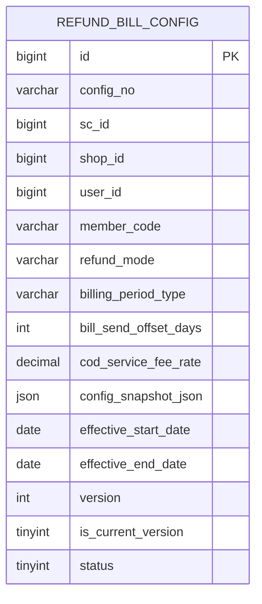

# BMS COD 返款账单配置一期开发方案

## 1. 一期结论

返款账单配置是独立业务域，与应收账单配置 `bill_config` 不建立任何关联。

一期只完成返款账单配置的创建、编辑、查询能力，不设计返款账期锚点表、返款扣减规则表、币种账户规则表，也不接入返款账单生成。

一期边界：

1. 只新增一张主表：`refund_bill_config`。
2. 不新增 `refund_bill_config_deduction_rule`。
3. 不新增 `refund_bill_config_currency_rule`。
4. 不新增返款账期锚点表。
5. 不修改 `BillConfigServiceImpl`、`BillConfigMapper`、`BillTypeEnum` 和应收配置 DTO。
6. 页面可以展示原型字段，但一期先作为配置快照保存在主表结构化字段和 `config_snapshot_json` 中。
7. 后续账单生成、扣减计算、币种账户精细化匹配时，再拆分二期专属子表。

## 2. 原型读取结果

原型地址：

```text
http://localhost:9999/#id=ngn0y4&p=返款账单配置页&g=1
```

读取页面：

```text
返款账单配置页.html
files/返款账单配置页/data.js
```

原型枚举和默认值：

| 控件 | 枚举/默认值 |
| --- | --- |
| 返款模式 | `签收返款`、`回款返款`，默认 `签收返款` |
| 账期类型 | `周`、`半周`，默认 `周` |
| 账单发出时间 | 默认 `2` 天 |
| 代收货款手续费比例 | 页面文案为“应返货款金额 {...%} 用作代收货款手续费”，默认 `3%` |
| 条款生效周期 | 示例值 `2023/01/01 ~ 2026/12/31` |
| 汇兑策略 | `随原始币种`、`指定币种` |
| 货款原始币种 | `不限`、`美元`、`日元`、`台币`、`其他` |
| 货款结算币种 | `美元`、`日元`、`台币` |
| 客户收款账户示例 | VISA台币账户、VISA日元账户、VISA美元账户 |
| 在应返货款中直接扣减的费项 | `代收货款手续费`、`超材费`、`重出费`、`其他应收费项`；默认勾选 `代收货款手续费`、`超材费`、`重出费` |

本次仅同步新增的“在应返货款中直接扣减的费项”字段；返款账期类型一期仅支持周与半周。

## 3. 与应收配置的边界

返款配置不得关联或复用以下对象：

```text
bill_config
bill_config_scope
bill_config_fee_currency_rule
BillConfigServiceImpl
BillConfigMapper
BillConfigRemoteService
```

应收与返款只共享客户、店铺、组织、币种、账户等主数据，不共享配置表。

页面入口边界：

```text
应收账单配置 Tab -> 现有应收接口与 SettlementSettingPanel
返款账单配置 Tab -> 独立返款配置接口与 RefundBillConfigPanel
```

两个 Tab 不共享列表记录、分页、统计、抽屉状态和保存逻辑。

## 4. 一期页面字段

一期页面按原型展示完整配置，但只落一张主表。

| 页面字段 | 一期存储位置 | 说明 |
| --- | --- | --- |
| COD 包裹货款代收条款开关 | `refund_bill_config.status` | 启用/停用配置 |
| 返款模式 | `refund_bill_config.refund_mode` | `SIGNED` / `RECEIVED` |
| 账期类型 | `refund_bill_config.billing_period_type` | 返款配置独立字典，仅支持 `WEEK/HALF_WEEK` |
| 账单发出时间 | `refund_bill_config.bill_send_offset_days` | 默认 2 天 |
| 代收货款手续费比例 | `refund_bill_config.cod_service_fee_rate` | 页面文案为“应返货款金额 {...%} 用作代收货款手续费”，默认 0.030000；代收货款手续费金额按 `ofp_ofdb1.sale_order_header.collection_premium_amount` 取数 |
| 条款生效周期 | `effective_start_date/effective_end_date` | 独立于应收配置 |
| 币种账户矩阵 | `config_snapshot_json` | 一期仅保存页面配置快照，不参与计算；必须至少一条 |
| 在应返货款中直接扣减的费项 | `config_snapshot_json` | 一期仅保存页面配置快照，不拆返款扣减规则表、不参与扣减计算；默认保存 `代收货款手续费`、`超材费`、`重出费` |

币种账户矩阵和直接扣减费项二期再拆表，不在一期设计结构化子表。一期前端新增配置时必须默认带出一条矩阵行，货款原始币种默认 `不限`；直接扣减费项默认勾选 `代收货款手续费`、`超材费`、`重出费`。

## 5. 一期数据模型



## 6. 一期 DDL

```sql
CREATE TABLE `refund_bill_config` (
  `id` bigint(20) unsigned NOT NULL AUTO_INCREMENT COMMENT '主键ID',
  `config_no` varchar(64) NOT NULL COMMENT '返款配置编号',
  `sc_id` bigint(20) NOT NULL COMMENT '供应链/组织ID',
  `shop_id` bigint(20) NOT NULL COMMENT '店铺ID',
  `user_id` bigint(20) NOT NULL COMMENT '用户ID',
  `customer_info_id` bigint(20) DEFAULT NULL COMMENT '客户信息ID',
  `member_code` varchar(64) NOT NULL COMMENT '会员编码',
  `member_name` varchar(128) DEFAULT NULL COMMENT '客户名称快照',
  `customer_no` varchar(64) DEFAULT NULL COMMENT '客户编码',
  `refund_mode` varchar(32) NOT NULL COMMENT '返款模式：SIGNED签收返款，RECEIVED回款返款',
  `billing_period_type` varchar(32) NOT NULL COMMENT '返款账期类型：WEEK周/HALF_WEEK半周',
  `bill_send_offset_days` int(11) NOT NULL DEFAULT '2' COMMENT '账期结束后第几天预定发出账单',
  `cod_service_fee_rate` decimal(10,6) NOT NULL DEFAULT '0.030000' COMMENT '代收货款手续费比例，0.03表示3%',
  `config_snapshot_json` json DEFAULT NULL COMMENT '一期页面配置快照JSON，包含币种账户矩阵等暂不拆表字段',
  `effective_start_date` date NOT NULL COMMENT '生效开始日期',
  `effective_end_date` date DEFAULT NULL COMMENT '生效结束日期',
  `status` tinyint(1) NOT NULL DEFAULT '1' COMMENT '状态：1启用，0停用',
  `version` int(11) NOT NULL DEFAULT '1' COMMENT '版本号',
  `is_current_version` tinyint(1) NOT NULL DEFAULT '1' COMMENT '是否当前版本：1是，0否',
  `remark` varchar(500) DEFAULT NULL COMMENT '备注',
  `created_at` datetime NOT NULL DEFAULT CURRENT_TIMESTAMP COMMENT '创建时间',
  `created_by` varchar(64) DEFAULT NULL COMMENT '创建人',
  `updated_at` datetime NOT NULL DEFAULT CURRENT_TIMESTAMP ON UPDATE CURRENT_TIMESTAMP COMMENT '更新时间',
  `updated_by` varchar(64) DEFAULT NULL COMMENT '更新人',
  `is_deleted` tinyint(1) NOT NULL DEFAULT '0' COMMENT '逻辑删除：0否，1是',
  `current_version_guard` tinyint GENERATED ALWAYS AS (
    CASE WHEN `is_current_version` = 1 AND `is_deleted` = 0 THEN 1 ELSE NULL END
  ) STORED COMMENT '当前版本唯一约束辅助列',
  PRIMARY KEY (`id`),
  UNIQUE KEY `uk_refund_config_version` (`config_no`,`version`),
  UNIQUE KEY `uk_refund_config_current` (
    `sc_id`,`shop_id`,`user_id`,`member_code`,`current_version_guard`
  ),
  KEY `idx_refund_config_customer` (
    `sc_id`,`shop_id`,`user_id`,`member_code`,`status`,`is_deleted`
  ),
  KEY `idx_refund_config_effective` (
    `effective_start_date`,`effective_end_date`,`status`,`is_deleted`
  )
) ENGINE=InnoDB DEFAULT CHARSET=utf8mb4 COMMENT='COD返款账单配置';
```

配置编号建议：

```text
RCB-{customerNo}-Scheme-{timestamp}-v{version}
```

`config_snapshot_json` 一期建议保存：

```json
{
  "currencyRules": [
    {
      "sourceCurrencyScope": "ANY",
      "sourceCurrency": null,
      "exchangeStrategy": "SOURCE_CURRENCY",
      "settlementCurrency": null,
      "customerReceiptAccountId": 2001,
      "receiptAccountName": "VISA账户",
      "receiptAccountNoMasked": "4012 **** **** 1881"
    }
  ],
  "directDeductFeeItems": [
    {
      "feeCode": "COD_SERVICE_FEE",
      "feeName": "代收货款手续费"
    },
    {
      "feeCode": "OVERSIZE_FEE",
      "feeName": "超材费"
    },
    {
      "feeCode": "REISSUE_FEE",
      "feeName": "重出费"
    }
  ]
}
```

## 7. 一期枚举

| 枚举 | 值 |
| --- | --- |
| `RefundModeEnum` | `SIGNED`、`RECEIVED` |
| `RefundBillingPeriodTypeEnum` | `WEEK` 周、`HALF_WEEK` 半周 |
| `RefundDirectDeductFeeItemEnum` | `COD_SERVICE_FEE` 代收货款手续费、`OVERSIZE_FEE` 超材费、`REISSUE_FEE` 重出费、`OTHER_RECEIVABLE_FEE` 其他应收费项 |

一期不新增扣减规则表、币种规则表、汇兑策略相关后端枚举；币种账户矩阵和直接扣减费项作为快照 JSON 保存。直接扣减费项页面选项改为读取 `fee_index`，快照保存用户选择的 `fee_index.fee_code + fee_name`；历史原型枚举值仅作为兼容映射使用，不在一期参与账单扣减计算。

## 8. 一期 API 设计

返款配置使用独立 API，不调用 `/api/bms/billConfig/*`。

新增：

```text
RefundBillConfigRemoteService
RefundBillConfigController
RefundBillConfigService
RefundBillConfigServiceImpl
```

| 方法 | 路径 | 用途 |
| --- | --- | --- |
| POST | `/api/bms/refund-bill-config/page` | 查询返款配置列表 |
| POST | `/api/bms/refund-bill-config/detail` | 查询当前返款配置详情 |
| POST | `/api/bms/refund-bill-config/save` | 创建或编辑返款配置 |
| POST | `/api/bms/refund-bill-config/status` | 启用或停用当前返款配置 |
| GET | `/api/bms/refund-bill-config/options` | 查询一期枚举选项 |

保存请求示例：

```json
{
  "id": 12,
  "scId": 1,
  "shopId": 2,
  "userId": 3,
  "customerInfoId": 1001,
  "memberCode": "M001",
  "customerNo": "C001",
  "status": 1,
  "refundMode": "SIGNED",
  "billingPeriodType": "WEEK",
  "billSendOffsetDays": 2,
  "codServiceFeeRate": 0.03,
  "configSnapshotJson": {
    "currencyRules": [
      {
        "sourceCurrencyScope": "ANY",
        "sourceCurrency": null,
        "exchangeStrategy": "SOURCE_CURRENCY",
        "settlementCurrency": null,
        "customerReceiptAccountId": 2001
      }
    ],
    "directDeductFeeItems": [
      {
        "feeCode": "COD_SERVICE_FEE",
        "feeName": "代收货款手续费"
      },
      {
        "feeCode": "OVERSIZE_FEE",
        "feeName": "超材费"
      },
      {
        "feeCode": "REISSUE_FEE",
        "feeName": "重出费"
      }
    ]
  },
  "effectiveStartDate": "2026-07-01",
  "effectiveEndDate": "2026-12-31",
  "operator": "admin"
}
```

说明：

1. `id` 为空表示创建。
2. `id` 非空表示编辑当前配置并生成新版本。
3. 一期编辑仍采用版本化保存，不直接覆盖旧版本。

DTO：

```text
RefundBillConfigPageReqDTO
RefundBillConfigPageRespDTO
RefundBillConfigSaveReqDTO
RefundBillConfigDetailReqDTO
RefundBillConfigDetailRespDTO
RefundBillConfigStatusReqDTO
RefundBillConfigOptionsRespDTO
```

所有 DTO 类和字段必须有 JavaDoc，不使用 `Map<String, Object>` 作为 Controller 或 Service 方法入参/出参。`configSnapshotJson` 可在 DTO 中使用 `String` 或显式快照 DTO，推荐使用显式快照 DTO。

## 9. 一期后端实现

| 模块 | 新增内容 |
| --- | --- |
| `bms/model` | 返款配置实体、DTO、一期枚举 |
| `bms/dao` | `RefundBillConfigMapper` 与 MyBatis XML |
| `bms/biz` | `RefundBillConfigService` 与实现 |
| `bms/client` | `RefundBillConfigRemoteService` |
| `bms/web` | `RefundBillConfigController` |

返款配置 SQL 必须写在 XML 中，不使用 `SqlProvider` 或复杂注解 SQL。

不修改：

```text
BillConfigServiceImpl
BillConfigMapper
BillConfigRemoteService
BillConfigController
BillConfig相关DTO和实体
```

`RefundBillConfigServiceImpl.save()` 必须使用：

```java
@Transactional(rollbackFor = Exception.class)
```

保存流程：

1. 校验客户数据隔离字段和请求字段。
2. 创建时生成 `RCB-{customerNo}-Scheme-{timestamp}-v1`，编辑时按当前配置编号升级为下一版本后缀。
3. 编辑时查询当前版本并锁定。
4. 编辑时将旧版本置为 `is_current_version = 0`。
5. 插入新版本 `refund_bill_config`。
6. 返回新版本详情。

核心校验：

1. `scId/shopId/userId/memberCode` 必须完整。
2. 返款模式必须是有效枚举值。
3. 账期类型必须是返款配置独立字典定义的 `周` 或 `半周`。
4. 账单发出时间不能小于 `0`。
5. 手续费比例必须满足 `0 <= codServiceFeeRate < 1`。
6. 生效结束日期不能早于开始日期。
7. 同一客户只能存在一个未删除的当前返款配置。
8. `configSnapshotJson.currencyRules` 一期必须至少包含一条记录。
9. 新建配置或前端未选择货款原始币种时，默认保存为 `sourceCurrencyScope = ANY`、`sourceCurrency = null`。
10. `configSnapshotJson.directDeductFeeItems` 必须命中 `fee_index` 启用费项；新建配置或前端未传时，默认按费项名称匹配并保存 `代收货款手续费`、`超材费`、`重出费` 对应的 `fee_index` 记录；若运行环境缺少对应费项，则回退到历史原型值做兼容。

## 10. 一期前端实现

`admin_shell/src/views/billing/billConfig/index.vue` 保留统一入口，但数据完全独立：

```text
应收 Tab -> queryBillConfigPage
返款 Tab -> queryRefundBillConfigPage
```

返款配置新增独立组件：

```text
admin_shell/src/views/billing/billConfig/components/RefundBillConfigPanel.vue
```

组件一期能力：

1. COD 包裹货款代收条款开关。
2. 返款模式。
3. 账期类型。
4. 账单发出时间。
5. 代收货款手续费比例。
6. 条款生效周期。
7. 在应返货款中直接扣减的费项，支持多选，选项为 `代收货款手续费 / 超材费 / 重出费 / 其他应收费项`。
8. 币种账户矩阵按原型展示并进入快照 JSON，不做独立表校验。
9. 币种账户矩阵默认至少一条记录，货款原始币种默认 `不限`。

前端 API 新增：

```text
queryRefundBillConfigPage
getRefundBillConfigDetail
saveRefundBillConfig
updateRefundBillConfigStatus
getRefundBillConfigOptions
```

页面校验：

1. 账期类型下拉展示 `周 / 半周`。
2. 手续费比例按百分比展示，提交时转换为小数。
3. 生效周期必填开始日期。
4. 币种账户矩阵至少保留一行，不允许删除到 0 行。
5. 新增矩阵行或未选择货款原始币种时，默认货款原始币种为 `不限`。
6. 直接扣减费项多选默认勾选 `代收货款手续费 / 超材费 / 重出费`，提交到 `configSnapshotJson.directDeductFeeItems`。
7. 直接扣减费项选项来自后端返回的 `fee_index` 列表，组件需要支持搜索，不允许前端自定义文本。
8. 保存返款配置后只刷新返款 Tab。
9. 返款 Tab 不携带 `billType` 复用应收配置接口。

## 11. 二期及以后范围

以下内容不进入一期：

1. 返款扣减规则表。
2. 返款币种与收款账户规则表。
3. 返款账期锚点表。
4. 返款账单生成。
5. 扣减金额计算。
6. 汇兑策略结构化匹配。
7. 客户收款账户结构化校验。
8. 返款生成任务配置快照。

二期触发条件：

1. 需要根据配置自动生成返款账单。
2. 需要计算代收手续费、扣减项和应返金额。
3. 需要按原始币种、结算币种、收款账户做精确匹配。
4. 需要支持自定义账期起始日。

## 12. 一期测试范围

### 12.1 独立性

1. 保存、编辑、停用返款配置不读写 `bill_config`。
2. 应收配置的保存、版本和列表完全不受返款配置影响。
3. 一期只有 `refund_bill_config` 一张新表。
4. 两个 Tab 的列表、统计、分页和抽屉状态完全独立。

### 12.2 创建与编辑

1. 新客户创建返款配置成功。
2. 已有配置编辑后生成新版本。
3. 旧版本 `is_current_version = 0`。
4. 当前版本查询只返回最新有效版本。
5. 停用配置后列表和详情状态正确。

### 12.3 字段校验

1. 账期类型枚举只能保存 `WEEK` 或 `HALF_WEEK`。
2. 页面输入 `3%` 保存为 `0.03`。
3. 手续费比例小于 `0` 或大于等于 `100%` 时保存失败。
4. 生效结束日期早于开始日期时保存失败。
5. 缺少客户数据隔离字段时保存失败。
6. 币种账户矩阵为空时保存失败。
7. 未选择货款原始币种时保存为 `不限` 快照。
8. 未选择直接扣减费项时按默认值保存为 `代收货款手续费 / 超材费 / 重出费` 快照。
9. 直接扣减费项包含非原型枚举值时保存失败。

## 13. 上线与回滚

上线返款配置一期不需要修改或迁移 `bill_config` 数据。

上线顺序：

1. 发布 `refund_bill_config` DDL。
2. 发布返款配置后端接口。
3. 验证返款配置读写完全不访问应收配置表。
4. 发布返款配置前端页面。
5. 验证创建、编辑、查询、停用能力。

回滚规则：

1. 回滚前关闭返款配置入口。
2. 返款配置历史数据不物理删除。
3. 回滚返款功能不得修改应收配置表和应收账单数据。

## 14. 待确认事项

1. 一期币种账户矩阵是否只需要保存快照，不参与任何计算。
2. 一期是否需要支持停用配置，还是只做创建、编辑、查询。
3. 同一客户是否允许按店铺维护多份返款配置。
4. 手续费比例基数在二期计算时采用代收货款总额、实际回款金额还是汇兑后金额。
5. 原型是否后续恢复“账期起始日”交互。
6. `其他应收费项` 在二期拆分扣减规则时是否需要展开为具体费项明细。

## 15. 一期验收标准

1. 返款配置使用独立表、接口、Service、Mapper 和版本生命周期。
2. 一期只新增 `refund_bill_config` 表。
3. 返款配置表不存在 `bill_config_id`。
4. 返款配置创建、编辑、查询不影响任何应收配置。
5. 页面字段与原型一致，且核心字段完成前后端校验。
6. 币种账户矩阵至少保存一条快照，默认货款原始币种为 `不限`。
7. 直接扣减费项保存到配置快照，默认值和可选枚举与原型一致。
8. 保存新版本具备事务与历史追溯能力。
