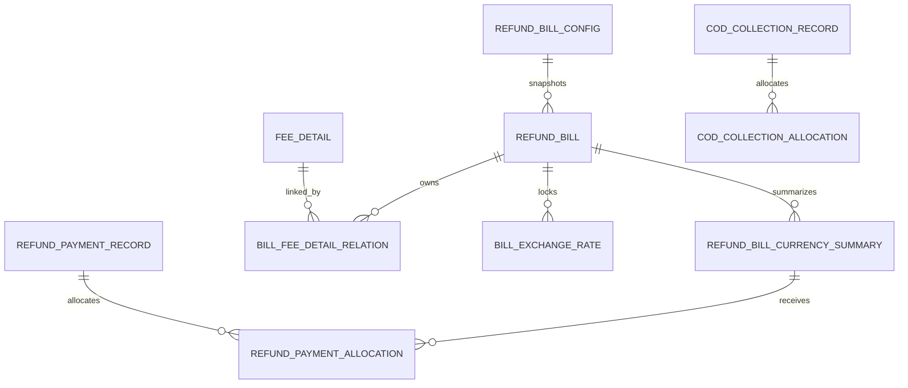

# BMS COD 返款账单开发设计

> 产品依据：`aidocs/product-caliber/bms/prd/返款账单.PRD.md`
>
> 账单生成调整依据：`aidocs/technical-caliber/bms/dev-specs/bms-bill-generate-adjustment-plan.md`
>
> 已有配置方案：`aidocs/technical-caliber/bms/dev-specs/bms-cod-refund-bill-config-development-plan.md`
>
> 当前页面框架：
>
> - `admin_shell/src/views/billing/refundBill/index.vue`
> - `admin_shell/src/views/billing/billConfig/index.vue`
> - `admin_shell/src/views/billing/billConfig/components/RefundBillConfigPanel.vue`

## 1. 设计结论

返款账单采用“独立业务主表 + 共享账单生成基础设施”的模型：

```text
订单、签收、台湾回款等业务源数据
  -> fee_detail                          公共费用源数据池
  -> bill_fee_detail_relation            账单费用关联及账单侧金额快照
  -> refund_bill                         返款账单主表
  -> refund_bill_currency_summary        返款账单币种汇总

台湾实际回款
  -> cod_collection_record               实际回款流水
  -> cod_collection_allocation           实际回款与订单/COD本金分配

向客户返款
  -> refund_payment_record               返款打款流水
  -> refund_payment_allocation            打款与返款账单币种汇总分配
```

核心结论：

1. 返款账单主表使用独立的 `refund_bill`，不复用 `ar_bill`。
2. 返款账单配置继续使用已落地的独立表 `refund_bill_config`，不并入 `bill_config`。
3. `fee_detail` 只保存来源费用及版本，不保存返款账单归属、返款汇率和账单金额。
4. 返款本金和扣减费项都通过共享表 `bill_fee_detail_relation` 进入返款账单。
5. `bill_fee_detail_relation.bill_type = COD_REFUND`，并通过 `settlement_role` 区分返款本金和扣减费项。
6. 返款业务汇率、银行汇率和财务本位币汇率保存为账单级快照，不回写来源费用。
7. “台湾侧实际回款”和“向客户返款打款”是方向相反的资金动作，必须使用不同表和不同状态。
8. 不复用应收账单的 `payment_receipt / payment_writeoff_detail` 登记返款打款；这些表表达客户向我方付款，与返款资金方向相反。
9. 返款账单和应收账单可以使用不同账期，但同一扣减费项只能被一个结算流程实际结算，禁止重复扣款。
10. 当前返款页面中的模拟状态和接口仅作为交互框架，后端状态以 PRD 状态机为准。

## 2. 当前项目基线

### 2.1 已完成能力

当前项目已具备：

1. 独立返款配置表、后端接口和前端配置面板。
2. 返款配置支持签收返款、回款返款、周/半周账期、直接扣减费项、手续费比例、币种账户矩阵和负数金额策略。
3. `admin_shell` 已存在返款账单列表、详情抽屉、复核、发送、登记打款、重新跑账单和导出入口。
4. `admin_shell/src/api/billing.js` 已预留 `/portal/bms/refundBill/*` 接口定义。
5. 应收账单已有主表、币种汇总、收款核销和账单生成实现，可参考其分页、金额汇总、状态校验和事务边界。

### 2.2 尚未完成能力

当前返款账单页面仍存在以下待实现项：

1. `USE_MOCK = true`，列表和详情使用模拟数据。
2. 后端尚无 `RefundBillRemoteService / RefundBillController / RefundBillService / RefundBillMapper`。
3. 返款账单生成尚未接入 `COD_REFUND` 账单类型策略。
4. 未建立返款账单主表、币种汇总、实际回款流水和返款打款流水。
5. 页面状态使用 `GENERATED / PENDING_REFUND / REFUNDED` 等临时状态，与 PRD 状态机未完全对齐。
6. 红冲调账、费用明细分页、汇率快照、未回款风险和资金对账尚未实现。

### 2.3 实施门禁

`bms-bill-generate-adjustment-plan.md` 已明确当前 `fee_detail` 存在多套 Schema 和代码模型。返款账单开发必须服从以下门禁：

1. P0-0 生产等价环境 Schema 摸底完成前，不执行 `fee_detail` 改造 DDL。
2. `bill_fee_detail_relation` 尚未落地前，不单独为返款账单复制一张返款费用明细事实表。
3. `bill_generate_task / bill_exchange_rate` 增加 `bill_type` 前，不接入正式返款账单生成任务。
4. 返款账单一期可先开发主表、查询、状态流转和打款接口，但正式金额生成必须等共享关系模型就绪。
5. 本文中的目标 DDL 是设计基线，执行前必须根据生产真实 Schema 生成独立变更脚本并完成演练。

## 3. 业务术语与资金方向

| 术语 | 方向 | 说明 |
| --- | --- | --- |
| COD 应收本金 | 买家应付给物流/平台 | 订单约定的代收货款 |
| 台湾实际回款 | 台湾物流或资金方 -> 我方 | 实际到账的 COD 货款，可能完全、部分或未回款 |
| 返款本金 | 我方 -> 客户 | 按签收或实际回款口径纳入返款账单的货款本金 |
| 返款扣减项 | 客户应付费用，从返款中扣减 | 基础运费、代收手续费等配置允许直接扣减的费项 |
| 应返金额 | 我方 -> 客户 | `返款本金 - 返款扣减项 + 调整项` |
| 返款打款 | 我方 -> 客户 | 财务实际向客户付款 |
| 未回款风险 | 台湾资金方尚未向我方支付 | 签收返款模式下尤其需要监控 |

必须避免将“实际回款登记”和“返款打款登记”都命名为 `payment` 后混用。API、DTO、表和页面文案应明确资金方向。

## 4. 业务流程设计

### 4.1 总体流程

```text
来源费用同步
  -> 同步 COD 本金、可扣减费项到 fee_detail
  -> 同步签收、回款及订单业务状态

返款账单生成
  -> 按 refund_bill_config 匹配客户配置
  -> CodRefundBillTypeStrategy 判断归集时点和账期
  -> 创建/匹配 refund_bill
  -> 创建 COD_REFUND 类型 bill_fee_detail_relation
  -> 锁定返款汇率、银行汇率和本位币汇率
  -> 刷新 refund_bill_currency_summary 和 refund_bill

账单流转
  -> 起草结束
  -> 财务复核
  -> 系统发送
  -> 财务登记返款打款
  -> 部分返款保持待结清
  -> 全额返款进入已结清

对账与风险
  -> 实际回款流水分配到订单
  -> 计算未回款金额和风险敞口
  -> 对比实际回款、返款本金、扣减项和已返金额
```

### 4.2 签收返款归集

签收返款模式使用订单广义签收时间作为返款归属时间：

1. 正常签收且签收时间落在账期内的 COD 本金进入返款账单。
2. 返款本金允许在实际台湾回款到账前进入返款账单。
3. 银行汇率取签收时点快照，返款业务汇率按配置和返款策略锁定。
4. 非正常签收、退件或取消订单不生成返款本金关系。
5. 非正常签收订单对应扣减费项不进入返款账单，按应收账单规则处理。
6. 已返款但台湾侧仍未回款的金额进入未回款风险监控。

### 4.3 回款返款归集

回款返款模式使用实际回款分配时间作为返款归属时间：

1. `cod_collection_record` 登记实际到账流水。
2. `cod_collection_allocation` 将流水分配到订单/COD 本金。
3. 已分配实际回款金额落在账期内的部分进入返款账单。
4. 部分回款只按已分配金额生成返款本金，未回款余额继续监控。
5. 正常签收但尚未回款的订单可以出现在账单详情的未回款监控区，但不计入回款返款模式的应返本金。
6. 银行汇率取实际回款时点快照。

### 4.4 扣减费项分流

扣减费项按 `refund_bill_config.config_snapshot_json.directDeductFeeItems` 匹配：

1. 命中直接扣减配置、订单符合返款条件且返款账单仍处于可追加状态时，优先进入返款账单。
2. 返款账单关系使用 `settlement_role = REFUND_DEDUCTION`。
3. 扣减项金额在关系表中保留正数原始金额，由返款汇总策略执行减法；禁止依赖前端判断正负。
4. 未命中返款扣减规则的费用继续按应收账单规则处理。
5. 非正常签收订单的扣减费项进入应收账单。
6. 费项已经在应收账单完成结算时，不允许再次在返款账单扣减；需要通过调账流程处理。
7. 应收页面需要展示“已在返款账单扣减”的费用时，通过跨账单关联查询展示，不新增参与应收金额汇总的有效关系。

### 4.5 负数应返金额

按返款配置的 `negativeAmountPolicy` 处理：

| 策略 | 处理方式 |
| --- | --- |
| `NEXT_REFUND_BILL` | 本期币种汇总应返金额最低为 0，超出本金的扣减金额形成待补扣余额，结转到后续返款账单 |
| `CURRENT_AR_BILL` | 本期币种汇总应返金额最低为 0，超出部分生成应收侧调整/补录关系，由应收账单结算 |

待补扣金额不得通过直接修改来源 `fee_detail` 实现。建议在账单关系或调整关系中保存结转来源和目标账单关系。

## 5. 状态模型

### 5.1 返款账单主状态

后端统一使用以下状态：

| 状态码 | 中文 | 说明 |
| --- | --- | --- |
| `DRAFT` | 起草中 | 账期内持续归集，允许追加和重算 |
| `UNDER_REVIEW` | 待审核 | 起草结束，明细冻结，允许补录、红冲和复核 |
| `PENDING_SETTLEMENT` | 待结清 | 复核并发送后等待返款打款，部分返款仍保持此状态 |
| `SETTLED` | 已结清 | 所有结算币种均已完成返款 |
| `VOID` | 已作废 | 仅用于作废账单，保留审计 |

发送失败、逾期未返、部分返款、异常回款、待补扣均作为标记或子状态，不增加主状态。

### 5.2 页面临时状态映射

| 当前页面临时状态 | 目标状态/标记 |
| --- | --- |
| `GENERATED` | `UNDER_REVIEW` |
| `PENDING_REFUND` | `PENDING_SETTLEMENT` |
| `OVERDUE_UNREFUNDED` | `PENDING_SETTLEMENT + overdue_flag = 1` |
| `REFUNDED` | `SETTLED` |
| `DRAFT` | `DRAFT` |

### 5.3 状态流转与操作

| 当前状态 | 操作 | 目标状态 | 约束 |
| --- | --- | --- | --- |
| `DRAFT` | 账期最后一轮归集完成 | `UNDER_REVIEW` | 系统动作 |
| `DRAFT` | 重新生成/重算 | `DRAFT` | 不回退来源同步标识 |
| `UNDER_REVIEW` | 复核通过并发送成功 | `PENDING_SETTLEMENT` | 明细和金额必须校验通过 |
| `UNDER_REVIEW` | 补录/红冲/调账 | `UNDER_REVIEW` | 写账单关系并重新汇总 |
| `PENDING_SETTLEMENT` | 部分返款 | `PENDING_SETTLEMENT` | 更新币种汇总和打款记录 |
| `PENDING_SETTLEMENT` | 全额返款 | `SETTLED` | 所有币种未返金额为 0 |
| `PENDING_SETTLEMENT` | 客户反馈有误 | `UNDER_REVIEW` | 已发生打款时需先处理返款调整 |
| `SETTLED` | 查看/导出 | `SETTLED` | 禁止直接改金额 |

## 6. 数据模型设计

### 6.1 模型关系



### 6.2 `refund_bill`：返款账单主表

该表参考 `ar_bill` 的数据隔离、账期、金额汇总和审计字段，但使用返款业务语义。

| 分类 | 字段 | 类型 | 说明 |
| --- | --- | --- | --- |
| 主键 | `id` | bigint unsigned | 主键 |
| 编号 | `bill_no` | varchar(64) | 全局唯一，建议前缀 `RFB` |
| 类型 | `bill_type` | varchar(32) | 固定 `COD_REFUND` |
| 状态 | `bill_status` | varchar(32) | `DRAFT/UNDER_REVIEW/PENDING_SETTLEMENT/SETTLED/VOID` |
| 配置 | `refund_bill_config_id` | bigint unsigned | 使用的返款配置版本 ID |
| 配置 | `refund_bill_config_no` | varchar(64) | 返款配置编号快照 |
| 配置 | `refund_bill_config_version` | int | 配置版本快照 |
| 配置 | `config_snapshot_json` | json | 本次生成使用的完整配置快照 |
| 任务 | `generate_task_id` | bigint unsigned | 生成任务 ID |
| 隔离 | `sc_id/shop_id/user_id` | bigint | 数据隔离维度 |
| 客户 | `customer_info_id` | bigint | 客户信息 ID |
| 客户 | `member_code/member_name/customer_no` | varchar | 客户快照 |
| 模式 | `refund_mode` | varchar(32) | `SIGNED/RECEIVED` |
| 账期 | `billing_cycle_type` | varchar(32) | `WEEK/HALF_WEEK` |
| 账期 | `billing_period_start_date/end_date` | date | 返款账期 |
| 时间 | `planned_send_date` | date | 计划发出日期 |
| 时间 | `sent_at/settled_at` | datetime | 实际发送、结清时间 |
| 标记 | `send_failed_flag` | tinyint | 发送失败标记 |
| 标记 | `overdue_flag/overdue_days` | tinyint/int | 逾期标记和天数 |
| 币种 | `fin_currency` | varchar(16) | 财务本位币 |
| 金额 | `principal_amount_fin` | decimal(18,4) | 返款本金本位币汇总 |
| 金额 | `deduction_amount_fin` | decimal(18,4) | 扣减项本位币汇总 |
| 金额 | `refundable_amount_fin` | decimal(18,4) | 应返本位币汇总 |
| 金额 | `refunded_amount_fin` | decimal(18,4) | 已返本位币汇总 |
| 金额 | `unrefunded_amount_fin` | decimal(18,4) | 未返本位币汇总 |
| 风险 | `uncollected_amount_fin` | decimal(18,4) | 未回款风险本位币汇总 |
| 审核 | `reviewed_at/reviewed_by` | datetime/varchar | 复核信息 |
| 审计 | `created_at/created_by/updated_at/updated_by/is_deleted` | - | 标准审计字段 |

推荐唯一键和索引：

```text
uk_refund_bill_no (bill_no)
uk_refund_bill_period (
  refund_bill_config_id,
  billing_period_start_date,
  billing_period_end_date
)
idx_refund_bill_customer_status (
  sc_id, shop_id, user_id, member_code, bill_status, is_deleted
)
idx_refund_bill_period (billing_period_start_date, billing_period_end_date)
idx_refund_bill_task (generate_task_id)
```

说明：

1. 一张返款账单允许包含多个结算币种，主表本位币金额只用于汇总展示。
2. `refund_bill_config_id` 指向实际使用的配置历史版本，不指向当前最新版本。
3. `config_snapshot_json` 必须保存币种规则、扣减项、手续费比例和负数金额策略，避免配置变更影响历史账单。
4. 不在主表保存单一默认结算币种，实际结算币种以币种汇总和关系表为准。

### 6.3 `refund_bill_currency_summary`：返款账单币种汇总

| 字段 | 类型 | 说明 |
| --- | --- | --- |
| `id` | bigint unsigned | 主键 |
| `bill_id/bill_no` | bigint/varchar | 返款账单 |
| `currency` | varchar(16) | 货款结算币种 |
| `fin_currency` | varchar(16) | 财务本位币 |
| `principal_amount` | decimal(18,4) | 返款本金 |
| `deduction_amount` | decimal(18,4) | 返款扣减金额 |
| `adjustment_amount` | decimal(18,4) | 调整净额 |
| `refundable_amount` | decimal(18,4) | 应返金额 |
| `refunded_amount` | decimal(18,4) | 已返金额 |
| `unrefunded_amount` | decimal(18,4) | 未返金额 |
| `pending_deduction_amount` | decimal(18,4) | 待补扣金额 |
| `principal_amount_fin` | decimal(18,4) | 本金本位币金额 |
| `deduction_amount_fin` | decimal(18,4) | 扣减本位币金额 |
| `refundable_amount_fin` | decimal(18,4) | 应返本位币金额 |
| `refunded_amount_fin` | decimal(18,4) | 已返本位币金额 |
| `unrefunded_amount_fin` | decimal(18,4) | 未返本位币金额 |
| `summary_status` | varchar(32) | `WAITING_REFUND/PART_REFUNDED/REFUNDED` |
| `fee_count/order_count` | int | 明细数和订单数 |
| `created_at/updated_at` | datetime | 审计时间 |

唯一键：

```text
uk_refund_bill_currency (bill_no, currency)
```

汇总公式：

```text
principal_amount
  = SUM(REFUND_PRINCIPAL 有效关系金额)

deduction_amount
  = SUM(REFUND_DEDUCTION 有效关系金额)

adjustment_amount
  = SUM(ADJUSTMENT/REVERSAL 对应有效关系净额)

raw_refundable_amount
  = principal_amount - deduction_amount + adjustment_amount

refundable_amount
  = MAX(raw_refundable_amount, 0)

pending_deduction_amount
  = ABS(MIN(raw_refundable_amount, 0))

unrefunded_amount
  = MAX(refundable_amount - refunded_amount, 0)
```

### 6.4 `bill_fee_detail_relation`：返款账单费用事实

返款账单复用调整方案中的共享关系表，不新增 `refund_bill_fee_detail`。

返款关系固定口径：

| 字段 | 返款取值 |
| --- | --- |
| `bill_type` | `COD_REFUND` |
| `bill_id/bill_no` | `refund_bill.id/bill_no` |
| `bill_config_id` | 保存 `refund_bill_config.id`，作为逻辑配置 ID，不建立到 `bill_config` 的外键 |
| `settlement_subject_type` | `MEMBER` |
| `settlement_subject_code` | 客户会员编码 |
| `settlement_role` | `REFUND_PRINCIPAL/REFUND_DEDUCTION` |
| `relation_type` | `SOURCE/MANUAL/ADJUSTMENT/REVERSAL` |
| `relation_status` | `NORMAL/REPLACED/REVERSED/VOID` |
| `calculation_rule_code` | `COD_REFUND_SIGNED/COD_REFUND_RECEIVED/COD_REFUND_DEDUCTION` 等 |
| `calculation_snapshot_json` | 返款模式、归属时点、返款汇率、银行汇率、手续费规则、负数策略等 |

有效金额仍只读取：

```text
relation_status IN ('NORMAL', 'REVERSED')
```

返款本金来源建议：

| 模式 | `fee_detail.source_fee_key` 建议 | 原始金额 |
| --- | --- | --- |
| 签收返款 | `COD_SIGNED:{orderId}:{codVersion}` | 订单应收 COD 本金 |
| 回款返款 | `COD_COLLECTION_ALLOC:{allocationId}` | 实际回款分配金额 |

扣减费项继续使用其真实来源费用业务键，不因进入返款账单而复制来源费用。

### 6.5 跨账单扣减结算归属

同一扣减费用可以被应收页面展示，但只能实际结算一次。仅依靠 `bill_type + settlement_role` 幂等规则无法阻止应收和返款并发重复结算。

建议新增轻量归属表 `fee_settlement_claim`：

| 字段 | 类型 | 说明 |
| --- | --- | --- |
| `id` | bigint unsigned | 主键 |
| `fee_detail_id` | bigint unsigned | 来源费用 ID |
| `claim_role` | varchar(32) | `CUSTOMER_CHARGE` 等互斥结算角色 |
| `owner_bill_type` | varchar(32) | `COD_REFUND/MEMBER_AR` |
| `owner_bill_id/owner_bill_no` | bigint/varchar | 实际结算账单 |
| `owner_relation_id` | bigint unsigned | 实际结算关系 |
| `claim_status` | varchar(32) | `ACTIVE/RELEASED/REPLACED` |
| `created_at/created_by/updated_at/updated_by` | - | 审计字段 |

唯一约束：

```text
同一 fee_detail_id + claim_role 同一时刻只能存在一条 ACTIVE 归属
```

处理顺序：

1. 返款账单策略命中直接扣减项时，在账单分组事务中先获取结算归属。
2. 获取成功后创建 `REFUND_DEDUCTION` 关系。
3. 已被应收账单结算时，不直接抢占；进入待处理或调账流程。
4. 应收账单生成时发现该费用已归属返款账单，不再计入应收金额，但允许通过关联查询展示。
5. 未复核账单来源版本替换时，旧归属置 `REPLACED`，新版本重新获取归属。

如项目决定不新增该表，则必须在 `bill_fee_detail_relation` 上实现等价的跨账单互斥约束和并发锁；禁止只依赖应用层先查后插。

### 6.6 `cod_collection_record`：台湾实际回款流水

该表保存台湾物流、银行或其他资金方实际向我方支付的 COD 回款。

| 字段 | 类型 | 说明 |
| --- | --- | --- |
| `id` | bigint unsigned | 主键 |
| `collection_no` | varchar(64) | 回款流水号 |
| `source_system/source_record_no` | varchar | 来源系统与来源流水号 |
| `sc_id/shop_id/user_id` | bigint | 数据隔离 |
| `member_code` | varchar(64) | 客户编码 |
| `payer_name/payer_account` | varchar | 付款方信息 |
| `collection_currency` | varchar(16) | 实际回款币种 |
| `collection_amount` | decimal(18,4) | 实际回款金额 |
| `allocated_amount` | decimal(18,4) | 已分配金额 |
| `unallocated_amount` | decimal(18,4) | 未分配金额 |
| `bank_exchange_rate` | decimal(18,8) | 回款时银行汇率快照 |
| `fin_currency/amount_fin_currency` | varchar/decimal | 本位币和换算金额 |
| `collected_at` | datetime | 实际回款时间 |
| `collection_status` | varchar(32) | `UNALLOCATED/PART_ALLOCATED/ALLOCATED/VOID` |
| `voucher_url/remark` | varchar | 凭证和备注 |
| `created_at/created_by/updated_at/updated_by/is_deleted` | - | 审计字段 |

唯一键建议：

```text
uk_cod_collection_no (collection_no)
uk_cod_collection_source (source_system, source_record_no)
```

### 6.7 `cod_collection_allocation`：实际回款订单分配

| 字段 | 类型 | 说明 |
| --- | --- | --- |
| `id` | bigint unsigned | 主键 |
| `allocation_no` | varchar(64) | 分配流水号 |
| `collection_id/collection_no` | bigint/varchar | 实际回款流水 |
| `business_order_no` | varchar(64) | 订单号 |
| `fee_detail_id` | bigint unsigned | 对应 COD 本金来源费用，可在费用同步后回填 |
| `allocation_currency` | varchar(16) | 分配币种 |
| `allocation_amount` | decimal(18,4) | 分配金额 |
| `allocated_at` | datetime | 分配时间，也是回款返款归属时间候选 |
| `allocation_status` | varchar(32) | `NORMAL/REVERSED/VOID` |
| `original_allocation_id` | bigint unsigned | 反分配来源 |
| `created_at/created_by/updated_at/updated_by` | - | 审计字段 |

关键规则：

1. 同一回款流水允许分配到多个订单。
2. 同一订单允许接收多笔部分回款。
3. 有效分配合计不得超过回款流水金额。
4. 反分配新增反向记录，不物理删除原记录。
5. 回款返款模式按有效分配记录生成返款本金来源费用。

### 6.8 `refund_payment_record`：向客户返款打款流水

| 字段 | 类型 | 说明 |
| --- | --- | --- |
| `id` | bigint unsigned | 主键 |
| `payment_no` | varchar(64) | 返款打款流水号 |
| `sc_id/shop_id/user_id` | bigint | 数据隔离 |
| `member_code` | varchar(64) | 收款客户 |
| `receipt_account_id/name/no_masked` | - | 客户收款账户快照 |
| `payment_currency` | varchar(16) | 打款币种 |
| `payment_amount` | decimal(18,4) | 打款金额 |
| `allocated_amount` | decimal(18,4) | 已分配到账单金额 |
| `unallocated_amount` | decimal(18,4) | 未分配金额 |
| `payment_channel` | varchar(32) | 银行转账、第三方支付等 |
| `paid_at` | datetime | 实际打款时间 |
| `payment_status` | varchar(32) | `CREATED/CONFIRMED/PART_ALLOCATED/ALLOCATED/REVERSED/VOID` |
| `voucher_url/remark` | varchar | 凭证和备注 |
| `created_at/created_by/updated_at/updated_by/is_deleted` | - | 审计字段 |

### 6.9 `refund_payment_allocation`：返款打款分配

| 字段 | 类型 | 说明 |
| --- | --- | --- |
| `id` | bigint unsigned | 主键 |
| `allocation_no` | varchar(64) | 分配流水号 |
| `payment_id/payment_no` | bigint/varchar | 返款打款流水 |
| `bill_id/bill_no` | bigint/varchar | 返款账单 |
| `currency_summary_id` | bigint unsigned | 返款账单币种汇总 |
| `payment_currency` | varchar(16) | 打款币种 |
| `allocation_amount_payment_currency` | decimal(18,4) | 打款币种分配金额 |
| `bill_currency` | varchar(16) | 账单结算币种 |
| `exchange_rate_to_bill` | decimal(18,8) | 打款币种到结算币种汇率 |
| `allocation_amount_bill_currency` | decimal(18,4) | 结算币种分配金额 |
| `fin_currency/exchange_rate_to_fin/allocation_amount_fin_currency` | - | 本位币换算快照 |
| `allocation_status` | varchar(32) | `NORMAL/REVERSED/VOID` |
| `allocated_at/allocated_by` | datetime/varchar | 分配审计 |
| `original_allocation_id/remark` | - | 反向分配来源和备注 |

关键规则：

1. 打款登记必须锁定 `refund_bill_currency_summary`。
2. 分配金额不得超过该币种汇总的未返金额。
3. 部分打款更新币种汇总，但账单主状态保持 `PENDING_SETTLEMENT`。
4. 所有币种汇总均为 `REFUNDED` 后，账单进入 `SETTLED`。
5. 撤销打款使用反向分配或状态反转，不能物理删除。

### 6.10 共享表调整

返款账单依赖调整方案中的共享表：

| 表 | 返款账单要求 |
| --- | --- |
| `fee_detail` | 保存 COD 本金、扣减费项及来源版本 |
| `bill_fee_detail_relation` | 支持 `bill_type = COD_REFUND` 和返款结算角色 |
| `bill_exchange_rate` | 增加 `bill_type`，支持返款业务汇率和银行参考汇率 |
| `bill_generate_task` | 增加 `bill_type`，支持返款配置 ID 和返款任务快照 |
| `bill_source_collect_mark` | 只保存来源抓取轨迹，不保存返款账单归属 |

建议返款专用汇率类型：

| 类型 | 用途 |
| --- | --- |
| `REFUND_BUSINESS_RATE` | 返款本金和客户对账单使用的业务汇率 |
| `BANK_REFERENCE_RATE` | 签收时点或回款时点银行汇率快照 |
| `BILL_TO_FIN` | 返款结算币种到财务本位币 |

`REFUND_BUSINESS_RATE` 与 `BANK_REFERENCE_RATE` 都需要保存汇率时间和来源，汇率差收益只作为内部报表口径，不改变客户应返金额。

## 7. 账单生成设计

### 7.1 生成任务

返款账单复用调整后的公共账单任务框架：

```text
bill_type = COD_REFUND
config_id = refund_bill_config.id
config_snapshot = 返款配置完整快照
trigger_type = SCHEDULED/MANUAL/RECALCULATE
```

说明：

1. `config_id` 是逻辑配置 ID，不建立到 `bill_config` 的数据库外键。
2. 公共任务代码必须通过 `bill_type` 选择配置读取器和账单类型策略。
3. 返款配置继续独立，不为接入公共任务而迁移到 `bill_config`。

### 7.2 `CodRefundBillTypeStrategy`

建议实现：

```java
public class CodRefundBillTypeStrategy implements BillTypeStrategy {

    public String supportedBillType();

    public boolean accepts(FeeDetail feeDetail, BillGenerateContext context);

    public String resolveSettlementRole(FeeDetail feeDetail, BillGenerateContext context);

    public LocalDateTime resolveBillingAttributionTime(FeeDetail feeDetail, BillGenerateContext context);

    public BillPeriod resolvePeriod(FeeDetail feeDetail, BillGenerateContext context);

    public BillGroupKey resolveGroupKey(FeeDetail feeDetail, BillGenerateContext context);

    public BillHeaderRef getOrCreateBill(BillGenerateContext context, BillGroupKey groupKey);

    public BillFeeCalculationResult calculate(BillFeeRelationContext context);

    public void aggregate(BillHeaderRef bill, String operator);
}
```

策略职责：

1. 根据配置判断签收返款或回款返款。
2. 判断 COD 本金、扣减项、异常签收和回款状态是否准入。
3. 计算账期归属时间和返款账单分组。
4. 匹配币种账户规则和返款结算币种。
5. 锁定返款业务汇率、银行参考汇率和本位币汇率。
6. 创建 `REFUND_PRINCIPAL / REFUND_DEDUCTION` 关系。
7. 处理扣减项跨账单结算归属。
8. 汇总返款本金、扣减金额、应返金额、待补扣和未回款风险。

### 7.3 账单分组

返款账单建议按以下维度分组：

```text
bill_type = COD_REFUND
+ refund_bill_config_id
+ sc_id + shop_id + user_id + member_code
+ billing_period_start_date + billing_period_end_date
```

目的国是否拆单由产品确认。当前配置未提供目的国分支规则，因此默认不按目的国拆分账单，目的国仅作为明细筛选和统计字段。

### 7.4 手续费计算

代收手续费应生成独立账单关系，不直接从返款本金金额字段中隐式扣除：

```text
手续费基数
  -> 根据最终确认口径选择 COD 本金、实际回款金额或已返金额

手续费金额
  = 手续费基数 * refund_bill_config.cod_service_fee_rate
```

手续费来源身份、计算基数、比例、舍入结果必须写入 `calculation_snapshot_json`。

当前 PRD 和配置页面对“已返货款金额比例”的计算基数仍有歧义，正式开发前必须确认。

### 7.5 重新跑账单

重新跑账单遵循调整方案：

1. 不清空业务源表同步标识。
2. 不作废或删除来源 `fee_detail`。
3. `DRAFT / UNDER_REVIEW` 账单允许通过替换关系和重算刷新。
4. `PENDING_SETTLEMENT / SETTLED` 账单不得直接覆盖，进入后续调整流程。
5. 已发生返款打款的账单禁止直接作废后重建。
6. 页面当前“重新跑返款账单会作废原账单”的提示需要按新规则调整。

## 8. 服务端设计

### 8.1 模块结构

| 模块 | 目标内容 |
| --- | --- |
| `bms/common` | 返款账单类型、状态、结算角色、回款和打款状态常量/枚举 |
| `bms/model` | 返款账单、币种汇总、实际回款、返款打款实体和 DTO |
| `bms/dao` | 独立 Mapper 接口和 XML |
| `bms/biz` | 返款账单查询、状态流转、打款、回款、生成策略和汇总服务 |
| `bms/client` | `RefundBillRemoteService`、回款管理契约 |
| `bms/web` | `RefundBillController`、回款管理 Controller |
| `platform-admin/web` | `/portal/bms/refundBill/*` 代理 Controller |

所有 SQL 写在 MyBatis XML 中；不新增 `Map<String, Object>` 入参或返回值。

### 8.2 建议服务

```text
RefundBillService
RefundBillPaymentService
CodCollectionService
CodRefundBillAggregateService
CodRefundBillTypeStrategy
RefundBillOperationStatePolicy
```

事务边界：

1. 单个返款账单关系写入、汇率锁定和金额汇总使用一个事务。
2. 实际回款流水登记和分配使用一个事务。
3. 返款打款流水、账单分配、币种汇总和主状态刷新使用一个事务。
4. 所有写操作必须使用 `@Transactional(rollbackFor = Exception.class)`。
5. 金额更新前必须对主表和币种汇总执行 `SELECT ... FOR UPDATE`。

## 9. API 设计

### 9.1 返款账单 API

路径前缀：

```text
BMS:            /api/bms/refund-bill
Platform Admin: /portal/bms/refundBill
```

| 方法 | 路径 | 用途 |
| --- | --- | --- |
| POST | `/page` | 返款账单分页及列表汇总 |
| GET | `/detail?billNo=` | 返款账单详情 |
| POST | `/fee-detail/page` | 账单费用关系明细分页 |
| POST | `/order-detail/page` | COD 订单、签收和回款状态分页 |
| GET | `/exchange-rate/list?billNo=` | 汇率快照 |
| GET | `/payment/list?billNo=` | 返款打款记录 |
| POST | `/review` | 复核通过 |
| POST | `/send` | 发送/重试发送 |
| POST | `/payment/register` | 登记返款打款 |
| POST | `/payment/reverse` | 撤销返款打款分配 |
| POST | `/regenerate` | 创建重算/调整任务 |
| POST | `/adjustment` | 补录、调账或红冲 |
| GET | `/export?billNo=` | 导出客户返款账单 |

当前前端预留接口可兼容映射：

| 当前路径 | 目标处理 |
| --- | --- |
| `/confirm` | 建议改名或代理到 `/review` |
| `/payment` | 代理到 `/payment/register` |
| `/feeDetail/page` | 代理到 `/fee-detail/page` |

### 9.2 实际回款管理 API

路径前缀：

```text
/api/bms/cod-collection
```

| 方法 | 路径 | 用途 |
| --- | --- | --- |
| POST | `/page` | 实际回款流水分页 |
| POST | `/register` | 登记实际回款 |
| POST | `/allocate` | 分配到订单 |
| POST | `/reverse-allocation` | 反分配 |
| POST | `/uncollected/page` | 未回款风险分页 |
| GET | `/reconciliation/detail` | 资金对账详情 |

### 9.3 核心 DTO

```text
RefundBillPageReqDTO / RefundBillPageRespDTO
RefundBillListDTO
RefundBillDetailRespDTO
RefundBillCurrencySummaryDTO
RefundBillFeeDetailQueryReqDTO / RefundBillFeeDetailDTO
RefundBillOrderDetailQueryReqDTO / RefundBillOrderDetailDTO
RefundBillActionReqDTO
RefundPaymentRegisterReqDTO / RefundPaymentDTO
RefundPaymentReverseReqDTO
CodCollectionRegisterReqDTO
CodCollectionAllocateReqDTO
CodCollectionPageReqDTO / CodCollectionPageRespDTO
UncollectedRiskPageReqDTO / UncollectedRiskPageRespDTO
```

所有实体、DTO、字段和 Controller 方法必须有 JavaDoc 或 `@ApiOperation`。

## 10. 前端设计

### 10.1 页面框架复用

继续使用：

```text
admin_shell/src/views/billing/refundBill/index.vue
```

改造重点：

1. 删除 `USE_MOCK`、模拟账单、模拟详情和模拟费用明细。
2. 状态 Tab 改为 `待审核 / 待结清 / 已结清 / 起草中 / 全部`。
3. “逾期未返”作为快捷筛选，不作为账单主状态。
4. “登记打款”明确为向客户返款，避免与台湾实际回款混淆。
5. 详情增加返款模式、返款本金、扣减项、未回款风险、汇率快照和对账差异。
6. 费用明细使用 `billFeeRelationId` 作为账单侧操作对象。
7. 回款返款和签收返款可共用详情容器，通过返款模式展示差异字段。
8. 红冲调账入口在后端调整接口完成后开放。

### 10.2 详情页 Tab

建议详情 Tab：

```text
账单信息
返款汇总
COD订单明细
扣减费项明细
实际回款与未回款
返款打款记录
汇率与对账
操作日志
```

### 10.3 API 约束

1. 所有 API 继续通过 `admin_shell/src/api/billing.js` 和 `@/utils/request` 调用。
2. 不在组件内直接调用 axios。
3. 不硬编码 API 基础地址。
4. 路由 `meta.code = RefundBill` 保持与后端权限码一致。

## 11. 对账与报表

### 11.1 未回款风险

订单维度：

```text
expected_cod_amount
- valid_collection_allocation_amount
= uncollected_amount
```

风险本位币金额：

```text
uncollected_amount_fin
= uncollected_amount * current_or_locked_bank_rate
```

签收返款模式需要重点展示：

```text
已向客户返款但台湾侧尚未回款金额
```

### 11.2 资金对账

建议按订单和账单双维度输出：

```text
实际回款金额
- 已返客户金额
- 已结算扣减项
- 汇率差收益
- 调整差额
= 对账未平金额
```

对账差异不得直接修改历史账单金额，应通过调整关系或对账调整记录处理。

### 11.3 导出

至少提供：

1. 客户返款账单：使用返款业务汇率。
2. 内部返款明细：包含银行汇率、返款汇率、汇率差、扣减项和打款记录。
3. 未回款风险报表。
4. 资金对账差异报表。

## 12. 幂等、并发与异常处理

### 12.1 幂等键

| 场景 | 幂等键 |
| --- | --- |
| 返款账单 | `refund_bill_config_id + period_start + period_end` |
| 签收返款本金 | `COD_SIGNED:{orderId}:{codVersion}` |
| 回款返款本金 | `COD_COLLECTION_ALLOC:{allocationId}` |
| 返款费用关系 | `bill_type + bill_id + fee_detail_id + settlement_role + relation_type + effective version` |
| 实际回款流水 | `source_system + source_record_no` |
| 返款打款流水 | `payment_no` 或外部支付流水号 |

### 12.2 并发控制

1. 创建账单时使用账期唯一键兜底。
2. 获取扣减费项结算归属时必须加锁或依赖唯一约束。
3. 实际回款分配时锁定 `cod_collection_record`。
4. 返款打款分配时锁定 `refund_payment_record + refund_bill_currency_summary + refund_bill`。
5. 状态流转更新 SQL 必须携带原状态条件。

### 12.3 异常处理

| 异常 | 处理 |
| --- | --- |
| 缺少返款配置 | 任务失败并记录客户和账期，不静默使用应收配置 |
| 缺少必要汇率 | 当前账单分组失败，不使用汇率 1 兜底 |
| 扣减项已被应收结算 | 进入待处理/调账，不重复扣减 |
| 打款超过未返金额 | 拒绝登记 |
| 实际回款超过订单未回款金额 | 拒绝分配或进入异常回款待确认 |
| 已结清账单需要调整 | 生成后续调整，不直接改历史金额 |

## 13. 验收用例

| 场景 | 预期结果 |
| --- | --- |
| 签收返款正常签收 | 按签收时点进入返款账单，锁定签收时银行汇率 |
| 签收返款未实际回款 | 可生成和返款，同时形成未回款风险 |
| 回款返款完全回款 | 按实际回款分配金额生成返款本金 |
| 回款返款部分回款 | 仅已回款部分进入应返本金，未回款余额持续展示 |
| 非正常签收 | 不生成返款本金，扣减费项按应收规则处理 |
| 命中直接扣减费项 | 进入 `REFUND_DEDUCTION`，不重复计入应收结算金额 |
| 扣减额小于本金 | 应返金额等于本金减扣减项 |
| 扣减额大于本金 | 应返金额为 0，差额按配置进入待补扣或应收调整 |
| 多币种返款 | 每个币种独立汇总和打款，主表汇总本位币金额 |
| 部分返款打款 | 主状态保持 `PENDING_SETTLEMENT`，更新已返和未返金额 |
| 全额返款打款 | 所有币种汇总完成后主状态进入 `SETTLED` |
| 返款打款撤销 | 恢复未返金额和待结清状态，保留反向记录 |
| 来源数据修改 | 新增 `fee_detail` 版本；未复核账单替换关系，已复核账单进入调整 |
| 重新跑账单 | 不清空源表标识，不修改来源费用 |
| 汇率调整 | 只重算账单关系和汇总，不修改 `fee_detail` |
| 应收与返款并发归集同一扣减项 | 只有一个流程获得实际结算归属 |

## 14. 待产品与数据方确认

以下事项不确认会直接影响表字段、计算规则或任务准入：

1. 代收货款手续费的计算基数：订单 COD 本金、实际回款金额、已返款金额，还是汇兑后的结算金额。
2. 签收返款的“广义签收”包含哪些签收状态，非正常签收状态清单由哪个系统提供。
3. 台湾实际回款数据源、来源表、唯一流水号、订单分配关系和可靠更新时间字段。
4. 同一客户的返款账单是否需要按目的国、仓库或收款账户拆单。
5. 客户收款账户是否允许一张账单同币种存在多个账户。
6. 银行汇率和返款业务汇率的数据源、汇率方向和取值时点。
7. `CURRENT_AR_BILL` 策略在当前应收账单已复核时，应进入后续应收账单还是财务调账中心。
8. 客户账单是否展示已在返款账单扣减、但不参与应收金额的费用。
9. 实际回款无法匹配订单时的人工分配和异常处理流程。
10. 对账差异允许自动平账的阈值和审批规则。

## 15. 最终边界

返款账单完成后，各模型职责必须稳定为：

```text
refund_bill_config
  负责返款条款及版本

fee_detail
  负责 COD 本金和扣减费项的来源事实及版本

bill_fee_detail_relation
  负责费用如何进入返款账单、使用何种币种/汇率/金额及调整状态

refund_bill / refund_bill_currency_summary
  负责返款账单生命周期和金额汇总

cod_collection_record / cod_collection_allocation
  负责台湾侧实际回款及订单分配

refund_payment_record / refund_payment_allocation
  负责向客户返款打款及账单分配
```

任何返款重跑、汇率调整、补录、红冲和打款操作都不得修改或删除来源 `fee_detail`；任何扣减费项都不得在应收和返款流程中被重复实际结算。
