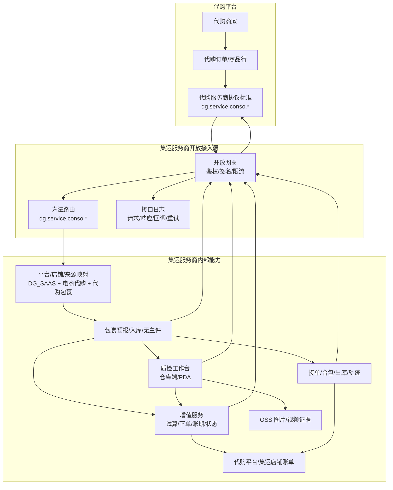
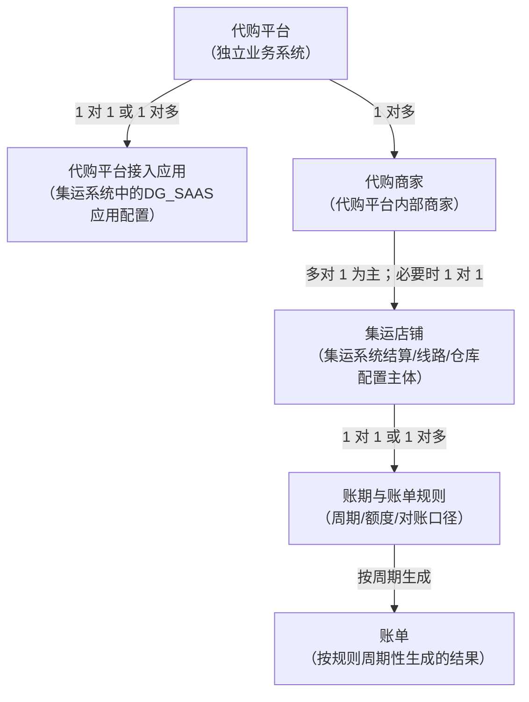
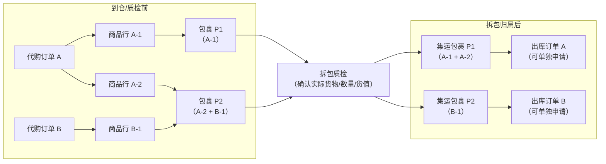
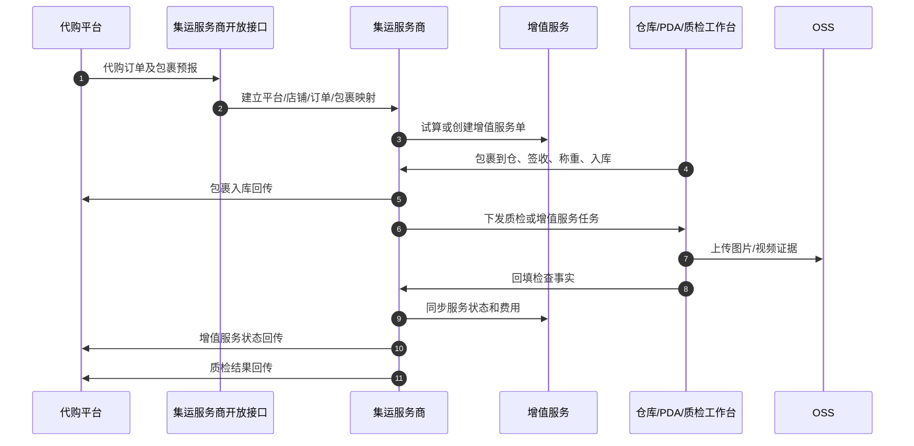

# 代购平台与集运服务商对接协议概要设计

> 版本：v1.0  
> 日期：2026-07-29  
> 定位：代购平台先定义自己的服务商对接协议标准，再给集运服务商提供最佳实践。  
> 范围：本文不设计代购平台内部采购、销售、商家经营和前台体验，重点定义代购平台与集运服务商之间的核心概念、系统边界、协议能力、业务流程、结算边界和集运商实现建议。

## 0. 修订记录

| 版本 | 日期 | 修订说明 | 存档 |
| --- | --- | --- | --- |
| v1.0 | 2026-07-29 | 汇总当前概要设计结论：代购平台制定 `dg.service.conso` 服务商协议标准，集运商按最佳实践实现；平台编码为 `DG_SAAS`，订单来源为 `电商代购`，包裹来源为 `代购包裹`；协议参考 PDD 但补足拆包质检、货值确认、一包多单拆包归属、入库/质检分开回传、出库作业节点回传、主动查询补偿、通用幂等与乱序规则、逆向闭环、无主识别码、OSS 证据、增值服务试算和代购平台/集运店铺统一结算能力。 | 当前文档 |

## 1. 文档定位与关键决策

### 1.1 文档定位

代购 SaaS 平台未来可能接入多个集运服务商。为了避免每接一家服务商都重新理解一套私有接口，代购平台需要先定义自己的服务商对接协议标准，再要求集运服务商按该标准实现。

本文分两层：

- 协议标准：代购平台对外定义的 `method`、主体关系、订单/包裹模型、事件和流程。
- 最佳实践：顺志通等集运服务商实现该协议时，推荐如何映射到自身的平台、店铺、包裹、仓库、增值服务、账单和回调能力。

### 1.2 使用全新的代购协议

本次不复用顺志通集运平台已上线 `method`，也不原样照搬 PDD/菜鸟/千帆协议，而是定义代购平台自己的协议方法族。

结论：

> 代购平台协议前缀使用 `dg.service.conso`。代购平台在集运系统侧的平台编码使用 `DG_SAAS`。协议能力参考 PDD 集运，但业务命名避免“集运单创建”等容易混淆的说法，改为“代购订单及包裹预报/更新”。

原因：

- 顺志通集运平台已上线，复用现有 `method` 会给线上业务带来兼容风险。
- 代购也包含包裹、合包、转运流程，但额外强调代购订单、商品行、拆包质检、货值申报和商家协同。
- 新协议可以让代购平台作为标准制定方，未来接入其他集运服务商时继续复用。
- 不建议把集运系统内部 Controller 直接开放给代购平台；跨系统对接必须有统一鉴权、接口日志、幂等、重试和责任边界。

### 1.3 参考 PDD，但不照搬 PDD

PDD 集运业务与代购业务有相似点：都可以从平台 App 的销售订单维度触发集运履约，都涉及包裹预报、入库、问题件、出库、费用和轨迹。

但 PDD 业务没有拆包质检能力，因此遇到过一个典型困境：商家对一个订单发了多个国内快递到仓，集运系统不知道每个包裹里的实际货物和价值；当多个包裹分多个航次发运时，每个航次应该申报多少金额会变得困难。

代购协议需要补足：

- 支持代购订单、商品行、国内快递包裹之间的清晰映射。
- 支持一单多包、一包多商品行；一包多单作为异常或兼容场景处理，不作为推荐作业模式。
- 支持入库后拆包质检，确认每个包裹实际货物、数量、货值和证据。
- 支持包裹级货值拆分和航次申报所需的数据回传。

PDD 接口规范可作为详细设计参考资料：  
[拼多多集运接口规范下载地址](https://thoughts.aliyun.com/workspaces/63ef08e415ada4001a05209b/files/6a69fca1d31fed0001d669be)

### 1.4 平台、订单来源、包裹来源

| 概念 | 说明 | 本次定义 |
| --- | --- | --- |
| 订单所属平台 | 这笔业务由哪个平台接入，用于鉴权、路由、日志、回调、统计和权限控制。 | `DG_SAAS`，不复用顺志通集运平台。 |
| 订单来源 | 集运系统出库订单来源，用于标识该出库订单来自代购场景。 | `电商代购`。 |
| 包裹来源 | 国内快递包裹从哪个业务场景进入集运仓，用于入库、无主件、质检、统计和货值处理。 | `代购包裹`。 |

平台编码、订单来源、包裹来源不要混用：平台编码解决“谁接入”；订单来源解决“出库订单来自哪里”；包裹来源解决“入库包裹来自哪里”。

## 2. 协议标准设计

### 2.1 系统边界

本图表达：代购平台定义协议，集运服务商通过开放接入层实现协议；接口日志属于集运服务商内部追踪能力，不作为业务回调对象。

边界规则：

- 代购平台定义协议和业务决策；集运服务商执行仓库和转运履约。
- 集运服务商回传事实，不替代代购平台做退款、补发、赔付或客户沟通。
- 图片和视频由集运服务商存储到 OSS，并通过协议返回可访问凭证。
- 所有外部请求、响应、回调和重试都必须进入接口日志。

### 2.2 接入主体关系

这里的“代购平台应用”不是代购平台本身，而是集运服务商开放平台中为代购平台创建的接入应用配置，例如 appKey、密钥、回调地址、接口权限和限流策略。

说明：

- 代购平台是独立业务系统；代购平台接入应用是集运系统里的开放平台配置。
- 一个代购平台可以在同一集运商侧有一个接入应用；如按国家/地区、环境、业务线拆分，也可以有多个接入应用。
- 代购平台下有多个代购商家；本期推荐多个代购商家映射到同一个集运店铺，形成统一结算。
- 集运店铺不是账单本身，而是费用、账期、线路、仓库配置的归属主体。
- 账单不是接入主体，只是按账期与账单规则周期性生成的结果；因此不把“集运店铺和账单”作为业务主体关系理解。

### 2.3 订单与包裹定义

| 概念 | 所属系统 | 定义 | 关键说明 |
| --- | --- | --- | --- |
| 代购订单 | 代购平台 | 终端客户或代购商家在代购平台形成的业务订单。 | 可包含多个商品行，不等同于集运出库订单。 |
| 商品行 | 代购平台 | 代购订单下的具体商品、SKU、数量、期望属性和货值。 | 是质检和申报价值拆分的重要依据。 |
| 国内快递包裹 | 履约链路 | 商家或采购渠道发往集运仓的快递包裹。 | 一个代购订单可拆成多个包裹；异常情况下一个包裹也可能混装多个订单商品。 |
| 包裹预报 | 代购平台 -> 集运服务商 | 代购平台提前告知服务商包裹和订单/商品行关系。 | 允许先粗预报，入库质检后修正实际货物。 |
| 集运包裹 | 集运服务商 | 服务商入库后管理的包裹对象。 | 如果没有拆包与重新包装，预报包裹和集运包裹是同一个对象。 |
| 集运出库订单 | 集运服务商 | 客户申请把一个或多个集运包裹合包/出库形成的履约单。 | 避免简称为“集运单创建”，以免和代购订单、PDD 集运单混淆。 |

### 2.4 订单与包裹关系

代购业务应尽量让多个代购订单的包裹在操作上不混在一起，方便客户针对某个代购订单单独申请转运、取消或售后。

遇到一包多个订单时，推荐拆包归属：

- 尽量不新增无意义的包裹对象，优先在已有 P1、P2 包裹上修正内容物归属。
- 示例：P1 原本装 A-1，P2 原本装 A-2 和 B-1；拆包质检后，将 A-2 从 P2 拿出来放到 P1，最终 P1 装 A-1、A-2，P2 装 B-1。
- 如果一个实物包裹确实混装多个代购订单，且无法通过移动内容物归属到已有包裹上，需要拆成多个集运包裹。
- 除非代购平台显式要求不拆；如果不拆，关联的几个代购订单必须一起申请集运出库，不能只转运其中一个订单。

规则：

- 支持一单多包：一个代购订单的不同商品可能由商家分多个快递发货。
- 支持一包多商品行：一个包裹里可能装同一个代购订单下的多个商品。
- 一包多单只作为异常或兼容场景支持，拆包后应尽量拆分归属关系。
- 拆包结果会影响后续申报货值、航次分配、出库申请、取消订单和售后处理。

拆包归属追溯原则：

- 原始预报关系不物理覆盖，保留原始预报包裹、订单、商品行关系。
- 拆包质检后生成“包裹归属修正记录”，记录商品行从哪个包裹移出、移入哪个包裹、操作人、时间、证据。
- 申报货值、航次分配、出库申请和费用分摊使用质检确认后的最终归属。
- 如代购平台显式要求不拆包，需要在包裹关系中标记关联订单必须一起出库。

### 2.5 方法命名建议

协议前缀确定为 `dg.service.conso`。命名尽量使用业务含义，避免“集运单创建”这类容易和集运出库订单混淆的词。

| 能力 | 方向 | 建议 method | 说明 |
| --- | --- | --- | --- |
| 代购订单及包裹预报 | 代购 -> 集运 | `dg.service.conso.fulfillment.create` | 下发代购订单引用、商品行、国内快递包裹、质检要求。 |
| 代购订单及包裹更新 | 代购 -> 集运 | `dg.service.conso.fulfillment.update` | 更新快递单、商品行关系、质检要求、货值等。 |
| 实名认证 | 代购 -> 集运 | `dg.service.conso.user.identify` | 参考 PDD 实名能力。 |
| 费用试算 | 代购 -> 集运 | `dg.service.conso.fee.estimate` | 集运运费、增值服务费试算。 |
| 增值服务下单/追加 | 代购 -> 集运 | `dg.service.conso.vas.order.create` | 入库前或入库后追加拍照、质检、补拍、复检等服务。 |
| 出库申请 | 代购 -> 集运 | `dg.service.conso.outbound.apply` | 代购平台申请把包裹合包/出库；接单结果同步返回。 |
| 逆向/退件指令 | 代购 -> 集运 | `dg.service.conso.reverse.notify` | 退件、销毁、继续保管等处理指令。 |
| 履约全量查询 | 代购 -> 集运 | `dg.service.conso.fulfillment.query` | 查询代购订单、商品行、包裹、质检、费用、出库汇总状态。 |
| 包裹状态查询 | 代购 -> 集运 | `dg.service.conso.package.query` | 查询包裹入库、无主件、问题件、质检、增值服务状态。 |
| 出库订单查询 | 代购 -> 集运 | `dg.service.conso.outbound.query` | 查询出库申请、作业节点、异常、运单、费用。 |
| 无主件查询 | 代购 -> 集运 | `dg.service.conso.dereliction.query` | 查询待认领、已认领、已转正常包裹的无主件列表。 |
| 费用明细查询 | 代购 -> 集运 | `dg.service.conso.fee.detail.query` | 查询包裹、出库单、增值服务、调整费用明细。 |
| 包裹入库回传 | 集运 -> 代购 | `dg.service.conso.package.inbound.notify` | 只表达包裹已到仓/入库事实。 |
| 增值服务状态回传 | 集运 -> 代购 | `dg.service.conso.vas.status.notify` | 服务待执行、执行中、完成、异常、待补款。 |
| 质检结果回传 | 集运 -> 代购 | `dg.service.conso.inspection.result.notify` | 质检事实、异常、OSS 证据。 |
| 无主件回传 | 集运 -> 代购 | `dg.service.conso.dereliction.notify` | 无主件识别和反解析信息。 |
| 问题件回传 | 集运 -> 代购 | `dg.service.conso.problem.notify` | 普通运输问题或仓库异常。 |
| 出库作业节点回传 | 集运 -> 代购 | `dg.service.conso.outbound.action.notify` | 审单、开始拣货、完成拣货、完成打包、交接等作业节点。 |
| 出库异常回传 | 集运 -> 代购 | `dg.service.conso.outbound.exception.notify` | 审单异常、拣货异常、缺货、包裹状态异常等。 |
| 仓库出库回传 | 集运 -> 代购 | `dg.service.conso.outbound.notify` | 实际完成出库、运单、重量、费用。 |
| 干线信息回传 | 集运 -> 代购 | `dg.service.conso.linehaul.notify` | 航次、干线、装载、起飞等信息。 |
| 清关申报回传 | 集运 -> 代购 | `dg.service.conso.customs.notify` | 申报、清关、税费等信息。 |
| 图片/视频证据回传 | 集运 -> 代购 | `dg.service.conso.media.notify` | OSS 文件 ID、URL、哈希、有效期。 |
| 逆向状态回传 | 集运 -> 代购 | `dg.service.conso.reverse.status.notify` | 退件接收、退件出库、国内退回、商家签收、销毁完成、逆向异常。 |
| 逆向费用回传 | 集运 -> 代购 | `dg.service.conso.reverse.fee.notify` | 逆向运费、仓储费、处理费、销毁费等费用明细。 |

### 2.6 预报报文要点

`dg.service.conso.fulfillment.create` 承载的是“代购订单及包裹履约预报”，不是集运出库订单创建。

建议包含：

- 代购平台信息：平台编码 `DG_SAAS`、外部商家号、订单来源 `电商代购`、包裹来源 `代购包裹`。
- 代购订单引用：代购订单号、采购单号、商品行号。
- 商品行信息：商品名称、SKU、数量、期望颜色、期望尺码、申报货值、币种。
- 国内快递信息：快递公司、快递单号、预计到仓、目的仓。
- 包裹与商品行关系：支持一单多包、一包多商品行；一包多单作为异常或兼容场景处理。
- 质检要求：服务项、检查项、证据要求；具体清单由代购团队在详细设计中完善。
- 结算归属：映射后的集运店铺、账期主体和费用归集方式，避免使用“订单来源”描述结算归属。

### 2.7 协议通用规范

为避免不同集运服务商实现分叉，以下规则需要在概要层统一。

| 规则 | 概要要求 |
| --- | --- |
| 请求幂等 | 以 `app_key + method + request_id` 作为请求幂等键。重复请求已处理成功时，返回原成功结果或等价成功结果；参数不一致时返回幂等冲突。 |
| 业务幂等 | 包裹、出库单、增值服务单等业务对象需要同时校验外部业务号，避免同一业务被不同 `request_id` 重复创建。 |
| 回调幂等 | 集运服务商回调需提供 `event_id`。代购平台按 `event_id` 去重，同一事件不重复推进状态、不重复计费。 |
| 乱序收敛 | 回调乱序时不回退主状态。旧事件进入事件日志；如有补充字段，可补充明细，不覆盖较新状态。 |
| 回调重试 | 回调失败进入重试队列；建议支持指数退避、最大重试次数、人工补发和补偿查询。 |
| 主动查询兜底 | 代购平台不能只依赖异步回调，需要通过查询接口补偿状态丢失、延迟或人工排查场景。 |
| 版本兼容 | 公共参数保留 `version`。新增字段默认向后兼容；废弃字段需要保留观察期；语义变更必须升级版本。 |
| 错误分类 | 错误至少分为鉴权类、参数类、幂等类、业务校验类、余额/账期类、系统异常类，详细错误码进入接口详细设计。 |

### 2.8 主动查询与补偿能力

主动查询接口是回调链路的兜底能力，一期建议纳入基础协议。

| 查询能力 | method | 典型用途 |
| --- | --- | --- |
| 履约全量查询 | `dg.service.conso.fulfillment.query` | 查询代购订单下包裹、质检、增值服务、费用、出库汇总状态。 |
| 包裹状态查询 | `dg.service.conso.package.query` | 查询包裹是否入库、是否无主件、是否质检异常、是否可出库。 |
| 出库订单查询 | `dg.service.conso.outbound.query` | 查询出库申请接单结果、审单、拣货、打包、出库、异常节点。 |
| 无主件查询 | `dg.service.conso.dereliction.query` | 查询待认领无主件列表，支持按仓库、快递单号、识别码、时间范围查询。 |
| 费用明细查询 | `dg.service.conso.fee.detail.query` | 查询包裹、增值服务、出库、逆向、调整费用明细。 |

### 2.9 状态与异常分类

概要层只统一分类，不在本文穷举所有错误码。

| 分类 | 建议状态/类型 |
| --- | --- |
| 包裹状态 | 预报成功、已到仓、已入库、无主待认领、问题件、可出库、已出库。 |
| 质检状态 | 待质检、质检中、质检完成、质检不合格待处理、待补拍、待复检、已放行、已关闭。 |
| 增值服务状态 | 待付款、待执行、执行中、已完成、异常、待补款、已取消。 |
| 出库状态 | 申请已接收、申请被拒绝、审单中、审单异常、拣货中、拣货异常、打包完成、交接完成、已出库、已取消。 |
| 逆向状态 | 逆向已接收、退件出库、国内退回、商家签收、销毁完成、逆向异常。 |
| 问题类型 | 普通运输问题、质检异常、无主件、费用异常、实名/地址异常、禁限运异常、系统异常。 |

## 3. 集运商实现最佳实践

### 3.1 入库与质检分开回传

入库和质检必须分开回传。

代购平台需支持：

- 页面状态区分“已入库”“待质检/质检中”“质检完成”“质检异常待处理”。
- 判断能否申请集运时，同时读取包裹入库状态、问题件状态、增值服务状态和质检冻结状态。
- 接收并展示入库回传、增值服务状态回传、质检结果回传三类事件。

原因：

- 包裹到仓入库后可能还在排队质检，如果代购平台仍显示未入库，客户容易误解货物丢失。
- 入库不代表可以立即申请集运，还需要判断是否存在增值服务待执行、执行中、待补款或异常待处理。
- 入库后追加增值服务也需要单独回传服务单状态，不能混在入库事件里。

建议事件：

- `dg.service.conso.package.inbound.notify`：包裹已入库，返回重量、体积、照片摘要、仓库、入库时间。
- `dg.service.conso.vas.status.notify`：增值服务状态变化，返回待执行、执行中、完成、异常、待补款。
- `dg.service.conso.inspection.result.notify`：质检结果，返回检查事实、异常原因和 OSS 证据。

代购平台判断是否可申请集运时，应同时看包裹入库状态、问题件状态、增值服务状态和质检冻结状态。

### 3.2 入库与质检流程

代购平台需支持：

- 在预报时下发代购订单、商品行、包裹和质检要求的映射关系。
- 接收入库后排队质检的中间状态，避免把“已入库但未完成质检”误判为可出库。
- 对质检结果中的异常事实做业务决策，例如继续转运、补拍、复检、退件、销毁或等待。

### 3.3 质检与增值服务

质检服务项由代购团队完善。以下仅作为服务商协议和系统实现示例：

代购平台需支持：

- 定义质检服务项、证据模板、检查项和小差异处理规范。
- 支持入库后追加增值服务，例如补拍、复检、功能测试。
- 支持接收集运服务商试算结果，并在初期按平价或固定比例/金额加价展示给客户。

| 示例服务项 | 说明 |
| --- | --- |
| 外箱拍照 | 包裹外包装照片 |
| 开箱拍照 | 打开快递箱后的内容物照片 |
| 商品照片 | 单个商品或商品组合照片 |
| 颜色核对 | 根据代购平台期望颜色记录实际颜色 |
| 尺寸测量 | 记录尺寸、尺码或实测值 |
| 数量核对 | 核对实际件数 |
| 功能测试照片/视频 | 对简单功能进行拍照或视频留证 |
| 补拍/复检 | 异常或证据不足时二次作业 |

实现建议：

- 代购质检作为增值服务实现，支持包裹级和订单级服务单。
- 质检可使用现有仓库端/PDA 执行，但需要定制代购质检工作台。
- 图片/视频使用 OSS，对外返回文件 ID、URL、哈希和有效期。
- 质检不合格默认冻结集运申请或出库，等待代购平台指令。

OSS 证据最低要求：

- 图片/视频必须绑定包裹号、质检任务、商品行、服务项、操作人和采集时间。
- 对外建议返回文件 ID，必要时换取签名 URL；不建议长期暴露固定公开 URL。
- 文件留存周期至少覆盖售后、清关、争议处理周期，具体天数在详细设计或合同中约定。
- 证据被替换、补拍或复检时，需要保留历史版本，避免售后和关务证据链断裂。

### 3.4 出库流程：同步接单与作业回传

出库需要区分“同步接单结果”“出库作业节点回传”和“实际出库校验”。

代购平台需支持：

- 出库申请同步处理接收、拒绝、待补资料或待处理异常。
- 根据审单、拣货、打包、交接等作业节点控制客户取消订单、修改地址、追加服务的窗口。
- 接收审单异常、拣货异常、打包异常、费用异常，并引导客户取消、补资料、补款、改线、拆单或等待人工处理。

接单校验发生在代购平台提交出库申请时：

- 包裹是否存在，是否属于 `DG_SAAS`。
- 包裹是否已入库。
- 包裹是否属于同一可合包范围，例如同客户、同目的国家/地区、同线路规则。
- 是否存在未处理的问题件或质检不合格冻结。
- 是否存在待执行、执行中、待补款的增值服务。
- 收件人、地址、实名信息是否基本完整。

接单结果在 `dg.service.conso.outbound.apply` 的同步响应中返回：接收、拒绝、待补资料或待处理异常。接单不再设计为异步回传。

出库作业节点通过 `dg.service.conso.outbound.action.notify` 异步回传：

- `AUDIT_STARTED`：开始审单。
- `AUDIT_PASSED`：审单通过。
- `PICKING_STARTED`：开始拣货。
- `PICKING_COMPLETED`：完成拣货。
- `PACKING_COMPLETED`：完成打包。
- `HANDOVER_COMPLETED`：完成交接。

出库异常通过 `dg.service.conso.outbound.exception.notify` 回传：

- 审单异常：实名、地址、禁限运、申报信息、线路规则不满足。
- 拣货异常：包裹找不到、库位不符、实物破损、包裹状态异常。
- 打包异常：体积重量异常、需要分箱、需要加固、服务未完成。
- 费用异常：账期额度不足、余额不足、待补款未完成。

这些节点用于代购平台控制客户取消订单、修改地址、追加服务等异常操作窗口，并及时把仓库进度反馈给客户。

出库阻断优先级建议：

1. 包裹不存在或不属于当前代购平台。
2. 包裹未入库或实物不在库。
3. 普通问题件、质检不合格、无主待认领。
4. 增值服务待执行、执行中、待补款或异常未解除。
5. 实名、收件地址、申报资料不完整。
6. 线路、禁限运、重量体积规则不满足。
7. 账期额度、余额或费用风控不通过。

同一出库申请同时命中多个阻断原因时，集运服务商可返回最高优先级原因，并在明细中附带其他阻断项，方便代购平台展示和客服处理。

### 3.5 无主件流程

无主识别码需要能反解析到代购订单，或至少反解析到代购平台可定位的业务对象，参考 PDD 的识别码逻辑。

代购平台需支持：

- 设计无主识别码生成规则，并在采购收货标识、商家发货指引或包裹备注中使用。
- 根据无主识别码反解析到代购订单、客户或至少可定位的业务对象。
- 接收无主件回传后，补齐包裹预报或更新包裹与订单/商品行关系。

建议：

- 代购平台在发给商家或采购渠道的收货标识中嵌入可反解析信息，例如平台码、订单短码、用户短码、校验码。
- 仓库扫描到无法匹配预报的快递时，集运服务商回传无主件事件，包含快递单、仓库、重量、外箱照片、无主识别码和解析结果。
- 代购平台根据识别码反查代购订单或客户，再调用预报创建/更新接口补齐包裹关系。
- 补齐后，集运服务商把无主件转为正常包裹，继续入库、质检和出库流程。

### 3.6 逆向履约流程

逆向链路需要形成最小闭环，避免代购售后只下发退件/销毁指令却无法追踪后续状态。

代购平台需支持：

- 下发退件、销毁、继续保管等逆向处理指令。
- 接收逆向状态回传和逆向费用回传。
- 将逆向节点同步给商家或客户，用于售后处理。

建议逆向状态：

- `REVERSE_ACCEPTED`：逆向指令已接收。
- `RETURN_OUTBOUNDED`：退件已从仓库出库。
- `DOMESTIC_RETURN_IN_TRANSIT`：国内退回运输中。
- `MERCHANT_SIGNED`：商家或指定收件方已签收。
- `DESTROY_COMPLETED`：销毁完成。
- `REVERSE_EXCEPTION`：逆向异常。

逆向费用至少区分退件运费、仓储费、人工处理费、销毁费和费用调整。

### 3.7 结算与试算

不推荐让代购商家直接与集运系统形成复杂预付款或账期结算链路。优先建议：

代购平台需支持：

- 维护代购商家到集运店铺的映射关系。
- 保存集运服务商返回的费用试算、费用明细和账单明细，用于平台内部拆账或客户展示。
- 初期如不建设完整增值服务报价系统，需要支持基于集运服务商报价的平价或比例加价策略。

> 代购商家与代购平台结算；代购平台/集运店铺与集运服务商结算。

规则：

- 多个代购商家可以映射到同一个集运店铺。
- 集运服务商按集运店铺生成费用、账单、对账单和风控额度。
- 费用明细保留外部商家号、代购订单号、包裹号、商品行、服务项和作业证据，供代购平台内部拆账。
- 增值服务需要支持代购平台与集运店铺账期结算。
- 集运服务商提供 `dg.service.conso.fee.estimate` 返回基础运费和增值服务试算；代购平台初期可平价展示，也可按固定比例或固定金额加价。
- 账单周期、额度风控和对账文件格式放到二期由双方沟通确定。

费用结构口径建议：

| 费用类型 | 说明 |
| --- | --- |
| 集运运费 | 按线路、重量、体积、目的地等计算的运输费用。 |
| 仓储作业费 | 入库、上架、仓租、退件、销毁等仓内作业费用。 |
| 增值服务费 | 拍照、开箱、质检、补拍、复检、加固等服务费用。 |
| 税费/清关费 | 税费、清关服务费或关务相关费用。 |
| 逆向费用 | 退件运费、销毁费、逆向人工处理费等。 |
| 优惠/调整 | 账单调整、争议处理、人工减免或补收。 |

费用试算和费用明细需要区分集运商基础价与代购平台展示价，预留平台加价字段或加价策略引用，避免不同服务商返回结构不一致导致平台重复适配。

## 4. 实施范围与联调

### 4.1 一期实施建议

一期目标：跑通“代购订单及包裹预报 -> 包裹入库回传 -> 增值服务/质检执行 -> 质检结果回传 -> 异常待处理 -> 出库申请同步接单 -> 仓库作业节点回传 -> 仓库出库 -> 费用与轨迹回传”闭环。

建议一期范围：

- 新建 `DG_SAAS` 平台应用和 `dg.service.conso.*` 方法族。
- 支持代购订单及包裹预报/更新，不使用“集运单创建”命名。
- 支持请求幂等、回调幂等、乱序收敛、回调重试和主动查询补偿。
- 支持订单来源和包裹来源。
- 支持一单多包、一包多商品行；一包多单作为异常或兼容场景处理。
- 支持拆包质检后的包裹归属修正和追溯记录。
- 支持包裹入库、增值服务状态、质检结果、出库作业节点和出库异常分开回传。
- 支持质检异常待处理查询和统计。
- 支持无主识别码反解析到代购订单或代购平台可定位对象。
- 支持逆向状态和逆向费用回传。
- 支持集运服务商费用试算接口，代购平台初期可平价或按比例加价。
- 结算聚焦代购平台/集运店铺统一主体。

### 4.2 联调与测试矩阵

- 鉴权、签名失败、重复 requestId、防重放、IP 白名单。
- `DG_SAAS` 平台配置、回调地址、接口权限、限流。
- 代购订单及包裹预报、重复预报、更新、取消。
- 请求幂等、回调幂等、乱序事件、失败重试、主动查询补偿。
- 一单多包、一包多商品行、一包多单异常兼容。
- 拆包后 P1/P2 包裹归属修正，支持按代购订单独立申请出库。
- 拆包归属修正记录、原始预报追溯、货值和航次申报联动。
- 显式不拆包场景，关联代购订单必须一起申请出库。
- 无主识别码反解析、无主件补预报。
- 入库回传与质检结果分开回传。
- 入库后追加增值服务及服务状态回传。
- OSS 证据绑定包裹、商品行、质检任务、服务项和操作人。
- 质检不合格待处理、补拍、复检、退件、销毁。
- 出库申请同步接单校验、接单拒绝原因、实际出库校验。
- 多阻断原因命中时按优先级返回主原因和明细原因。
- 审单、开始拣货、完成拣货、完成打包、交接等出库作业节点回传。
- 审单异常、拣货异常、打包异常、费用异常回传。
- 逆向接收、退件出库、国内退回、商家签收、销毁完成、逆向异常回传。
- VAS 待付款、待补款、执行中、异常对出库的阻断。
- 费用试算、费用结构分层、代购平台加价展示、账单明细对账。
- OSS URL 权限、过期、跨商家隔离。
- 回调失败重试、人工补发、主动查询补偿。
- 重复回调不重复计费，乱序回调不回退状态。

### 4.3 待详细设计确认

- 质检服务项一期清单和每个服务项的证据模板：由代购团队完善。
- 小差异自动处理规范，例如色差、尺寸误差、包装轻微破损：概要层要求支持规则配置，具体阈值由代购团队在接口详细设计中完善。
- OSS URL 有效期、签名访问方式、水印和跨境访问策略：概要层已约定证据绑定和留存原则，具体策略待详细设计完善。
- 代购平台/集运店铺账单周期、额度风控和对账文件格式：二期双方沟通确定。
