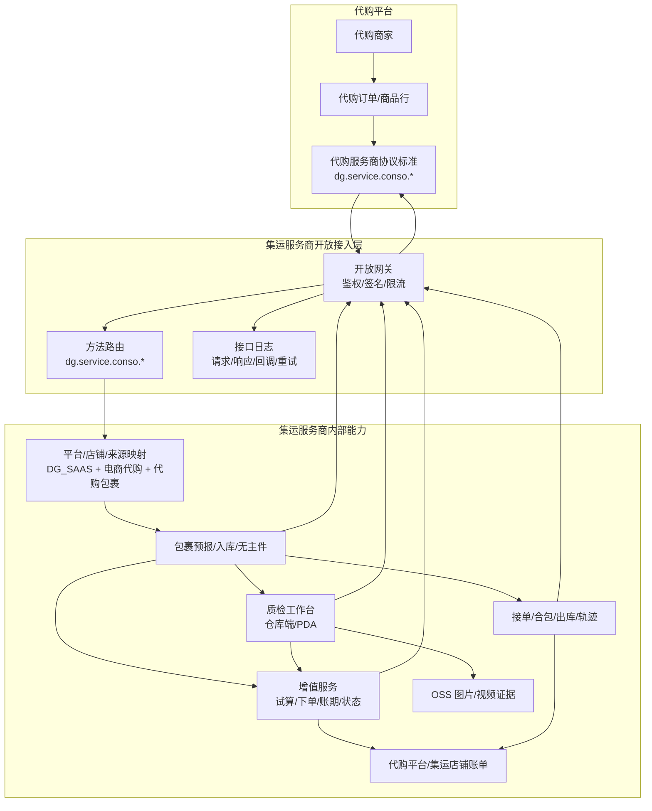
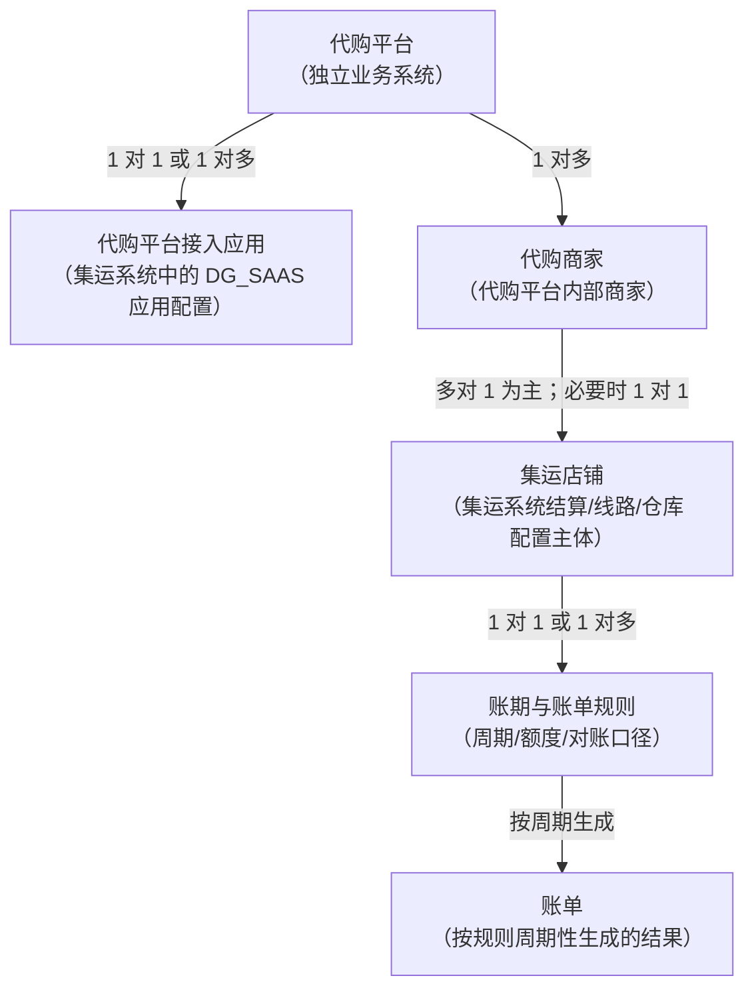
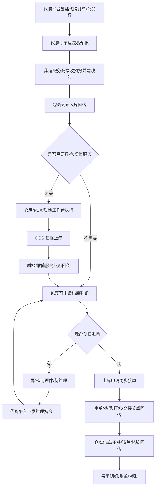
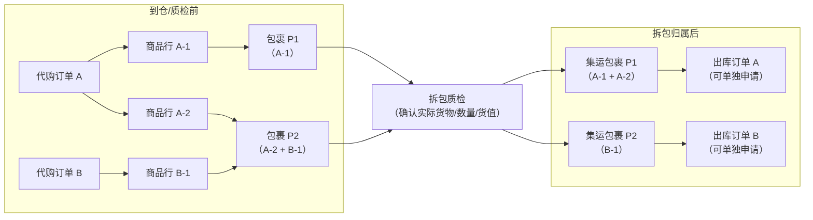
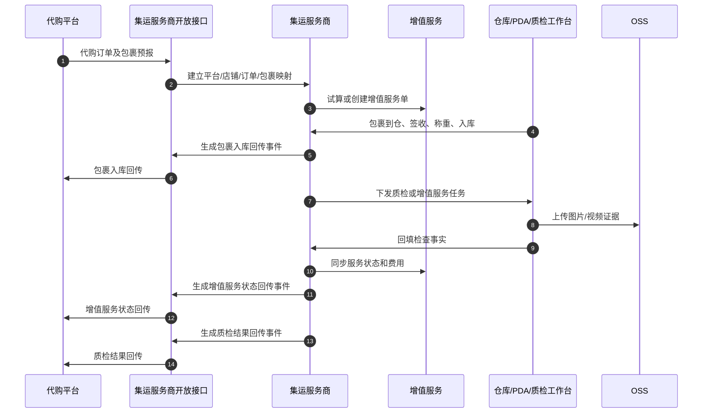

# 代购平台 DG_SAAS 集运服务商对接标准白皮书

> 版本：v1.3  
> 日期：2026-07-30  
> 定位：代购平台制定集运服务商对接标准，供代购平台、集运服务商、商务、运营、实施和研发共同遵循。  
> 范围：本文定义代购平台与集运服务商之间的合作模式、权责边界、接入流程、协议标准、业务规则、结算对账、异常兜底和实施建议；不展开代购平台内部采购、销售、商家经营和前台体验设计。

## 0. 前言与摘要

### 0.1 文档定位与价值

代购 SaaS 平台未来可能接入多个集运服务商。为了避免每接一家服务商都重新理解一套私有接口，代购平台需要先定义自己的服务商对接标准，再要求集运服务商按该标准实现。

- 对商务和运营：说明合作模式、准入要求、权责边界、结算原则、风险和异常处理。
- 对集运服务商：说明需要具备哪些仓配、质检、回调、对账和数据留存能力。
- 对研发和实施：说明 `dg.service.conso.*` 协议方法、通用规范、业务流程、幂等重试、查询兜底和联调范围。

核心价值：

- 让代购平台成为协议标准制定方，后续接入多家集运服务商时复用同一套业务语义。
- 补足普通集运协议对代购业务支持不足的问题，尤其是拆包质检、商品行货值确认、一包多单拆包归属、无主件反解析、质检证据和异常闭环。
- 降低集运服务商接入学习成本，避免直接暴露内部系统接口导致鉴权、日志、限流、回调、责任边界不可控。

### 0.2 适用对象与阅读指引

| 读者 | 建议重点阅读 |
| --- | --- |
| 商务/合作负责人 | 第 1 章合作与接入总览、第 5 章结算风控、第 6 章异常与风险。 |
| 运营/客服/仓库负责人 | 第 2 章业务架构、第 3 章业务能力、第 6 章异常与风险、附录 D。 |
| 集运服务商研发/实施 | 第 1 章接入指南、第 3 章业务能力、第 4 章协议标准、第 7 章联调矩阵。 |
| 代购平台研发/产品 | 全文，重点关注协议标准、状态枚举、主动查询、质检和出库阻断规则。 |

### 0.3 版本修订记录

| 版本 | 日期 | 修订说明 | 存档 |
| --- | --- | --- | --- |
| v1.3 | 2026-07-30 | 汇总当前白皮书结论：文档面向代购平台与集运服务商共同执行，采用 `DG_SAAS` 平台编码和 `dg.service.conso.*` 协议族；保留参考 PDD 但不照搬、拆包质检、入库/质检分开回传、一包多单拆包归属、无主识别码、主动查询、逆向闭环、OSS 证据和代购平台/集运店铺统一结算等核心结论；目录收敛为合作接入、业务架构、业务能力、协议标准、结算风控、异常风险、实施落地和附录，业务架构与业务能力相邻呈现；所有集运侧数据回传统一经过集运服务商开放接口进入代购平台。 | 当前文档 |

### 0.4 参考文档

- 拼多多集运接口规范可作为详细设计参考资料：  
  [拼多多集运接口规范下载地址](https://thoughts.aliyun.com/workspaces/63ef08e415ada4001a05209b/files/6a69fca1d31fed0001d669be)
- 顺志通集运平台、菜鸟集运、千帆集运可作为业务能力和行业接口参考，但本白皮书不复用其既有 `method` 名称。

## 1. 合作与接入总览

### 1.1 业务背景与行业痛点

代购业务包含包裹、合包、转运等普通集运流程，但其核心对象不只是包裹，还包括代购订单、采购单、商品行、商家协同、质检事实和售后证据。

普通集运协议通常围绕“包裹入库、合包、出库、轨迹”展开；代购业务还需要解决：

- 商家对一个代购订单可能发多个国内快递包裹，集运服务商需要知道每个包裹内实际货物和货值。
- 一个国内快递包裹可能混装多个代购订单或多个商品行，需要拆包质检后修正归属。
- 入库质检可能要求拍摄内容物照片、核对颜色尺寸、记录功能性问题或破损事实。
- 多个包裹分不同航次发运时，每个航次需要有可追溯的商品行和申报货值依据。
- 图片、视频、操作事实会成为清关、售后、赔付、复检和客服沟通的证据。

### 1.2 合作模式说明

本白皮书推荐的合作模式：

> 代购平台制定 `dg.service.conso.*` 对接标准；集运服务商通过开放接口接入并执行仓配履约；代购商家与代购平台结算，代购平台/集运店铺与集运服务商结算。

结算链路优先保持简洁：

- 代购商家不直接与集运系统形成复杂预付款或账期结算关系。
- 多个代购商家可映射到同一个集运店铺，由代购平台统一归集费用和对账。
- 预付款模式可作为服务商能力扩展，但不作为本期推荐主链路。

### 1.3 服务商准入、考核与清退规则

服务商准入建议至少覆盖：

| 类别 | 准入要求 |
| --- | --- |
| 仓储履约能力 | 具备包裹签收、称重、入库、库内保管、拣货、打包、出库和问题件处理能力。 |
| 质检作业能力 | 支持开箱拍照、内容物核对、补拍、复检、证据留存和代购质检工作台/PDA 作业。 |
| 跨境履约能力 | 具备线路、干线、清关、实名、禁限运校验和轨迹回传能力。 |
| 系统对接能力 | 支持开放接口、鉴权签名、限流、接口日志、幂等、回调重试、主动查询和联调环境。 |
| 数据与证据能力 | 支持图片/视频 OSS 存储、证据绑定、留存、权限隔离和争议追溯。 |
| 售后处理能力 | 支持货损、丢失、漏检、漏拍、延迟、退件、销毁等异常处理和责任配合。 |

接入考核建议关注：

- 入库及时率、质检及时率、出库及时率。
- 回调成功率、回调延迟、主动查询可用性。
- 质检证据合格率、漏拍漏检率。
- 无主件积压时长、问题件处理时效。
- 对账差异率、费用争议处理时效。

清退和暂停合作条件由商务合同确定。白皮书层面建议保留以下原则：连续不达标、重大合规风险、严重数据泄露、私自加价、恶意截留包裹、拒绝配合对账或赔付时，代购平台可暂停接入、限制流量、停止下发新单或终止合作。

### 1.4 双方权责划分与赔付原则

| 事项 | 代购平台责任 | 集运服务商责任 |
| --- | --- | --- |
| 协议标准 | 制定 `dg.service.conso.*` 标准，发布版本变更和联调要求。 | 按标准实现接口、回调、日志、状态和查询能力。 |
| 商家管理 | 管理代购商家、客户沟通、售后策略、内部拆账。 | 不直接管理代购商家，不绕过代购平台联系客户或商家。 |
| 订单与包裹预报 | 下发代购订单、商品行、包裹、货值、质检要求和收件信息。 | 接收预报，建立平台、店铺、包裹、订单和商品行映射。 |
| 仓内履约 | 接收履约事实，并作出业务决策。 | 负责签收、称重、入库、质检、增值服务、保管、拣货、打包、出库。 |
| 质检事实 | 定义服务项、检查项、小差异规则和售后处理策略。 | 按要求拍照/录像/检查，回传检查事实和 OSS 证据。 |
| 费用结算 | 与代购商家结算，归集后与集运店铺/服务商对账。 | 按集运店铺输出费用明细、账单、对账数据和调整记录。 |
| 售后赔付 | 面向客户或商家处理售后，依据服务商事实和合同追责。 | 对自身履约导致的丢失、破损、漏检、漏拍、延迟、错发等配合举证和赔付。 |
| 合规数据 | 提供合规所需实名、申报、订单和商品资料。 | 按约定保管和使用数据，不越权查询、导出、泄露或挪用。 |

赔付标准不在本文直接固化金额，建议在商务合同或服务等级协议中细化：

- 包裹丢失、破损、错发、漏发的责任认定和赔付上限。
- 质检漏拍、漏检、证据不合格导致售后无法举证的责任承担。
- 回调超时、数据漏传、状态错误导致客户误操作或出库阻断的处理方式。
- 禁限运、实名、申报信息错误导致清关异常时的平台与服务商责任边界。

禁止行为：

- 服务商不得绕过代购平台私自向商家或客户收费。
- 服务商不得私自修改商品货值、申报品名、包裹归属或质检结论。
- 服务商不得截留、挪用、私拆无关包裹或泄露商家、客户、订单、图片和实名数据。
- 服务商不得绕过开放接口直接调用代购平台内部接口。

### 1.5 跨境合规监管要求

跨境代购集运涉及禁限运、实名、申报、图片证据、隐私数据和售后举证。白皮书层面要求：

- 代购平台负责提供订单、商品行、货值、实名、收件地址、禁限运校验所需基础数据。
- 集运服务商负责按线路和监管要求执行禁限运校验、清关申报、实名校验结果回传和异常拦截。
- 商品品名、数量、货值、币种和包裹归属需要能追溯到商品行和质检证据。
- 图片/视频、入库、质检、出库、清关和异常数据的留存周期至少覆盖售后、清关和争议处理周期，具体天数在合同或详细设计中约定。
- 涉及实名、地址、图片、订单明细等敏感数据时，双方需要执行最小必要、权限隔离、日志审计和跨境传输合规要求。

### 1.6 接入开通步骤

| 阶段 | 动作 | 主要产出 |
| --- | --- | --- |
| 商务确认 | 确认合作范围、线路、仓库、服务项、结算主体和 SLA。 | 合作协议、服务范围、费率口径。 |
| 应用开通 | 集运服务商开放平台创建 `DG_SAAS` 接入应用。 | appKey、密钥、接口权限、限流规则。 |
| 环境配置 | 配置测试/生产域名、回调地址、IP 白名单、证书或签名参数。 | 环境清单、回调配置、白名单。 |
| 联调准备 | 准备测试订单、包裹、质检服务项、OSS 测试凭证、对账样例。 | 联调用例、测试数据、报文模板。 |
| 接口联调 | 覆盖预报、入库、质检、出库、异常、查询、费用、逆向等链路。 | 联调报告、问题清单、修复记录。 |
| 灰度上线 | 小范围商家、仓库或线路放量，监控成功率和时效。 | 灰度数据、风险评估、放量结论。 |
| 全量开通 | 达到验收标准后正式开放。 | 上线确认、监控看板、运维支持机制。 |

### 1.7 测试环境与生产环境隔离

服务商需提供或配合配置：

- 测试环境和生产环境分离的接口域名、appKey、密钥、回调地址和 IP 白名单。
- 测试环境不得写入真实业务账单、真实清关申报或真实客户通知。
- 测试环境应支持模拟入库、质检、出库、异常、回调失败、回调重试和主动查询。
- 生产环境上线前需要完成灰度计划、回滚方案、监控告警和联系人确认。

### 1.8 应用配置标准

`DG_SAAS` 接入应用至少包含：

- appKey、appSecret 或等价密钥。
- 允许调用的 `dg.service.conso.*` method 清单。
- 代购平台回调地址、回调签名密钥、回调失败重试策略。
- IP 白名单、QPS 限流、单商家/单店铺限流。
- 灰度开关、日志留存周期、接口日志查询权限。
- 账期主体、集运店铺映射、订单来源 `电商代购`、包裹来源 `代购包裹`。

### 1.9 技术支持与故障反馈通道

建议服务商接入前明确三类对接人：

- 商务对接：合作范围、价格、结算、SLA、赔付和清退。
- 技术对接：接口联调、签名、回调、查询、环境、日志和版本升级。
- 运营/售后对接：入库、质检、无主件、出库异常、逆向、对账差异。

故障分级建议：

| 等级 | 示例 | 响应原则 |
| --- | --- | --- |
| P0 | 大面积无法下单/入库/出库，核心接口不可用，生产数据严重错乱。 | 立即响应，建立临时群，优先恢复业务。 |
| P1 | 单核心链路异常，例如回调大量失败、质检无法完成、出库批量阻断。 | 当日响应，明确止血方案和补偿计划。 |
| P2 | 局部商家、线路、仓库、服务项异常。 | 工作时间响应，按问题单跟踪。 |
| P3 | 文案、字段、报表、低频边界问题。 | 纳入迭代或常规排期。 |

## 2. 业务架构与主体关系

### 2.1 跨系统交互边界

本图表达：代购平台定义协议，集运服务商通过开放接入层实现协议；接口日志属于集运服务商内部追踪能力，不作为业务回调对象。所有回调必须先进入集运服务商开放接口，再由开放接口回传给代购平台。



边界规则：

- 代购平台定义协议、业务策略、售后决策和客户沟通。
- 集运服务商执行仓库、质检、干线、清关、出库、逆向等履约动作，并回传事实。
- 集运服务商不替代代购平台做退款、补发、赔付承诺或客户解释。
- 所有外部请求、响应、回调、失败重试和人工补发都必须进入接口日志。

### 2.2 业务主体映射关系

这里的“代购平台接入应用”不是代购平台本身，而是集运服务商开放平台中为代购平台创建的接入应用配置，例如 appKey、密钥、回调地址、接口权限和限流策略。



说明：

- 一个代购平台可以在同一集运商侧有一个接入应用；如按国家/地区、环境、业务线拆分，也可以有多个接入应用。
- 代购平台下有多个代购商家；本期推荐多个代购商家映射到同一个集运店铺，形成统一结算。
- 集运店铺不是账单本身，而是费用、账期、线路、仓库配置的归属主体。
- 账单不是接入主体，只是按账期与账单规则周期性生成的结果。

### 2.3 平台、订单来源、包裹来源

| 概念 | 说明 | 本次定义 |
| --- | --- | --- |
| 订单所属平台 | 这笔业务由哪个平台接入，用于鉴权、路由、日志、回调、统计和权限控制。 | `DG_SAAS`，不复用顺志通集运平台。 |
| 订单来源 | 集运系统出库订单来源，用于标识该出库订单来自代购场景。 | `电商代购`。 |
| 包裹来源 | 国内快递包裹从哪个业务场景进入集运仓，用于入库、无主件、质检、统计和货值处理。 | `代购包裹`。 |

平台编码、订单来源、包裹来源不要混用：平台编码解决“谁接入”；订单来源解决“出库订单来自哪里”；包裹来源解决“入库包裹来自哪里”。

### 2.4 核心设计决策

本次不复用顺志通集运平台已上线 `method`，也不原样照搬 PDD/菜鸟/千帆协议，而是定义代购平台自己的协议方法族。

结论：

> 代购平台协议前缀使用 `dg.service.conso`。代购平台在集运系统侧的平台编码使用 `DG_SAAS`。协议能力参考 PDD 集运，但业务命名避免“集运单创建”等容易混淆的说法，改为“代购订单及包裹预报/更新”。

原因：

- 顺志通集运平台已上线，复用现有 `method` 会给线上业务带来兼容风险。
- 代购也包含包裹、合包、转运流程，但额外强调代购订单、商品行、拆包质检、货值申报和商家协同。
- 新协议可以让代购平台作为标准制定方，未来接入其他集运服务商时继续复用。
- 不建议把集运系统内部 Controller 直接开放给代购平台；跨系统对接必须有统一鉴权、接口日志、幂等、重试和责任边界。

参考 PDD，但不照搬 PDD：

- PDD 集运业务与代购业务相似，都是从平台 App 的销售订单维度触发集运履约，都涉及包裹预报、入库、问题件、出库、费用和轨迹。
- PDD 业务没有拆包质检能力，遇到多包裹、多航次时，集运系统难以准确判断每个包裹的实际货物和申报货值。
- 代购协议需要补足代购订单、商品行、国内快递包裹之间的清晰映射，支持入库后拆包质检、货值确认、证据回传和航次申报数据回传。

### 2.5 全链路标准履约总流程



## 3. 全业务域能力标准

### 3.1 订单与包裹定义

| 概念 | 所属系统 | 定义 | 关键说明 |
| --- | --- | --- | --- |
| 代购订单 | 代购平台 | 终端客户或代购商家在代购平台形成的业务订单。 | 可包含多个商品行，不等同于集运出库订单。 |
| 采购单 | 代购平台 | 代购平台内部为采购履约形成的单据。 | 可作为代购订单和供应商发货的关联信息。 |
| 商品行 | 代购平台 | 代购订单下的具体商品、SKU、数量、期望属性和货值。 | 是质检和申报价值拆分的重要依据。 |
| 国内快递包裹 | 履约链路 | 商家或采购渠道发往集运仓的快递包裹。 | 一个代购订单可拆成多个包裹；异常情况下一个包裹也可能混装多个订单商品。 |
| 包裹预报 | 代购平台 -> 集运服务商 | 代购平台提前告知服务商包裹和订单/商品行关系。 | 允许先粗预报，入库质检后修正实际货物。 |
| 集运包裹 | 集运服务商 | 服务商入库后管理的包裹对象。 | 如果没有拆包与重新包装，预报包裹和集运包裹是同一个对象。 |
| 集运出库订单 | 集运服务商 | 客户申请把一个或多个集运包裹合包/出库形成的履约单。 | 避免简称为“集运单创建”，以免和代购订单、PDD 集运单混淆。 |

### 3.2 代购订单及包裹预报

`dg.service.conso.fulfillment.create` 承载的是“代购订单及包裹履约预报”，不是集运出库订单创建。

建议包含：

- 代购平台信息：平台编码 `DG_SAAS`、外部商家号、订单来源 `电商代购`、包裹来源 `代购包裹`。
- 代购订单引用：代购订单号、采购单号、商品行号。
- 商品行信息：商品名称、SKU、数量、期望颜色、期望尺码、申报货值、币种。
- 国内快递信息：快递公司、快递单号、预计到仓、目的仓。
- 包裹与商品行关系：支持一单多包、一包多商品行；一包多单作为异常或兼容场景处理。
- 质检要求：服务项、检查项、证据要求；具体清单由代购团队在详细设计中完善。
- 结算归属：映射后的集运店铺、账期主体和费用归集方式，避免使用“订单来源”描述结算归属。

### 3.3 订单与包裹关系

代购业务应尽量让多个代购订单的包裹在操作上不混在一起，方便客户针对某个代购订单单独申请转运、取消或售后。

遇到一包多个订单时，推荐拆包归属：

- 尽量不新增无意义的包裹对象，优先在已有 P1、P2 包裹上修正内容物归属。
- 示例：P1 原本装 A-1，P2 原本装 A-2 和 B-1；拆包质检后，将 A-2 从 P2 拿出来放到 P1，最终 P1 装 A-1、A-2，P2 装 B-1。
- 如果一个实物包裹确实混装多个代购订单，且无法通过移动内容物归属到已有包裹上，需要拆成多个集运包裹。
- 除非代购平台显式要求不拆；如果不拆，关联的几个代购订单必须一起申请集运出库，不能只转运其中一个订单。



拆包归属追溯原则：

- 原始预报关系不物理覆盖，保留原始预报包裹、订单、商品行关系。
- 拆包质检后生成“包裹归属修正记录”，记录商品行从哪个包裹移出、移入哪个包裹、操作人、时间、证据。
- 申报货值、航次分配、出库申请和费用分摊使用质检确认后的最终归属。
- 如代购平台显式要求不拆包，需要在包裹关系中标记关联订单必须一起出库。

### 3.4 入库、质检与增值服务

入库和质检必须分开回传。

代购平台需支持：

- 页面状态区分“已入库”“待质检/质检中”“质检完成”“质检异常待处理”。
- 判断能否申请集运时，同时读取包裹入库状态、问题件状态、增值服务状态和质检冻结状态。
- 接收并展示入库回传、增值服务状态回传、质检结果回传三类事件。
- 对质检结果中的异常事实做业务决策，例如继续转运、补拍、复检、退件、销毁或等待。

集运服务商需支持：

- 使用现有仓库端/PDA 执行质检，但针对代购业务定制质检工作台。
- 通过增值服务能力承载质检、拍照、补拍、复检、功能测试等服务项。
- 按质检任务、包裹、商品行和服务项采集图片/视频证据，并上传 OSS。
- 只回传检查事实，不替代代购平台做售后决策。



质检服务项由代购团队完善。以下仅作为服务商协议和系统实现示例：

| 示例服务项 | 说明 |
| --- | --- |
| 外箱拍照 | 包裹外包装照片。 |
| 开箱拍照 | 打开快递箱后的内容物照片。 |
| 商品照片 | 单个商品或商品组合照片。 |
| 颜色核对 | 根据代购平台期望颜色记录实际颜色。 |
| 尺寸测量 | 记录尺寸、尺码或实测值。 |
| 数量核对 | 核对实际件数。 |
| 功能测试照片/视频 | 对简单功能进行拍照或视频留证。 |
| 补拍/复检 | 异常或证据不足时二次作业。 |

### 3.5 OSS 媒体凭证标准

OSS 证据最低要求：

- 图片/视频必须绑定包裹号、质检任务、商品行、服务项、操作人和采集时间。
- 对外建议返回文件 ID，必要时换取签名 URL；不建议长期暴露固定公开 URL。
- 文件留存周期至少覆盖售后、清关、争议处理周期，具体天数在详细设计或合同中约定。
- 证据被替换、补拍或复检时，需要保留历史版本，避免售后和关务证据链断裂。
- 图片分辨率、拍摄角度、水印、URL 有效期、跨境访问和签名策略进入接口详细设计。

### 3.6 无主件流程

无主识别码需要能反解析到代购订单，或至少反解析到代购平台可定位的业务对象，参考 PDD 的识别码逻辑。

代购平台需支持：

- 设计无主识别码生成规则，并在采购收货标识、商家发货指引或包裹备注中使用。
- 根据无主识别码反解析到代购订单、客户或至少可定位的业务对象。
- 接收无主件回传后，补齐包裹预报或更新包裹与订单/商品行关系。

集运服务商需支持：

- 仓库扫描到无法匹配预报的快递时，生成无主件并回传。
- 无主件回传包含快递单、仓库、重量、外箱照片、无主识别码和解析结果。
- 代购平台补齐预报后，服务商把无主件转为正常包裹，继续入库、质检和出库流程。

识别码规则建议在详细设计中至少明确：编码格式、校验码、反解析字段、过期策略、隐私脱敏和无法解析时的人工处理流程。

### 3.7 出库履约域

出库需要区分“同步接单结果”“出库作业节点回传”和“实际出库校验”。

代购平台需支持：

- 出库申请同步处理接收、拒绝、待补资料或待处理异常。
- 根据审单、拣货、打包、交接等作业节点控制客户取消订单、修改地址、追加服务的窗口。
- 接收审单异常、拣货异常、打包异常、费用异常，并引导客户取消、补资料、补款、改线、拆单或等待人工处理。

接单校验发生在代购平台提交出库申请时：

- 包裹是否存在，是否属于 `DG_SAAS`。
- 包裹是否已入库。
- 包裹是否属于同一可合包范围，例如同客户、同目的国家/地区、同线路规则。
- 是否存在未处理的问题件或质检不合格冻结。
- 是否存在待执行、执行中、待补款的增值服务。
- 收件人、地址、实名信息是否基本完整。

接单结果在 `dg.service.conso.outbound.apply` 的同步响应中返回：接收、拒绝、待补资料或待处理异常。接单不再设计为异步回传。

出库作业节点通过 `dg.service.conso.outbound.action.notify` 异步回传：

- `AUDIT_STARTED`：开始审单。
- `AUDIT_PASSED`：审单通过。
- `PICKING_STARTED`：开始拣货。
- `PICKING_COMPLETED`：完成拣货。
- `PACKING_COMPLETED`：完成打包。
- `HANDOVER_COMPLETED`：完成交接。

出库异常通过 `dg.service.conso.outbound.exception.notify` 回传：

- 审单异常：实名、地址、禁限运、申报信息、线路规则不满足。
- 拣货异常：包裹找不到、库位不符、实物破损、包裹状态异常。
- 打包异常：体积重量异常、需要分箱、需要加固、服务未完成。
- 费用异常：账期额度不足、余额不足、待补款未完成。

出库阻断优先级建议：

1. 包裹不存在或不属于当前代购平台。
2. 包裹未入库或实物不在库。
3. 普通问题件、质检不合格、无主待认领。
4. 增值服务待执行、执行中、待补款或异常未解除。
5. 实名、收件地址、申报资料不完整。
6. 线路、禁限运、重量体积规则不满足。
7. 账期额度、余额或费用风控不通过。

同一出库申请同时命中多个阻断原因时，集运服务商可返回最高优先级原因，并在明细中附带其他阻断项，方便代购平台展示和客服处理。

### 3.8 逆向售后域

逆向链路需要形成最小闭环，避免代购售后只下发退件/销毁指令却无法追踪后续状态。

代购平台需支持：

- 下发退件、销毁、继续保管等逆向处理指令。
- 接收逆向状态回传和逆向费用回传。
- 将逆向节点同步给商家或客户，用于售后处理。

建议逆向状态：

- `REVERSE_ACCEPTED`：逆向指令已接收。
- `RETURN_OUTBOUNDED`：退件已从仓库出库。
- `DOMESTIC_RETURN_IN_TRANSIT`：国内退回运输中。
- `MERCHANT_SIGNED`：商家或指定收件方已签收。
- `DESTROY_COMPLETED`：销毁完成。
- `REVERSE_EXCEPTION`：逆向异常。

逆向费用至少区分退件运费、仓储费、人工处理费、销毁费和费用调整。

## 4. 通用协议标准

### 4.1 接口命名和 method 前缀

协议前缀确定为 `dg.service.conso`。命名尽量使用业务含义，避免“集运单创建”这类容易和集运出库订单混淆的词。

| 能力 | 方向 | 建议 method | 说明 |
| --- | --- | --- | --- |
| 代购订单及包裹预报 | 代购 -> 集运 | `dg.service.conso.fulfillment.create` | 下发代购订单引用、商品行、国内快递包裹、质检要求。 |
| 代购订单及包裹更新 | 代购 -> 集运 | `dg.service.conso.fulfillment.update` | 更新快递单、商品行关系、质检要求、货值等。 |
| 实名认证 | 代购 -> 集运 | `dg.service.conso.user.identify` | 参考 PDD 实名能力。 |
| 费用试算 | 代购 -> 集运 | `dg.service.conso.fee.estimate` | 集运运费、增值服务费试算。 |
| 增值服务下单/追加 | 代购 -> 集运 | `dg.service.conso.vas.order.create` | 入库前或入库后追加拍照、质检、补拍、复检等服务。 |
| 出库申请 | 代购 -> 集运 | `dg.service.conso.outbound.apply` | 代购平台申请把包裹合包/出库；接单结果同步返回。 |
| 逆向/退件指令 | 代购 -> 集运 | `dg.service.conso.reverse.notify` | 退件、销毁、继续保管等处理指令。 |
| 履约全量查询 | 代购 -> 集运 | `dg.service.conso.fulfillment.query` | 查询代购订单、商品行、包裹、质检、费用、出库汇总状态。 |
| 包裹状态查询 | 代购 -> 集运 | `dg.service.conso.package.query` | 查询包裹入库、无主件、问题件、质检、增值服务状态。 |
| 出库订单查询 | 代购 -> 集运 | `dg.service.conso.outbound.query` | 查询出库申请、作业节点、异常、运单、费用。 |
| 无主件查询 | 代购 -> 集运 | `dg.service.conso.dereliction.query` | 查询待认领、已认领、已转正常包裹的无主件列表。 |
| 费用明细查询 | 代购 -> 集运 | `dg.service.conso.fee.detail.query` | 查询包裹、出库单、增值服务、调整费用明细。 |
| 包裹入库回传 | 集运 -> 代购 | `dg.service.conso.package.inbound.notify` | 只表达包裹已到仓/入库事实。 |
| 增值服务状态回传 | 集运 -> 代购 | `dg.service.conso.vas.status.notify` | 服务待执行、执行中、完成、异常、待补款。 |
| 质检结果回传 | 集运 -> 代购 | `dg.service.conso.inspection.result.notify` | 质检事实、异常、OSS 证据。 |
| 无主件回传 | 集运 -> 代购 | `dg.service.conso.dereliction.notify` | 无主件识别和反解析信息。 |
| 问题件回传 | 集运 -> 代购 | `dg.service.conso.problem.notify` | 普通运输问题或仓库异常。 |
| 出库作业节点回传 | 集运 -> 代购 | `dg.service.conso.outbound.action.notify` | 审单、开始拣货、完成拣货、完成打包、交接等作业节点。 |
| 出库异常回传 | 集运 -> 代购 | `dg.service.conso.outbound.exception.notify` | 审单异常、拣货异常、缺货、包裹状态异常等。 |
| 仓库出库回传 | 集运 -> 代购 | `dg.service.conso.outbound.notify` | 实际完成出库、运单、重量、费用。 |
| 干线信息回传 | 集运 -> 代购 | `dg.service.conso.linehaul.notify` | 航次、干线、装载、起飞等信息。 |
| 清关申报回传 | 集运 -> 代购 | `dg.service.conso.customs.notify` | 申报、清关、税费等信息。 |
| 图片/视频证据回传 | 集运 -> 代购 | `dg.service.conso.media.notify` | OSS 文件 ID、URL、哈希、有效期。 |

### 4.2 通用请求与响应结构

公共请求字段建议：

| 字段 | 说明 |
| --- | --- |
| app_key | 集运服务商开放平台分配给代购平台的接入应用标识。 |
| method | `dg.service.conso.*` 方法名。 |
| version | 协议版本号。 |
| timestamp | 请求时间戳，用于防重放。 |
| request_id | 请求幂等号，同一业务重试保持一致。 |
| sign | 签名。 |
| biz_content | 业务报文。 |

公共响应字段建议：

| 字段 | 说明 |
| --- | --- |
| success | 是否成功接收和处理。 |
| code | 标准错误码或成功码。 |
| message | 可读错误说明。 |
| request_id | 原请求幂等号。 |
| data | 返回业务结果。 |

示例：

```json
{
  "app_key": "DG_SAAS_TEST",
  "method": "dg.service.conso.fulfillment.create",
  "version": "1.0",
  "timestamp": "2026-07-30T10:00:00+08:00",
  "request_id": "REQ202607300001",
  "biz_content": {}
}
```

### 4.3 鉴权、签名和防重放

白皮书层面约定：

- 请求必须带 appKey、时间戳、requestId 和签名。
- 签名算法、字段排序、编码方式、摘要算法和密钥轮换周期在接口详细设计中固化。
- 服务商应支持 IP 白名单、时间戳有效期、防重放缓存、签名失败日志和密钥灰度切换。
- 代购平台和集运服务商都需要记录签名原文摘要，方便排查签名不一致。

### 4.4 幂等、回调重试和乱序收敛

| 规则 | 标准要求 |
| --- | --- |
| 请求幂等 | 以 `app_key + method + request_id` 作为请求幂等键。重复请求已成功时返回原成功结果或等价成功结果；参数不一致时返回幂等冲突。 |
| 业务幂等 | 包裹、出库单、增值服务单等业务对象需要同时校验外部业务号，避免同一业务被不同 `request_id` 重复创建。 |
| 回调幂等 | 集运服务商回调需提供 `event_id`。代购平台按 `event_id` 去重，同一事件不重复推进状态、不重复计费。 |
| 回调重试 | 回调失败进入重试队列；建议支持指数退避、最大重试次数、人工补发和补偿查询。 |
| 乱序收敛 | 回调乱序时不回退主状态。旧事件进入事件日志；如有补充字段，可补充明细，不覆盖较新状态。 |
| 主动查询兜底 | 代购平台不能只依赖异步回调，需要通过查询接口补偿状态丢失、延迟或人工排查场景。 |

### 4.5 协议版本迭代与兼容策略

- 公共参数保留 `version`。
- 新增字段默认向后兼容，服务商和代购平台不得因未知字段拒绝处理。
- 废弃字段需要保留观察期，并在版本说明中明确废弃时间。
- 语义变更、枚举含义变更、签名规则变更属于不兼容变更，必须升级版本并灰度切换。
- 版本变更应通过约定渠道提前通知服务商，保留适配窗口期和回滚方案。

### 4.6 统一状态枚举和业务错误码

状态分类：

| 分类 | 建议状态/类型 |
| --- | --- |
| 包裹状态 | 预报成功、已到仓、已入库、无主待认领、问题件、可出库、已出库。 |
| 质检状态 | 待质检、质检中、质检完成、质检不合格待处理、待补拍、待复检、已放行、已关闭。 |
| 增值服务状态 | 待付款、待执行、执行中、已完成、异常、待补款、已取消。 |
| 出库状态 | 申请已接收、申请被拒绝、审单中、审单异常、拣货中、拣货异常、打包完成、交接完成、已出库、已取消。 |
| 逆向状态 | 逆向已接收、退件出库、国内退回、商家签收、销毁完成、逆向异常。 |
| 问题类型 | 普通运输问题、质检异常、无主件、费用异常、实名/地址异常、禁限运异常、系统异常。 |

错误码分类：

| 分类 | 示例含义 |
| --- | --- |
| 鉴权类 | appKey 不存在、签名错误、时间戳过期、IP 不在白名单。 |
| 参数类 | 必填缺失、字段格式错误、枚举值非法、金额币种不匹配。 |
| 幂等类 | requestId 重复且参数不一致、业务号重复创建。 |
| 业务校验类 | 包裹不存在、包裹未入库、质检异常、无主待认领、禁限运。 |
| 费用风控类 | 余额不足、账期额度不足、待补款、价格不可用。 |
| 系统异常类 | 服务不可用、超时、内部错误、依赖系统异常。 |

详细错误码编码、文案和处理建议进入接口详细设计手册。

## 5. 结算、账期与风控标准

### 5.1 二级结算模型

本期聚焦代购平台/集运店铺作为统一结算主体。

> 代购商家与代购平台结算；代购平台/集运店铺与集运服务商结算。

规则：

- 多个代购商家可以映射到同一个集运店铺。
- 集运服务商按集运店铺生成费用、账单、对账单和风控额度。
- 费用明细保留外部商家号、代购订单号、包裹号、商品行、服务项和作业证据，供代购平台内部拆账。
- 增值服务需要支持代购平台与集运店铺账期结算。

### 5.2 费用类型与试算规则

费用结构口径建议：

| 费用类型 | 说明 |
| --- | --- |
| 集运运费 | 按线路、重量、体积、目的地等计算的运输费用。 |
| 仓储作业费 | 入库、上架、仓租、退件、销毁等仓内作业费用。 |
| 增值服务费 | 拍照、开箱、质检、补拍、复检、加固等服务费用。 |
| 税费/清关费 | 税费、清关服务费或关务相关费用。 |
| 逆向费用 | 退件运费、销毁费、逆向人工处理费等。 |
| 优惠/调整 | 账单调整、争议处理、人工减免或补收。 |

集运服务商提供 `dg.service.conso.fee.estimate` 返回基础运费和增值服务试算；代购平台初期可平价展示，也可按固定比例或固定金额加价。

费用试算和费用明细需要区分集运商基础价与代购平台展示价，预留平台加价字段或加价策略引用，避免不同服务商返回结构不一致导致平台重复适配。

### 5.3 账单、对账、补差和开票

白皮书层面建议形成以下对账流程：

1. 集运服务商按集运店铺和账期生成账单。
2. 账单明细关联包裹、出库订单、代购订单、商品行、服务项、费用类型和证据。
3. 代购平台拉取或接收对账文件，进行内部拆账、加价展示和商家结算。
4. 双方对差异费用发起核对，支持补差、冲销、减免或重算。
5. 对账确认后进入付款、开票或账期结转流程。

账单周期、对账文件格式、开票流程、冲销规则和账期欠费处理规则建议二期由双方结合合同细化。

### 5.4 额度风控和欠费拦截

本期建议至少预留：

- 集运店铺额度、已占用额度、可用额度。
- 费用试算时预估额度占用。
- 出库申请时校验额度或余额。
- 额度不足时通过同步响应返回标准错误分类和阻断原因。
- 额度预警、临时提额、欠费停发、恢复出库等流程进入二期详细设计。

## 6. 异常、故障与风险保障

### 6.1 全链路异常分类与处理策略

| 异常类型 | 示例 | 处理策略 |
| --- | --- | --- |
| 预报异常 | 快递单重复、商品行缺失、货值缺失。 | 同步拒绝或进入待补资料。 |
| 入库异常 | 无主件、外箱破损、重量体积异常。 | 回传无主件或问题件，等待代购平台处理。 |
| 质检异常 | 数量不符、颜色尺寸不符、破损、功能异常、证据不足。 | 回传检查事实和证据，冻结出库或等待指令。 |
| 增值服务异常 | 待补款、服务无法执行、补拍失败。 | 回传服务状态，阻断出库。 |
| 出库异常 | 审单异常、拣货异常、打包异常、费用异常。 | 作业节点或异常回传，代购平台控制客户操作窗口。 |
| 逆向异常 | 退件失败、销毁失败、商家拒收。 | 回传逆向异常和费用。 |
| 系统异常 | 回调失败、接口超时、状态乱序。 | 重试、人工补发、主动查询补偿。 |

### 6.2 主动查询补偿接口

主动查询接口是回调链路的兜底能力，一期建议纳入基础协议。

| 查询能力 | method | 典型用途 |
| --- | --- | --- |
| 履约全量查询 | `dg.service.conso.fulfillment.query` | 查询代购订单下包裹、质检、增值服务、费用、出库汇总状态。 |
| 包裹状态查询 | `dg.service.conso.package.query` | 查询包裹是否入库、是否无主件、是否质检异常、是否可出库。 |
| 出库订单查询 | `dg.service.conso.outbound.query` | 查询出库申请接单结果、审单、拣货、打包、出库、异常节点。 |
| 无主件查询 | `dg.service.conso.dereliction.query` | 查询待认领无主件列表，支持按仓库、快递单号、识别码、时间范围查询。 |
| 费用明细查询 | `dg.service.conso.fee.detail.query` | 查询包裹、增值服务、出库、逆向、调整费用明细。 |

### 6.3 监控与告警标准

建议双方共同监控：

- 接口成功率、接口耗时、签名失败率、限流次数。
- 回调成功率、回调延迟、重试积压、人工补发次数。
- 入库及时率、质检完成及时率、出库及时率。
- 质检不合格待处理数量、待补拍数量、待复检数量。
- 无主件数量、无主件平均处理时长。
- 对账差异率、费用异常数量、额度不足拦截数量。

### 6.4 故障与赔付处理原则

故障处理应先恢复业务，再进行责任判定：

- 回调丢失或延迟时，通过主动查询补齐状态。
- 质检证据缺失时，优先补拍或复检；无法补证时进入争议处理。
- 包裹丢失、破损、错发时，集运服务商提供仓内轨迹、操作记录、照片视频和责任说明。
- 因代购平台预报错误、申报资料错误、客户资料错误导致的问题，由代购平台负责客户侧处理；服务商按事实回传。
- 具体赔付金额、上限、免责条款以合同或服务等级协议为准。

### 6.5 海关申报违规风险

商品品名、数量、货值、币种、实名和收件信息不准确，可能导致清关异常、税费异常、退运、罚款或客户投诉。代购平台和集运服务商必须保留商品行、包裹、质检事实、申报数据和航次之间的追溯关系。

### 6.6 数据泄露和隐私风险

订单、实名、地址、图片和视频属于敏感数据。双方必须按最小必要原则使用数据，控制访问权限，记录操作日志，并避免固定公开 URL 长期暴露。

### 6.7 未完成质检出库风险

包裹已入库不代表可以出库。若质检、增值服务、问题件或待补款未完成就出库，可能造成货不对板、售后无法举证和客户赔付争议。代购平台必须把质检冻结和增值服务状态纳入出库判断。

### 6.8 无主件积压风险

无主识别码无法反解析或代购平台未及时补预报，会导致仓库积压、仓储费增加、售后投诉和包裹丢失风险。代购平台需要设计可落地的无主识别码和运营处理流程。

## 7. 实施落地规划

### 7.1 一期实施建议

一期目标：跑通“代购订单及包裹预报 -> 包裹入库回传 -> 增值服务/质检执行 -> 质检结果回传 -> 异常待处理 -> 出库申请同步接单 -> 仓库作业节点回传 -> 仓库出库 -> 费用与轨迹回传”闭环。

建议一期范围：

- 新建 `DG_SAAS` 平台应用和 `dg.service.conso.*` 方法族。
- 支持代购订单及包裹预报/更新，不使用“集运单创建”命名。
- 支持请求幂等、回调幂等、乱序收敛、回调重试和主动查询补偿。
- 支持订单来源和包裹来源。
- 支持一单多包、一包多商品行；一包多单作为异常或兼容场景处理。
- 支持拆包质检后的包裹归属修正和追溯记录。
- 支持包裹入库、增值服务状态、质检结果、出库作业节点和出库异常分开回传。
- 支持质检异常待处理查询和统计。
- 支持无主识别码反解析到代购订单或代购平台可定位对象。
- 支持逆向状态和逆向费用回传。
- 支持集运服务商费用试算接口，代购平台初期可平价或按比例加价。
- 结算聚焦代购平台/集运店铺统一主体。

### 7.2 二期建议

- 账单周期、额度风控、对账文件、开票、补差和冲销规则。
- 小差异自动处理规范，例如色差、尺寸误差、包装轻微破损。
- OSS URL 有效期、签名访问方式、水印和跨境访问策略。
- 服务商考核看板、SLA 报表、清退规则自动化。
- 更完整的逆向费用、退件干线、二次入库和销毁证据模板。

### 7.3 联调与测试矩阵

- 鉴权、签名失败、重复 requestId、防重放、IP 白名单。
- `DG_SAAS` 平台配置、回调地址、接口权限、限流。
- 代购订单及包裹预报、重复预报、更新、取消。
- 请求幂等、回调幂等、乱序事件、失败重试、主动查询补偿。
- 一单多包、一包多商品行、一包多单异常兼容。
- 拆包后 P1/P2 包裹归属修正，支持按代购订单独立申请出库。
- 拆包归属修正记录、原始预报追溯、货值和航次申报联动。
- 显式不拆包场景，关联代购订单必须一起申请出库。
- 无主识别码反解析、无主件补预报。
- 入库回传与质检结果分开回传。
- 入库后追加增值服务及服务状态回传。
- OSS 证据绑定包裹、商品行、质检任务、服务项和操作人。
- 质检不合格待处理、补拍、复检、退件、销毁。
- 出库申请同步接单校验、接单拒绝原因、实际出库校验。
- 多阻断原因命中时按优先级返回主原因和明细原因。
- 审单、开始拣货、完成拣货、完成打包、交接等出库作业节点回传。
- 审单异常、拣货异常、打包异常、费用异常回传。
- 逆向接收、退件出库、国内退回、商家签收、销毁完成、逆向异常回传。
- VAS 待付款、待补款、执行中、异常对出库的阻断。
- 费用试算、费用结构分层、代购平台加价展示、账单明细对账。
- OSS URL 权限、过期、跨商家隔离。
- 回调失败重试、人工补发、主动查询补偿。
- 重复回调不重复计费，乱序回调不回退状态。

## 附录 A 术语词汇表

| 术语 | 释义 |
| --- | --- |
| `DG_SAAS` | 代购平台在集运服务商开放平台中的平台编码。 |
| `dg.service.conso.*` | 代购平台制定的集运服务商对接协议方法族。 |
| 代购平台接入应用 | 集运服务商开放平台中为代购平台创建的 appKey、密钥、回调、权限和限流配置。 |
| 代购订单 | 代购平台内的客户或商家业务订单，不等同于集运出库订单。 |
| 商品行 | 代购订单下的商品明细，是质检、货值和申报拆分的依据。 |
| 国内快递包裹 | 商家或采购渠道发往集运仓的快递包裹。 |
| 包裹预报 | 代购平台向集运服务商提前下发包裹及订单/商品行关系。 |
| 集运包裹 | 集运服务商入库后管理的包裹对象。 |
| 集运出库订单 | 客户申请一个或多个集运包裹出库形成的履约单。 |
| 一包多单 | 一个包裹混装多个代购订单商品，属于异常或兼容场景。 |
| 拆包归属 | 质检后将商品行归属修正到正确集运包裹。 |
| 无主识别码 | 用于无预报包裹反解析代购订单或客户的识别码。 |
| 代购平台/集运店铺结算 | 多个代购商家费用归集到集运店铺，与集运服务商统一对账。 |

## 附录 B 报文示例目录

详细接口设计阶段建议至少提供：

- 代购订单及包裹预报请求/响应示例。
- 包裹更新请求/响应示例。
- 包裹入库回传示例。
- 增值服务下单、状态回传示例。
- 质检结果和 OSS 证据回传示例。
- 出库申请同步接单请求/响应示例。
- 出库作业节点、出库异常、仓库出库回传示例。
- 无主件回传、无主件补预报示例。
- 逆向指令、逆向状态、逆向费用示例。
- 费用试算、费用明细、对账文件示例。

## 附录 C OSS 拍照/视频取证模板

建议详细设计为每个服务项定义证据模板：

| 场景 | 最低证据要求 |
| --- | --- |
| 外箱拍照 | 快递面单、外箱整体、破损位置。 |
| 开箱拍照 | 开箱前、开箱后全景、填充物、内容物整体。 |
| 商品照片 | 商品正面、背面、标签、尺码、颜色或关键特征。 |
| 数量核对 | 同一商品全量摆放照片和数量记录。 |
| 功能测试 | 操作过程照片/视频、测试结果说明。 |
| 破损异常 | 破损局部、外包装、内包装、关联商品行。 |
| 补拍/复检 | 原问题、补拍结果、复检结论和操作人。 |

## 附录 D 高频接入 FAQ

| 问题 | 标准答复 |
| --- | --- |
| 预报重复如何处理？ | 使用 `app_key + method + request_id` 做请求幂等，同时用外部业务号做业务幂等；重复成功返回等价成功，参数不一致返回幂等冲突。 |
| 一包多单无法拆分怎么办？ | 默认为异常兼容场景；若显式不拆，关联代购订单必须一起申请出库，不能只出其中一个订单。 |
| 入库后为什么还不能出库？ | 入库不代表质检、增值服务、问题件、待补款都已完成，代购平台需要综合判断可出库状态。 |
| 质检异常如何处理？ | 集运服务商回传事实和证据；代购平台决定继续转运、补拍、复检、退件、销毁或等待。 |
| 回调丢失怎么办？ | 先通过主动查询接口补拉状态；必要时由集运服务商人工补发回调，并通过接口日志追踪。 |
| 费用对账差异如何核对？ | 以集运店铺账单和费用明细为基础，按包裹、出库单、商品行、服务项、证据和调整记录核对。 |

## 附录 E 待详细设计确认

- 质检服务项一期清单和每个服务项的证据模板：由代购团队完善。
- 小差异自动处理规范，例如色差、尺寸误差、包装轻微破损：白皮书要求支持规则配置，具体阈值由代购团队在接口详细设计中完善。
- OSS URL 有效期、签名访问方式、水印和跨境访问策略：白皮书已约定证据绑定和留存原则，具体策略待详细设计完善。
- 代购平台/集运店铺账单周期、额度风控和对账文件格式：二期双方沟通确定。
- 服务商准入考核阈值、赔付金额、清退条件和 SLA 响应时效：由商务合同或服务等级协议确认。
